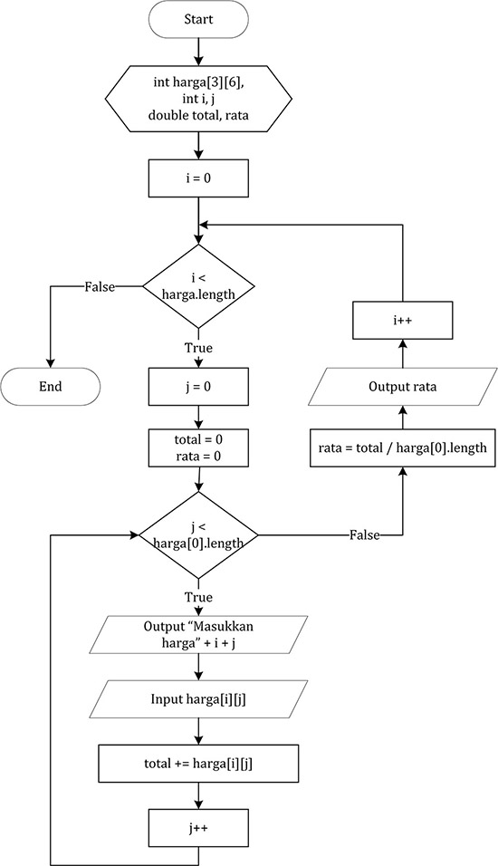

# JOBSHEET 11. ARRAY 2

## Tujuan
* Mahasiswa mampu memahami pembuatan array dua dimensi
* Mahasiswa mampu menyelesaikan studi kasus dengan memanfaatkan array dua dimensi

## Alat dan Bahan
* PC/Laptop
* Browser
* Koneksi internet
* Anaconda3 + Java kernel (opsional)

## Praktikum

### Percobaan 1: Deklarasi, Inisialisasi, dan Menampilkan Array 2 Dimensi
Pada Percobaan 1, kode program yang dibuat digunakan untuk menyimpan nilai praktikum dari 2 orang mahasiswa pada 3 mata kuliah yang berbeda.
1.	Buat array bertipe **integer** dengan nama **nilai** dengan kapasitas baris 2 elemen (menyatakan jumlah mahasiswa) dan kolom 3 elemen (menyatakan jumlah mata kuliah)


```Java
int[][] nilai = new int[2][3];
```

2. Isi masing-masing elemen array **nilai** sebagai berikut:


```Java
nilai[0][1] = 75;
nilai[0][1] = 90;
nilai[0][2] = 88;
nilai[1][0] = 79;
nilai[1][1] = 82;
nilai[1][2] = 67;
```


    67


3. Tampilkan semua isi elemen array **nilai**


```Java
System.out.println(nilai[0][1] + " " + nilai[0][1] + " " + nilai[0][2]);
System.out.println(nilai[0][1] + " " + nilai[1][1] + " " + nilai[1][2]);
```

    90 90 88
    90 82 67


#### Pertanyaan
1. Apakah pengisian elemen array harus dilakukan secara berurutan mulai dari indeks 0? Jelaskan!

Tidak, pengisian nilai array dapat dilakukan langsung dari indeks mana saja, jika suatu nilai pada index array belum diisi, maka nilainya akan null

2. Lakukan modifikasi pada Percobaan 1 Langkah 3 untuk menampilkan semua isi elemen array **nilai** menggunakan perulangan *for*


```Java
for(int i = 0; i < nilai.length; i++) {
    for(int j = 0; j < nilai[0].length; j++) {
        System.out.printf("nilai[%d][%d] = %d\n", i, j, nilai[i][j]);
    }   
}
```

    nilai[0][0] = 79
    nilai[0][1] = 90
    nilai[0][2] = 88
    nilai[1][0] = 79
    nilai[1][1] = 82
    nilai[1][2] = 67


### Percobaan 2: Mengisi Elemen Array 2 Dimensi Menggunakan Input Keyboard
Pada Percobaan 2, kode program yang dibuat digunakan untuk menyimpan nilai rating restoran yang terdaftar pada aplikasi pemesanan makanan online. Rating diberikan oleh 4 orang pengguna kepada 2 restoran yang terdaftar.
1. Import dan deklarasikan Scanner dengan nama **sc**


```Java
import java.util.Scanner;

Scanner sc = new Scanner(System.in);
```

2.	Buat array bertipe **integer** dengan nama **rating** dengan kapasitas baris 4 elemen (menyatakan jumlah pengguna) dan kolom 2 elemen (menyatakan jumlah restoran)


```Java
int[][] rating = new int[4][2];
```

3. Dengan menggunakan perulangan *for*, buat input untuk mengisi elemen array **rating**


```Java
for(int i = 0; i < rating.length; i++) {
    for(int j = 0; j < rating[0].length; j++) {
        System.out.print("MAsukkan rating pengguna " + i + " untuk restoran " + j + " : ");
        rating[i][j] = sc.nextInt();
    }
    
    System.out.println("");
}
```

    MAsukkan rating pengguna 0 untuk restoran 0 : 5
    MAsukkan rating pengguna 0 untuk restoran 1 : 5
    
    MAsukkan rating pengguna 1 untuk restoran 0 : 4
    MAsukkan rating pengguna 1 untuk restoran 1 : 4
    
    MAsukkan rating pengguna 2 untuk restoran 0 : 3
    MAsukkan rating pengguna 2 untuk restoran 1 : 3
    
    MAsukkan rating pengguna 3 untuk restoran 0 : 2
    MAsukkan rating pengguna 3 untuk restoran 1 : 2
    


4. Dengan menggunakan perulangan *for-each*, tampilkan semua isi elemen dari array **rating**


```Java
for(int[] rtg : rating) {
    for(int r: rtg) {
        System.out.print(r + " ");
    }
    
    System.out.println("");
}
```

    5 5 
    4 4 
    3 3 
    2 2 


#### Pertanyaan
1. Pada Percobaan 2 Langkah 3, dapatkah posisi i ditukar dengan posisi j? Jelaskan alasannya!

Tidak bisa, karena akan terjadi error index out of bond karena jika panjang baris dan kolom berbeda, jika nilai yang lebih kecil akan diakses dengan indeks yang lebih besar, maka akan menampilkan error index out of bond

2. Tambahkan kode program untuk menentukan banyaknya baris dan kolom elemen array secara dinamis (baris dan kolom ditentukan saat program berjalan melalui input keyboard)!


```Java
import java.util.Scanner;

Scanner sc = new Scanner(System.in);

System.out.print("Masukkan jumlah pengguna: ");
int jumlahPengguna = sc.nextInt();
System.out.print("Masukkan jumlah restoran: ");
int jumlahRestoran = sc.nextInt();

int[][] rating = new int[jumlahPengguna][jumlahRestoran];

for(int i = 0; i < rating.length; i++) {
    for(int j = 0; j < rating[0].length; j++) {
        System.out.print("Masukkan rating pengguna " + i + " untuk restoran " + j + " : ");
        rating[i][j] = sc.nextInt();
    }
    
    System.out.println("");
}
```

    Masukkan jumlah pengguna: 1
    Masukkan jumlah restoran: 1
    Masukkan rating pengguna 0 untuk restoran 0 : 5
    


### Percobaan 3: Melakukan Operasi Aritmatika pada Elemen Array 2 Dimensi
Pada Percobaan 3, kode program yang dibuat digunakan untuk menghitung nilai rata-rata harga setiap bahan pokok selama 1 semester. Terdapat 3 bahan pokok yang dicatat harganya setiap akhir bulan. Program dibuat berdasarkan flowchart berikut.

1. Import dan deklarasikan Scanner dengan nama **sc**


```Java
import java.util.Scanner;

Scanner sc = new Scanner(System.in);
```

2.	Buat array bertipe **integer** dengan nama **harga** dengan kapasitas baris 3 elemen (menyatakan jumlah bahan pokok) dan kolom 6 elemen (menyatakan jumlah bulan). Deklarasikan juga variabel **total** dan **rata** bertipe **double**


```Java
int[][] harga = new int[3][6];

double total, rata;
```

3. Dengan menggunakan perulangan *for*, buat input untuk mengisi elemen array **harga**. Kemudian, perhitungan total harga dilakukan untuk setiap bulan (kolom) pada setiap bahan pokok (baris). Setelah itu, nilai rata-rata dihitung untuk setiap bahan pokok (tiap satu baris) dan ditampilkan


```Java
for(int i = 0; i < harga.length; i++) {
    total = 0;
    rata = 0;
    
    for(int j = 0; j < harga[0].length; j++) {
        System.out.printf("Masukkan harga[%d][%d]: ", i, j);
        harga[i][j] = sc.nextInt();
        total += harga[i][j];
    }
    
    rata = total / harga[0].length;
    System.out.printf("Rata-rata harga bahan ke-%d adalah %.2f\n", i, rata);
}
```

    Masukkan harga[0][0]: 1
    Masukkan harga[0][1]: 2
    Masukkan harga[0][2]: 3
    Masukkan harga[0][3]: 1
    Masukkan harga[0][4]: 2
    Masukkan harga[0][5]: 3
    Rata-rata harga bahan ke-0 adalah 2.00
    Masukkan harga[1][0]: 3
    Masukkan harga[1][1]: 2
    Masukkan harga[1][2]: 3
    Masukkan harga[1][3]: 2
    Masukkan harga[1][4]: 3
    Masukkan harga[1][5]: 2
    Rata-rata harga bahan ke-1 adalah 2.50
    Masukkan harga[2][0]: 1
    Masukkan harga[2][1]: 4
    Masukkan harga[2][2]: 2
    Masukkan harga[2][3]: 3
    Masukkan harga[2][4]: 1
    Masukkan harga[2][5]: 4
    Rata-rata harga bahan ke-2 adalah 2.50


#### Pertanyaan
1. Jelaskan fungsi dari **rata = total / harga[0].length**!

Fungsi dari kode tersebut adalah untuk menghitung harga rata-rata dari tiap bahan. Dimana variable total berisi total harga pada bahan tersebut dan harga[0].length adalah jumlah harga pada tiap barang yaitu 6

2. Mengapa insialisasi variabel **total = 0** dan **rata = 0** berada di dalam perulangan *for* yang pertama? Menurut Anda, apa yang terjadi jika inisialisasi kedua variabel tersebut diletakkan di luar perulangan *for* (setelah deklarasi array)?

Variable tersebut perlu diatur ke 0 karena variable tersebut digunakan untuk menghitung total harga pada tiap bahan dimana pada saat selesai menghitung bahan yang pertama, sebelum menghitung barang yang kedua, perlu dilakukan reset pada nilai rata rata dan totalnya. Jika diletakan diluar, maka pada tiap iterasi, akan menghitung rata rata dengan nilai sebelumnya, sehingga pada akhir iterasi, akan menghitung rata-rata dari seluruh data

## Tugas

1. Perhatikan flowchart berikut.

Buat kode program sesuai dengan flowchart tersebut untuk mencari suhu tertinggi yang dicatat dari 5 kota di Jepang selama 7 hari berturut-turut!


```Java
import java.util.Scanner;

Scanner scn = new Scanner(System.in);

double suhu[][] = new double[5][7];
int x, y;
double max = 0;

for(int x = 0; x < suhu.length; x++) {
    for(int y = 0; y < suhu[0].length; y++) {
        System.out.printf("Masukkan suhu pada kota ke %d hari ke %d: ", x, y);
        suhu[x][y] = scn.nextInt();

        if(suhu[x][y] > max) {
            max = suhu[x][y];
        }
    }
}

System.out.println("Suhu tertinggi adalah: " + max);

```

    Masukkan suhu pada kota ke 0 hari ke 0: 43
    Masukkan suhu pada kota ke 0 hari ke 1: 21
    Masukkan suhu pada kota ke 0 hari ke 2: 32
    Masukkan suhu pada kota ke 0 hari ke 3: 21
    Masukkan suhu pada kota ke 0 hari ke 4: 32
    Masukkan suhu pada kota ke 0 hari ke 5: 32
    Masukkan suhu pada kota ke 0 hari ke 6: 32
    Masukkan suhu pada kota ke 1 hari ke 0: 23
    Masukkan suhu pada kota ke 1 hari ke 1: 12
    Masukkan suhu pada kota ke 1 hari ke 2: 32
    Masukkan suhu pada kota ke 1 hari ke 3: 12
    Masukkan suhu pada kota ke 1 hari ke 4: 32
    Masukkan suhu pada kota ke 1 hari ke 5: 123
    Masukkan suhu pada kota ke 1 hari ke 6: 32
    Masukkan suhu pada kota ke 2 hari ke 0: 123
    Masukkan suhu pada kota ke 2 hari ke 1: 321
    Masukkan suhu pada kota ke 2 hari ke 2: 123
    Masukkan suhu pada kota ke 2 hari ke 3: 32
    Masukkan suhu pada kota ke 2 hari ke 4: 21
    Masukkan suhu pada kota ke 2 hari ke 5: 32
    Masukkan suhu pada kota ke 2 hari ke 6: 32
    Masukkan suhu pada kota ke 3 hari ke 0: 43
    Masukkan suhu pada kota ke 3 hari ke 1: 12
    Masukkan suhu pada kota ke 3 hari ke 2: 32
    Masukkan suhu pada kota ke 3 hari ke 3: 21
    Masukkan suhu pada kota ke 3 hari ke 4: 32
    Masukkan suhu pada kota ke 3 hari ke 5: 43
    Masukkan suhu pada kota ke 3 hari ke 6: 12
    Masukkan suhu pada kota ke 4 hari ke 0: 32
    Masukkan suhu pada kota ke 4 hari ke 1: 23
    Masukkan suhu pada kota ke 4 hari ke 2: 21
    Masukkan suhu pada kota ke 4 hari ke 3: 32
    Masukkan suhu pada kota ke 4 hari ke 4: 12
    Masukkan suhu pada kota ke 4 hari ke 5: 32
    Masukkan suhu pada kota ke 4 hari ke 6: 32
    Suhu tertinggi adalah: 321.0


2. Terdapat hasil pencatatan data lima mahasiswa yang berisi informasi mengenai umur, berat badan (kg), dan tinggi badan (cm). Data tersebut disimpan ke dalam array dua dimensi.

*Keterangan: penyimpanan nilai dapat dilakukan melalui inisialisasi menggunakan operator assignment*
 * Tampilkan *berat badan terendah* di antara kelima mahasiswa tersebut
 * Tampilkan *rata-rata tinggi badan* dari kelima mahasiswa tersebut
 * Tampilkan nama mahasiswa dengan *umur tertua* di antara kelima mahasiswa tersebut


```Java
import java.util.Scanner;

Scanner scn = new Scanner(System.in);

int data[][] = {
    {19, 51, 155},
    {18, 55, 163},
    {18, 45, 153},
    {20, 46, 158},
    {19, 58, 160},
};

int beratTerendah = 0;
int totalTinggi = 0;
int indeksMhsTertua = 0;
int umurTertua = 0;

for(int x = 0; x < data.length; x++) {
    if(data[x][0] > umurTertua) {
        indeksMhsTertua = x;
        umurTertua = data[x][0];
    }
    
    if(data[x][1] < beratTerendah) {
        beratTerendah = data[x][1];
    }
    
    totalTinggi += data[x][2];
}

String namaTertua = switch(indeksMhsTertua) {
    case 0 -> "Desi";
    case 1 -> "Rofan";
    case 2 -> "Lala";
    case 3 -> "Beky";
    case 4 -> "Ega";
    default -> "Tidak dikenal";
};

System.out.println("Berat badan terendah: " + beratTerendah);
System.out.println("Rata rata tinggi: " + totalTinggi / data.length);
System.out.println("Mahasiswa tertua: " + namaTertua);

```

    Berat badan terendah: 0
    Rata rata tinggi: 157
    Mahasiswa tertua: Beky


Kode di atas digunakan untuk menghitung data data yang diperlukan

For loop digunakan untuk melakukan iterasi tiap mahasiswa, di dalam perulangan tersebut terdapat pengecekan umur tertua, berat terendah dan pengumpulan totalTinggi yang nantinya dapat digunakan untuk menghitung rata-rata
