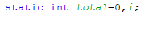

# JOBSHEET 13. Fungsi 1

## Tujuan
* Mahasiswa mampu memahami penggunaan fungsi static pada Java dengan parameter dan mengembalikan nilai.
* Mahasiswa mampu membuat program menggunakan fungsi static dan mengeksekusi fungsi tersebut.


## Alat dan Bahan
* PC/Laptop
* Browser
* Koneksi internet
* Anaconda3 + Java kernel (opsional)

## Praktikum

### Percobaan 1: Fungsi Void (tidak menggunakan return value)

1.	Buat fungsi **beriSalam** bertipe void yang digunakan untuk mencetak **“Halo! Selamat Pagi”**.


2. Eksekusi atau panggil fungsi **beriSalam**.


```Java
// Tuliskan kode program Percobaan 1 Langkah 1 & 2
static void beriSalam(){
    System.out.println("Halo! Selamat Pagi");
}
beriSalam();
```

    Halo! Selamat Pagi

3. Buat fungsi **beriUcapan** dengan sebuah parameter bertipe String.


4. Buatlah variabel **salam** bertipe String kemudian eksekusi atau panggil fungsi **beriUcapan** dengan mengisi parameternya dengan variable **salam** yang sudah dibuat.


```Java
// Tuliskan kode program Percobaan 1 Langkah 1, 2, 3 & 4
static void beriSalam(){
    System.out.println("Halo! Selamat Pagi");
}

static void beriUcapan(String ucapan){
    System.out.println(ucapan);
}

    beriSalam();
    String salam = "Selamat datang di pemrograman Java";
    beriUcapan(salam);
```

    Halo! Selamat Pagi
    Selamat datang di pemrograman Java


#### Pertanyaan
1. Jelaskan perbedaan fungsi **beriSalam** dan **beriUcapan** pada praktikum 1!

Jawab: kalau pada fungsi beriSalam tidak menggunakan parameter atau non parameter sedangkan pada fungsi beriUcapan menggunakan parameter bertipe data String

2. Jelaskan cara pemanggilan sebuah fungsi void yang berparameter dan tanpa parameter!

Jawab: Untuk pemanggilan fungsi void yang berparameter yaitu dengan menambahkan dalam kurung parameter dengan diikuti tipe datanya di sebelahnya/setelahnya. Sedangkan fungsi void tanpa parameter hanya menambahkan tanda kurung yang tidak memiliki isi parameter dan tipe data. 

### Percobaan 2: Fungsi dengan return value (Bukan void)
Pada Percobaan 2, kode program yang dibuat digunakan untuk menghitung luas persegi dengan membuat fungsi **luasPersegi** yang menggunakan parameter.
1. Buat fungsi **luasPersegi**  untuk menghitung luas persegi yang mengembalikan nilai luas (int) dan parameter masukan sisi (int).


2.	Eksekusi atau panggil fungsi luasPersegi dengan cara membuat variabel baru yaitu **luasan**, kemudian isi variabel tersebut dengan memanggil fungsi luasPersegi dan mengisi parameter sisi. Selanjutnya cetak variabel luasan untuk menampilkan luas persegi panjang


```Java
// Tuliskan kode program Percobaan 2 Langkah 1 & 2
static int luasPersegi(int sisi){
    int luas = sisi * sisi;
    return luas;
}

int luasan = luasPersegi(5);
System.out.println("Luas Persegi dengan sisi 5 = " + luasan);
```

    Luas Persegi dengan sisi 5 = 25


#### Pertanyaan
1. jelaskan mengapa ketika memanggil fungsi **luasPersegi** harus membuat variabel baru yaitu luasan?

Jawab: Karena fungsi luasPersegi membutuhkan variabel yang di mana digunakan untuk menampung hasil dari code program fungsi yang telah dibuat.

2. Jelaskan kegunaan **return luas** pada percobaan 2 diatas!

Jawab: kegunaan return luas dari percobaan 2 tersebut yaitu untuk mengembalikan nilai operasi dari variabel luas agar fungsi bisa diolah di proses selanjutnya. 


3. Modifikasilah program di percobaan 2, dengan membuat panjang **sisi** sebagai inputan!


```Java
// Tuliskan jawaban nomor 3
import java.util.Scanner;
Scanner input = new Scanner(System.in);
static int luasPersegi(int sisi){
    int luas = sisi * sisi;
    return luas;
}
System.out.print("Masukkan sisi: ");
int sisi = input.nextInt();
int luasan = luasPersegi(sisi);
System.out.println("Luas Persegi dengan sisi " + sisi + " = " + luasan);
```

    Masukkan sisi: 2
    Luas Persegi dengan sisi 2 = 4

### Percobaan 3: Fungsi dapat meng-CALL Fungsi Lain
Pada Percobaan 3, kode program yang dibuat digunakan untuk mengimplementasikan bahwa fungsi dapat meng-CALL fungsi yang lain. Dimana dalam percobaan ini terdapat fungsi **Kali dan Kurang**. 
1. Buatlah fungsi **Kali** yang mengembalikan nilai H (int) dan parameter masukan C dan D (int).


2.	Buatlah fungsi **Kurang** yang mengembalikan nilai X (int) dan parameter masukan A dan B (int) dan memanggil fungsi Kali.


3. Lakukan import class Scanner sebagai inputan di langkah selajutnya.

4. Eksekusi atau panggil fungsi **Kurang** .


```Java
//Tuliskan kode program Percobaan 3 Langkah 1, 2, 3 & 4
static int Kali(int C, int D){
    int H;
    H = (C + 10) % (D + 19);
    return H;
}

static int Kurang(int A, int B){
    int X;
    A = A + 7;
    B = B + 4;
    X = Kali(A, B);
    return X;
}

int nilai1, nilai2;
Scanner input = new Scanner(System.in);
System.out.print("Masukkan Nilai 1 : ");
nilai1 = input.nextInt();
System.out.print("Masukkan Nilai 2 : ");
nilai2 = input.nextInt();
int hasil = Kurang(nilai1, nilai2);
System.out.println("Hasil akhir adalah " + hasil);
```

    Masukkan Nilai 1 : 3
    Masukkan Nilai 2 : 2
    Hasil akhir adalah 20


#### Pertanyaan
1. Modifikasilah percobaan diatas dimana di fungsi **Kali** dapat memanggil fungsi **Kurang** kemudian eksekusi atau panggil fungsi Kali


```Java
// Tuliskan jawaban nomor 1
static int Kali(int C, int D){
    int X;
    C = C + 7;
    D = D + 4;
    X = Kurang(C, D);
    return X;
}

static int Kurang(int A, int B){
    int H;
    H = (A + 10) * (B + 19);
    return H;
}

int nilai1, nilai2;
Scanner input = new Scanner(System.in);
System.out.print("Masukkan Nilai 1 : ");
nilai1 = input.nextInt();
System.out.print("Masukkan Nilai 2 : ");
nilai2 = input.nextInt();
int hasil = Kali(nilai1, nilai2);
System.out.println("Hasil akhir adalah " + hasil);
```

    Masukkan Nilai 1 : 3
    Masukkan Nilai 2 : 6
    Hasil akhir adalah 580

2. Jelaskan alur jalannya program di percobaan 3 mulai dari input sampai keluar output!

jawab: Jadi alur jalannya dari program percobaan 3 kita menginputkan dua angka untuk dimasukkan pada variabel nilai1 dan nilai2, lalu kita membuat variabel untuk mencantumkan hasil yang di mana variabel hasil tersebut merupakan dari fungsi Kurang. Di mana nilai1 dan nilai2 pada fungsi parameter kurang yaitu variabel A dan B. Lalu, nilai A ditambahkan 7 sedangkan nilai B ditambahkan 4 dan hasil tersebut dimasukkan pada fungsi Kali di mana hasil variabel A dimasukkan ke variabel C dan variabel B dimasukkan ke variabel D. Lalu, variabel C + 10 dan variabel D + 19. Setelah itu, hasil dari keduanya dimodulus. Dan hasil tersebut diprint.

### Percobaan 4: Mengubah Program Tidak Menggunakan Fungsi dan Menggunakan Fungsi
Pada Percobaan 4, kode program yang dibuat digunakan untuk menghitung luas persegi panjang dan volume balok tanpa menggunakan fungsi dan dengan menggunakan fungsi.
1. Import dan deklarasikan Scanner dengan nama **input**


2. Buatlah inputan panjang, lebar, dan tinggi 


3. Hitung luas persegi panjang dan volume balok


```Java
// Tuliskan kode program Percobaan 4 Langkah 1, 2, & 3
import java.util.Scanner;
Scanner input = new Scanner(System.in);

int p, l, t, L, vol;
System.out.print("Masukkan panjang: ");
p = input.nextInt();
System.out.print("Masukkan lebar: ");
l = input.nextInt();
System.out.print("Masukkan tinggi: ");
t = input.nextInt();

L = p * l;
System.out.println("Luas Persegi Panjang adalah " + L);

vol = p*l*t;
System.out.println("Volume Balok adalah " + vol);
```

    Masukkan panjang: 2
    Masukkan lebar: 3
    Masukkan tinggi: 4
    Luas Persegi Panjang adalah 6
    Volume Balok adalah 24


4. Program menghitung luas persegi dan volume balok diatas jika dibuatkan fungsi maka terdapat 3 fungsi yaitu hitungLuas, hitungVolume dan fungsi main, seperti dibawah ini:

Fungsi hitungLuas


Fungsi hitungVolume


5. Eksekusi/panggil fungsi **hitungLuas** dan **hitungVolume**


```Java
// Tuliskan kode program Percobaan 4 Langkah 1, 2, & 3
static int hitungLuas(int pjg, int lb){
    int Luas;
    Luas = pjg*lb;
    return Luas;
}

static int hitungVolume(int a, int b, int tinggi){
    int Volume;
    Volume = hitungLuas(a, b) * tinggi;
    return Volume;
}

Scanner input = new Scanner(System.in);
int p, l, t, L, vol;
System.out.print("Masukkan panjang: ");
p = input.nextInt();
System.out.print("Masukkan lebar\t: ");
l = input.nextInt();
System.out.print("Masukkan tinggi\t: ");
t = input.nextInt();

L = hitungLuas(p, l);
System.out.println("Luas Persegi Panjang adalah " + L);
vol = hitungVolume(p, l, t);
System.out.println("Volume balok adalah " + vol);
```

    Masukkan panjang: 2
    Masukkan lebar	: 3
    Masukkan tinggi	: 4
    Luas Persegi Panjang adalah 6
    Volume balok adalah 24


#### Pertanyaan
1. Jelaskan kegunaan parameter yang terdapat didalam fungsi hitungLuas dan hitungVolume!

Jawab: 

- Pada parameter dalam fungsi hitungLuas terdapat parameter int pjg dan int lb nantinya akan dimasukkan nilai dari variabel dari p dan l
- Pada parameter dalam fungsi hitungVolume terdapat int a, int b, dan int tinggi di mana nanti akan dimasukkan nilai dari variabel p, l, dan t

2. Setelah melakukan percobaan 4, menurut anda manakah program yg lebih efisien apakah menggunakan fungsi atau tanpa fungsi? Jelaskan!

Jawab: lebih efisien menggunakan fungsi karena mempermudah hanya dengan cara memasukkan fungsi yang telah berisi code program yang telah dibuat dan juga lebih rapi dan enak dilihat. 

### Percobaan 5: Fungsi Menggunakan Array dan Variabel Global
Pada Percobaan 5, kode program yang dibuat digunakan untuk menghitung total nilai yang ada didalam array dengan membuat 3 fungsi yaitu isiarray, hitTol, dan tampilArray.
1. Buatlah **variable global total dan i** bertipe int


2. Buatlah fungsi **isiarray** bertipe int dengan parameter angka bertipe int 


3. Buatlah fungsi **tampilArray** bertipe **void** dengan parameter data array **arr** bertipe int


4. Buatlah fungsi **hitTot** bertipe int dengan parameter data array **arr** bertipe int


5. Import dan deklarasikan Scanner dengan nama **input**


6. Eksekusi atau panggil ketiga fungsi yaitu **isiarray, tampilArray, dan hitTot**, kemudian jalankan program!


```Java
// Tuliskan kode program Percobaan 4 Langkah 1 s/d 6
static int total = 0, i;

static int[] isiarray (int angka){
    Scanner input = new Scanner(System.in);
    int array[] = new int [angka];
    for(i = 0; i < array.length; i++){
        System.out.println("Masukkan data ke-" + i);
        array[i] = input.nextInt();
    }
    return array;
}

static void tampilArray(int [] arr){
    for(i = 0; i < arr.length; i++){
        System.out.println("Nilai yang anda inputkan ke-" + i);
        System.out.println(arr[i]);
    }
}

static int hitTot(int [] arr){
    for(i = 0; i < arr.length; i++){
        total += arr[i];
    }
    return total;
}

import java.util.Scanner;
Scanner input = new Scanner(System.in);

System.out.println("Masukkan jumlah data yang anda ingin inputkan: ");
int jum = input.nextInt();
int [] dataArray = isiarray(jum);
tampilArray(dataArray);
total = hitTot(dataArray);
System.out.println("Total nilai = " + total);
```

    Masukkan jumlah data yang anda ingin inputkan: 
    2
    Masukkan data ke-0
    3
    Masukkan data ke-1
    2
    Nilai yang anda inputkan ke-0
    3
    Nilai yang anda inputkan ke-1
    2
    Total nilai = 5


#### Pertanyaan
1. Jelaskan mengapa fungsi tampil array dibuat bertipe void, sedangkan isiarray dan hitTot bertipe int!

Jawab: karena tampilarray tidak memilii nilai di dalamnya yang akan dikembalikan, sedangkan isiarray dan hitTot memiliki nilai yang bertipedata int.

2. Menurut pendapat anda apakah fugsi isiarray dan hitTot dapat diganti dengan tipe void? Jelaskan dan buktikan dengan program!


```Java
// Tuliskan jawaban nomor 2
static int total = 0, i;

static void[] isiarray (int angka){
    Scanner input = new Scanner(System.in);
    int array[] = new int [angka];
    for(i = 0; i < array.length; i++){
        System.out.println("Masukkan data ke-" + i);
        array[i] = input.nextInt();
    }
    return array;
}

static void tampilArray(int [] arr){
    for(i = 0; i < arr.length; i++){
        System.out.println("Nilai yang anda inputkan ke-" + i);
        System.out.println(arr[i]);
    }
}

static void hitTot(int [] arr){
    for(i = 0; i < arr.length; i++){
        total += arr[i];
    }
    return total;
}

import java.util.Scanner;
Scanner input = new Scanner(System.in);

System.out.println("Masukkan jumlah data yang anda ingin inputkan: ");
int jum = input.nextInt();
int [] dataArray = isiarray(jum);
tampilArray(dataArray);
total = hitTot(dataArray);
System.out.println("Total nilai = " + total);
```


    |   static void[] isiarray (int angka){

    illegal start of expression

    

    |   static void[] isiarray (int angka){

    ';' expected

    

    |   static void[] isiarray (int angka){

    '.class' expected

    

    |   static void[] isiarray (int angka){

    ';' expected

    

    |   static void[] isiarray (int angka){

    unexpected type

      required: value

      found:    class

    

    |       int array[] = new int [angka];

    cannot find symbol

      symbol:   variable angka

## Tugas

1. Buatlah sebuah static method yang bernama Max3(int bil1, int bil2, int bil3) yang menerima 3 buah parameter bilangan integer dan mengembalikan sebuah bilangan integer yang merupakan nilai maksimum diantara ketiga bilangan tersebut. 


```Java
// Tuliskan jawaban nomor 1
import java.util.Scanner;
Scanner sc = new Scanner(System.in);
System.out.print("Masukkan angka ke-1: ");
int angka1 = sc.nextInt();
System.out.print("Masukkan angka ke-2: ");
int angka2 = sc.nextInt();
System.out.print("Masukkan angka ke-3: ");
int angka3 = sc.nextInt();

static int max3(int bil1, int bil2, int bil3){
int max = 0;
    if(bil1 > max){
        max = bil1;
    } if(bil2 > max){
        max = bil2;
    } if(bil3 > max){
        max = bil3;
    }
    return max;
}
int maks = max3(angka1, angka2, angka3);
System.out.print("Jadi nilai maksimum dari ketiga bilangan tersebut adalah " + maks);
```

    Masukkan angka ke-1: 2
    Masukkan angka ke-2: 3
    Masukkan angka ke-3: 4
    Jadi nilai maksimum dari ketiga bilangan tersebut adalah 4

Penjelasan nomer 1:
Untuk mencari nilai maksimum dari tiga bilangan tersebut yaitu pertama dengan menginputkan ketiga bilangan tersebut setelah itu membuat fungsi max dan setelah itu membuat variabel max = 0 untuk menampung nilai maksimum dan membuat code pemrograman pemilihan atau if yaitu jika bilangan 1 lebih dari max maka nilai terbut masuk ke variabel max begitupun untuk seterusnya sampai bilangan3 dan nanti bilangan maksimum akan diprint.

2. Disebuah restoran terdapat 3 menu yang dijual yaitu nasi goreng, soto, dan sate. Harga nasi goreng Rp. 20.000, soto Rp. 15.000, dan sate Rp. 25.000. Restoran tersebut buka dari hari senin sampai jumat. Berikut ini merupakan tabel pejualan perhari untuk masing-masing menu di restoran tersebut dari hari senin sampai jumat


Buatlah Fungsi sebagai berikut:
 * Fungsi menampilkan menu favorit di hari selasa dan jumat (menu favorit diasumsikan adalah menu yang paling banyak terjual di hari tersebut)
 * Fungsi untuk menghitung pemasukan restoran tersebut mulai hari senin sampai jumat.
 * Fungsi untuk menghitung berapa porsi yang terjual untuk masing-masing menu yaitu nasi goreng, soto, dan sate mulai senin sampai jumat.


```Java
// Tuliskan jawaban nomor 2
int[][] porsiMakanan = {
    {20, 15, 35, 24, 70},
    {30, 40, 10, 28, 35},
    {5, 10, 50, 48, 15}
};
String[] hari = {"Senin", "Selasa", "Rabu", "Kamis", "Jumat"};
String[] menu = {"Nasi Goreng", "Soto", "Sate"};

static void menuFavorit1(){
int fav1 = 0;
int max = 0;
for(int i = 0; i < menu.length; i++){
        if(porsiMakanan[i][1] > max){
            max = porsiMakanan[i][1];
            fav1 = (int) i;
        }
        
}
System.out.println("Menu Makanan Favorit Di Hari Selasa Adalah " + menu[fav1]);
}

static void menuFavorit2(){
int fav2 = 0;
int max1 = 0;
for(int j = 0; j < menu.length; j++){
        if(porsiMakanan[j][4] > max1){
            max1 = porsiMakanan[j][4];
            fav2 = (int) j;
        }
        
}
System.out.println("Menu Makanan Favorit Di Hari Jumat Adalah " + menu[fav2]);
}

static void biayaPemasukan(){
int totPemasukan = 0;
int sumNasgor = 0;
int sumSoto = 0;
int sumSate = 0;
int nasGor = 20000;
int Soto = 15000;
int Sate = 25000;
for(int i = 0; i < porsiMakanan[0].length; ++i){
sumNasgor += porsiMakanan[0][i];
sumSoto += porsiMakanan[1][i];
sumSate += porsiMakanan[2][i];
}
int pemasukanNasgor = sumNasgor * nasGor;
int pemasukanSoto = sumSoto * Soto;
int pemasukanSate = sumSate * Sate;
int jmlPemasukan = pemasukanNasgor + pemasukanSoto + pemasukanSate;
System.out.println("Jumlah Pemasukan Restoran Tersebut Dari Senin Sampai Jumat Adalah: Rp." + jmlPemasukan);
}
static void terjual(){
int sumNasgor = 0;
int sumSoto = 0;
int sumSate = 0;
for(int i = 0; i < porsiMakanan[0].length; ++i){
sumNasgor += porsiMakanan[0][i];
sumSoto += porsiMakanan[1][i];
sumSate += porsiMakanan[2][i];
}
System.out.println("Jumlah Nasi Goreng Yang Terjual Adalah " + sumNasgor + " porsi");
System.out.println("Jumlah Soto Yang Terjual Adalah " + sumSoto + " porsi");
System.out.println("Jumlah Sate Yang Terjual Adalah " + sumSate + " porsi");
}

menuFavorit1();
menuFavorit2();
biayaPemasukan();
terjual();
```

    Menu Makanan Favorit Di Hari Selasa Adalah Soto
    Menu Makanan Favorit Di Hari Jumat Adalah Nasi Goreng
    Jumlah Pemasukan Restoran Tersebut Dari Senin Sampai Jumat Adalah: Rp.8625000
    Jumlah Nasi Goreng Yang Terjual Adalah 164 porsi
    Jumlah Soto Yang Terjual Adalah 143 porsi
    Jumlah Sate Yang Terjual Adalah 128 porsi

Penjelasan nomer 2:
Untuk membuat program dan menampilkan menu makanan favorit, jumlah pemasukan restoran, jumlah porsi dari Nasgor, sate, dan soto. Pertama membuat variabel max = 0 untuk menentukan menu favorit di mana menentukan porsi yang paling banyak dan membuat code untuk print untuk hari selasa dan jumat. Dan untuk jumlah pemasukan membuat loop satu per satu untuk melakukan penjumlahan, lalu dikalikan dengan harga masing-masing menu makanan. Setelah itu, dijumlahkan semua dan diprint.  Setiap makanan dimasukkan di sebuah looping untuk dijumlah total dari suatu jenis makanan tersebut dan setelah jumlah total ketiga makanan tersebut ditemukan, lalu membuat sistem untuk menampilkan print out berupa jumlah total makanan, yaitu jumlah total nasi goreng, jumlah total soto, dan jumlah total sate. 