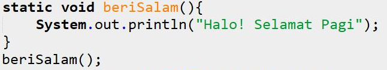

# JOBSHEET 13. Fungsi 1

## Tujuan
* Mahasiswa mampu memahami penggunaan fungsi static pada Java dengan parameter dan mengembalikan nilai.
* Mahasiswa mampu membuat program menggunakan fungsi static dan mengeksekusi fungsi tersebut.


## Alat dan Bahan
* PC/Laptop
* Browser
* Koneksi internet
* Anaconda3 + Java kernel (opsional)

## Praktikum

### Percobaan 1: Fungsi Void (tidak menggunakan return value)

1.	Buat fungsi **beriSalam** bertipe void yang digunakan untuk mencetak **“Halo! Selamat Pagi”**.


2. Eksekusi atau panggil fungsi **beriSalam**.



```Java
// Tuliskan kode program Percobaan 1 Langkah 1 & 2
static void beriSalam(){
    System.out.println("Halo! Selamat Pagi");
}
static void beriUcapan(String ucapan){
    System.out.println(ucapan);
}
beriSalam();
String salam = "Selamat datang di pemrograman Java";
beriUcapan(salam);
```

    Halo! Selamat Pagi
    Selamat datang di pemrograman Java


3. Buat fungsi **beriUcapan** dengan sebuah parameter bertipe String.


4. Buatlah variabel **salam** bertipe String kemudian eksekusi atau panggil fungsi **beriUcapan** dengan mengisi parameternya dengan variable **salam** yang sudah dibuat.


```Java
// Tuliskan kode program Percobaan 1 Langkah 1, 2, 3 & 4
static void beriSalam(){
    System.out.println("Halo! Selamat Pagi");
}
static void beriUcapan(String ucapan){
    System.out.println(ucapan);
}
beriSalam();
String salam = "Selamat datang di pemrograman Java";
beriUcapan(salam);
```

    Halo! Selamat Pagi
    Selamat datang di pemrograman Java


#### Pertanyaan
1. Jelaskan perbedaan fungsi **beriSalam** dan **beriUcapan** pada praktikum 1!

jawab : fungsi beriSalam tidak menggunakan parameter. Sedangkan fungsi beriUcapan menggunakan parameter

2. Jelaskan cara pemanggilan sebuah fungsi void yang berparameter dan tanpa parameter!

jawab : cara pemanggilan sebuah fungsi void yang berparameter yaitu dengan menuliskan nama fungsi dan nama variabel baru yang telah dibuat yaitu salam, yang telah diisi/diberi nilai. contohnya pada program diatas pemanggilan sebuah fungsi dengan parameter yaitu **beriUcapan(salam);** . sedangkan pemanggilan fungsi void tanpa parameter yaitu dengan menuliskan nama fungsi. Contoh : **beriSalam();**

### Percobaan 2: Fungsi dengan return value (Bukan void)
Pada Percobaan 2, kode program yang dibuat digunakan untuk menghitung luas persegi dengan membuat fungsi **luasPersegi** yang menggunakan parameter.
1. Buat fungsi **luasPersegi**  untuk menghitung luas persegi yang mengembalikan nilai luas (int) dan parameter masukan sisi (int).


2.	Eksekusi atau panggil fungsi luasPersegi dengan cara membuat variabel baru yaitu **luasan**, kemudian isi variabel tersebut dengan memanggil fungsi luasPersegi dan mengisi parameter sisi. Selanjutnya cetak variabel luasan untuk menampilkan luas persegi panjang


```Java
// Tuliskan kode program Percobaan 2 Langkah 1 & 2
static int luasPersegi(int sisi){
    int luas = sisi * sisi;
    return luas;
}
int luasan = luasPersegi(5);
System.out.println("Luas Persegi dengan sisi 5 = " + luasan);
```

    Luas Persegi dengan sisi 5 = 25


#### Pertanyaan
1. jelaskan mengapa ketika memanggil fungsi **luasPersegi** harus membuat variabel baru yaitu luasan?

jawab : untuk menampung nilai dari fungsi

2. Jelaskan kegunaan **return luas** pada percobaan 2 diatas!

jawab : untuk mengembalikan nilai output luas sehingga bisa diolah pada proses berikutnya

3. Modifikasilah program di percobaan 2, dengan membuat panjang **sisi** sebagai inputan!


```Java
// Tuliskan jawaban nomor 2
static int luasPersegi(int sisi){
    int luas = sisi * sisi;
    return luas;
}
import java.util.Scanner;
Scanner sc= new Scanner(System.in);
System.out.print("Masukkan panjang sisi : ");
int i = sc.nextInt();
int luasan = luasPersegi(i);
System.out.println("Luas Persegi = " + luasan);
```

    Masukkan panjang sisi : 6
    Luas Persegi = 36


### Percobaan 3: Fungsi dapat meng-CALL Fungsi Lain
Pada Percobaan 3, kode program yang dibuat digunakan untuk mengimplementasikan bahwa fungsi dapat meng-CALL fungsi yang lain. Dimana dalam percobaan ini terdapat fungsi **Kali dan Kurang**. 
1. Buatlah fungsi **Kali** yang mengembalikan nilai H (int) dan parameter masukan C dan D (int).


2.	Buatlah fungsi **Kurang** yang mengembalikan nilai X (int) dan parameter masukan A dan B (int) dan memanggil fungsi Kali.


3. Lakukan import class Scanner sebagai inputan di langkah selajutnya.

4. Eksekusi atau panggil fungsi **Kurang** .


```Java
// Tuliskan kode program Percobaan 3 Langkah 1, 2, 3 & 4
static int Kali(int C, int D){
    int H;
    H = (C+10) %(D +19);
    return H;
}
static int Kurang(int A, int B){
    int X;
    A = A + 7;
    B = B + 4;
    X = Kali(A, B);
    return X;
}
int nilai1, nilai2;
Scanner input = new Scanner ( System.in);
System.out.println("Masukkan nilai 1 :");
nilai1= input.nextInt();
System.out.println("Masukkan nilai 2 :");
nilai2= input.nextInt();
int hasil= Kurang(nilai1,nilai2);
System.out.println("Hasil akhir adalah " + hasil);

```

    Masukkan nilai 1 :
    70
    Masukkan nilai 2 :
    80
    Hasil akhir adalah 87


#### Pertanyaan
1. Modifikasilah percobaan diatas dimana di fungsi **Kali** dapat memanggil fungsi **Kurang** kemudian eksekusi atau panggil fungsi Kali


```Java
// Tuliskan jawaban nomor 1
import java.util.Scanner;
static int Kurang(int C, int D){
    int X;
    X = (C + 10) % (D + 19); 
    return X;
}

static int Kali(int A, int B){
    int X;
    A = A + 7;
    B = B + 4;
    X = Kurang(A, B);
    return X;
}

int nilai1, nilai2;
Scanner input = new Scanner(System.in);
System.out.print("Masukkan nilai 1 : ");
nilai1 = input.nextInt();
System.out.print("Masukkan nilai 2 : ");
nilai2 = input.nextInt();
int hasil = Kali(nilai1, nilai2);
System.out.println("Hasil akhir adalah " + hasil);
```

    Masukkan nilai 1 : 70
    Masukkan nilai 2 : 80
    Hasil akhir adalah 87


2. Jelaskan alur jalannya program di percobaan 3 mulai dari input sampai keluar output!
Ketika kode program diatas dijalankan maka yang pertama yaitu menginputkan nilai dalam variabel nilai1 dan nilai2. kemudian memanggil fungsi kurang ke dalam variabel hasil dengan input variabel nilai 1 dan nilai2. fungsi Kurang dengan parameter int a A dan B akan dijalankan disini nilai1 yaitu A akan ditambah 7 dan nilai2 yaitu B akan ditambah dengan 4. sehingga akan menghasilkan nilai A = 77 dan B = 84 kemudian fungsi kurang memanggil fungsi kali. disini variabel ditambahkan nilainya lalu dimodulus. nilai A sebagai C akan ditambah 10 hasilnya yaitu 87 dan nilai B sebagai D akan ditambah 19 hasilnya yaitu 103 dan modulusnya nya yaitu 87. kemudian nilainya akan dikembalikan dan variabel hasil akan dikeluarkan.

### Percobaan 4: Mengubah Program Tidak Menggunakan Fungsi dan Menggunakan Fungsi
Pada Percobaan 4, kode program yang dibuat digunakan untuk menghitung luas persegi panjang dan volume balok tanpa menggunakan fungsi dan dengan menggunakan fungsi.
1. Import dan deklarasikan Scanner dengan nama **input**


2. Buatlah inputan panjang, lebar, dan tinggi 


3. Hitung luas persegi panjang dan volume balok


```Java
// Tuliskan kode program Percobaan 4 Langkah 1, 2, & 3
import java.util.Scanner;
Scanner input =  new Scanner(System.in);
int p,l,t,L,vol;
System.out.println("Masukkan panjang");
p=input.nextInt();
System.out.println("Masukkan lebar");
l=input.nextInt();
System.out.println("Masukkan tinggi");
t=input.nextInt();
L=p*l;
System.out.println("Luas Persegi panjang adalah " + L);
vol=p*l*t;
System.out.println("Volume balok adalah " +vol);
```

    Masukkan panjang
    3
    Masukkan lebar
    4
    Masukkan tinggi
    5
    Luas Persegi panjang adalah 12
    Volume balok adalah 60


4. Program menghitung luas persegi dan volume balok diatas jika dibuatkan fungsi maka terdapat 3 fungsi yaitu hitungLuas, hitungVolume dan fungsi main, seperti dibawah ini:

Fungsi hitungLuas


Fungsi hitungVolume


5. Eksekusi/panggil fungsi **hitungLuas** dan **hitungVolume**


```Java
// Tuliskan kode program Percobaan 4 Langkah 1, 2, & 3
static int hitungLuas(int pjg, int lb){
    int Luas=pjg*lb;
    return Luas;
}
static int hitungVolume(int tinggi, int a, int b){
    int volume=hitungLuas(a,b)*tinggi;
    return volume;
}
import java.util.Scanner;
Scanner input =  new Scanner(System.in);
int p,l,t,L,vol;
System.out.println("Masukkan panjang");
p=input.nextInt();
System.out.println("Masukkan lebar");
l=input.nextInt();
System.out.println("Masukkan tinggi");
t=input.nextInt();
L=hitungLuas(p,l);
System.out.println("Luas Persegi panjang adalah " + L);
vol=hitungVolume(t,p,l);
System.out.println("Volume balok adalah " +vol);
```

    Masukkan panjang
    3
    Masukkan lebar
    4
    Masukkan tinggi
    5
    Luas Persegi panjang adalah 12
    Volume balok adalah 60


#### Pertanyaan
1. Jelaskan kegunaan parameter yang terdapat didalam fungsi hitungLuas dan hitungVolume!

jawab : kegunaan parameter pada fungsi hitungLuas adalah untuk menampung nilai panjang dan lebar pada variabel yang bertipe data integer untuk diproses didalam fungsi hitungLuas. kegunaan parameter pada fungsi hitungVolume adalah untuk menampung nilai pada variabel yang bertipe data integer untuk diproses didalam fungsi hitungVolume.

2. Setelah melakukan percobaan 4, menurut anda manakah program yg lebih efisien apakah menggunakan fungsi atau tanpa fungsi? Jelaskan!

Jawab : menurut saya program yang lebih efisien yaitu menggunakan fungsi. karena jika menggunakan fungsi maka program dapat disusun secara lebih terstruktur dan lebih efektif. sehingga jika diperlukan dalam suatu program untuk menjalankan tugas tersebut, maka tidak perlu dituliskan berulang-ulang, tapi yang dilakukan hanya cukup memanggil fungsi tersebut.

### Percobaan 5: Fungsi Menggunakan Array dan Variabel Global
Pada Percobaan 5, kode program yang dibuat digunakan untuk menghitung total nilai yang ada didalam array dengan membuat 3 fungsi yaitu isiarray, hitTol, dan tampilArray.
1. Buatlah **variable global total dan i** bertipe int


2. Buatlah fungsi **isiarray** bertipe int dengan parameter angka bertipe int 


3. Buatlah fungsi **tampilArray** bertipe **void** dengan parameter data array **arr** bertipe int


4. Buatlah fungsi **hitTot** bertipe int dengan parameter data array **arr** bertipe int


5. Import dan deklarasikan Scanner dengan nama **input**


6. Eksekusi atau panggil ketiga fungsi yaitu **isiarray, tampilArray, dan hitTot**, kemudian jalankan program!


```Java
// Tuliskan kode program Percobaan 4 Langkah 1 s/d 6
static int total = 0,i;
static int [] isiarray (int angka){
    Scanner input = new Scanner (System.in);
    int array[]=new int[angka];
    for(i=0; i<array.length; i++){
    System.out.println("Masukkan data ke- "+i);
    array[i]= input.nextInt();
    }
    return array;
}
static void tampilArray(int [] arr ){
    for (i=0; i<arr.length; i++){
        System.out.println("Nilai yang anda inputkan ke"+i);
        System.out.println(arr[i]);
    }
}
static int hitHot (int [] arr ){
    for (i=0; i<arr.length; i++){
        total+=arr[i];
    }
    return total;
}
import java.util.Scanner;
Scanner input =  new Scanner(System.in);
System.out.println("Masukkan jumlah data yang ingin anda inputkan");
int jum=input.nextInt();
int[]dataArray=isiarray(jum);
tampilArray(dataArray);
total = hitHot(dataArray);
System.out.println("total nilai = " + total);
```

    Masukkan jumlah data yang ingin anda inputkan
    3
    Masukkan data ke- 0
    70
    Masukkan data ke- 1
    80
    Masukkan data ke- 2
    90
    Nilai yang anda inputkan ke0
    70
    Nilai yang anda inputkan ke1
    80
    Nilai yang anda inputkan ke2
    90
    total nilai = 240


#### Pertanyaan
1. Jelaskan mengapa fungsi tampil array dibuat bertipe void, sedangkan isiarray dan hitTot bertipe int!

Jawab : karena fungsi tampil array yang bertipe void tidak memerlukan return. sedangkan fungsi hitTot bertipe int karena memerlukan return

2. Menurut pendapat anda apakah fugsi isiarray dan hitTot dapat diganti dengan tipe void? Jelaskan dan buktikan dengan program!

Jawab : ketika fungsi isiarray dan hitTot diganti dengan tipe void maka akan terjadi eror karena fungsi isiArray variabelnya adalah array dengan tipe data integer, akan eror ketika diganti dengan tipe void. selain itu tipe data void tidak memerlukan return.


```Java
// Tuliskan jawaban nomor 2
static int total = 0, i;
static void [] isiArray (int angka){
    Scanner input = new Scanner (System.in);
    int array[] = new int[angka];
    for(i = 0; i < array.length; i++){
        System.out.println("Masukan data ke-" +i);
        array[i] = input.nextInt();
    }
    return array;
}
static void tampilArray(int [] arr){
    for(i = 0; i < arr.length; i++){
        System.out.println("Nilai yang anda inputkan ke " +i);
        System.out.println(arr[i]);
    }
}
static void hitTot(int []arr){
    for(i = 0; i < arr.length; i++){
        total+=arr[i];
    }
    return total;
}

import java.util.Scanner;
Scanner input = new Scanner(System.in);

System.out.println("Masukan jumlah data yang ingin anda inputkan: ");
int jum = input.nextInt();
int []dataArray = isiArray(jum);
tampilArray(dataArray);
total = hitTot(dataArray);
System.out.println("Total nilai = "+ total)

```


    |   static void [] isiArray (int angka){

    illegal start of expression

    

    |   static void [] isiArray (int angka){

    ';' expected

    

    |   static void [] isiArray (int angka){

    '.class' expected

    

    |   static void [] isiArray (int angka){

    ';' expected

    

    |   static void [] isiArray (int angka){

    unexpected type

      required: value

      found:    class

    

    |       int array[] = new int[angka];

    cannot find symbol

      symbol:   variable angka

    


## Tugas

1. Buatlah sebuah static method yang bernama Max3(int bil1, int bil2, int bil3) yang menerima 3 buah parameter bilangan integer dan mengembalikan sebuah bilangan integer yang merupakan nilai maksimum diantara ketiga bilangan tersebut. 


```Java
// Tuliskan jawaban nomor 1
static int Max3(int bil1, int bil2, int bil3){ //membuat deklarasi fungsi dengan parameter 
    int max=0; //membuat variabel max dan memberi nilai awal 0

    if (bil1 > bil2 && bil1 > bil3) {  //kondisi 1
        max = bil1; // pernyataan 1 ini akan dijalankan apabila kondisi 1 bernilai benar
    } else if (bil2 > bil1 && bil2 > bil3){ //kondisi 2
        max = bil2; // pernyataan 2 akan dijalankan apabila kondisi 1 bernilai salah dan kondisi 2 bernilai benar
    } else { // kondisi 3
        max = bil3;//pernyataan 3 akan dijalankan apabila bernilai benar dimana kondisi 1 dan 2 bernilai salah
}
    return max; // mengembalikan nilai setelah proses fungsi telah selesai
}
import java.util.Scanner;  // menambahkan library Scanner
Scanner sc = new Scanner(System.in); // membuat deklarasi Scanner
System.out.print("Masukkan bil1 : "); // menuliskan perintah untuk menginputkan bil1
int bil1 = sc.nextInt();
System.out.print("Masukkan bil2 : "); // menuliskan perintah untuk menginputkan bil2
int bil2 = sc.nextInt();
System.out.print("Masukkan bil3 : "); // menuliskan perintah untuk menginputkan bil3
int bil3 = sc.nextInt();
int bilangan = Max3(bil1, bil2, bil3); // membuat variabel bilangan
System.out.println ("Nilai Maksimum = " + bilangan); // untuk menampilan isi variabel bilangan
```

    Masukkan bil1 : 4
    Masukkan bil2 : 7
    Masukkan bil3 : 9
    Nilai Maksimum = 9


2. Disebuah restoran terdapat 3 menu yang dijual yaitu nasi goreng, soto, dan sate. Harga nasi goreng Rp. 20.000, soto Rp. 15.000, dan sate Rp. 25.000. Restoran tersebut buka dari hari senin sampai jumat. Berikut ini merupakan tabel pejualan perhari untuk masing-masing menu di restoran tersebut dari hari senin sampai jumat


Buatlah Fungsi sebagai berikut:
 * Fungsi menampilkan menu favorit di hari selasa dan jumat (menu favorit diasumsikan adalah menu yang paling banyak terjual di hari tersebut)
 * Fungsi untuk menghitung pemasukan restoran tersebut mulai hari senin sampai jumat.
 * Fungsi untuk menghitung berapa porsi yang terjual untuk masing-masing menu yaitu nasi goreng, soto, dan sate mulai senin sampai jumat.


```Java
// Tuliskan jawaban nomor 2
static int total, harga, a = 0, b; // deklarasi variabel global agar bisa diakses dari fungsi manapun
static String makanan; // deklarasi variabel global

static void jualMakanan(int nama){ // deklarasi fungsi **jualMakanan** dengan parameter
    if(nama == 0){  //kondisi 1
        makanan = "nasi goreng"; //pernyataan 1
    }else if(nama == 1){ //kondisi 2
        makanan = "soto";  //pernyataan 2
    }else if(nama == 2){  // kondisi 3
        makanan = "sate"; //pernyataan 3
    }
}
static void jualTerbanyak (int [][] arr){ //deklarasi fungsi **jualTerbanyak** dengan parameter
    for(int i = 0; i < arr[0].length; i++){ 
        a = 0;
        if(i == 1){ 
            
            for(int j = 0; j < arr.length; j++){ 
                if( arr[j][i] > a){
                    a = arr[j][i];
                    jenis(j);
                }
            }
            
            System.out.println("Menu Favorit pada hari selasa yaitu " +makanan); // menampilkan variabel makanan favorit pada hari selasa
        
        }else if(i == 4){
            
            for(int j = 0; j < arr.length; j++){
                if( arr[j][i] > a){
                    a = arr[j][i];
                    jenis(j);
                }
            }
            
            System.out.println("Menu Favorit pada hari jumat yaitu " +makanan); //menampilkan variabel makanan favorit pada hari jumat
        
        }
    }
}
static void hitungPemasukan(int [][] arr){ // deklarasi fungsi hitungPemasukan dengan parameter data array arr
     for(int i = 0; i < arr.length; i++){ 
         if (i == 0){  
             harga = 20000;
             for(int j = 0; j < arr[0].length; j++){
                 total+= arr[i][j] * harga;
             }
         }else if(i == 1){
             harga = 15000;
             for(int j = 0; j < arr[0].length; j++){
                 total+= arr[i][j] * harga;
             }
         }else{
             harga = 25000;
             for(int j = 0; j < arr[0].length; j++){
                 total+= arr[i][j] * harga;
             }
         }
     }
}
static void hitungPorsi(int [][] arr){ // deklarasi fungsiPorsi dengan parameter data array arr
     for(int i = 0; i < arr.length; i++){
         int porsi = 0;
         for(int j = 0; j < arr[0].length; j++){
             porsi+= arr[i][j];
         }
         jenis(i);
         System.out.println("Banyaknya menu makanan " + makanan + " yang terjual adalah " + porsi); //menampilkan variabel makanan dan porsi
         
     }
}
int [][] menu = {{20, 15, 35, 24, 70},
                {30, 40, 10, 28, 35},
                {5, 10, 50, 48, 15}};
jualTerbanyak(menu); //memanggil fungsi jualTerbanyak
hitungPemasukan(menu); //memanggil fungsi hitungPemasukkan
System.out.println("pemasukan restoran tersebut  adalah sebesar Rp " +total); //menampilkan variabel total
hitungPorsi(menu); //memanggil fungsi hitungPorsi
```

    Menu Favorit pada hari selasa yaitu soto
    Menu Favorit pada hari jumat yaitu nasi goreng
    pemasukan restoran tersebut  adalah sebesar Rp 8625000
    Banyaknya menu makanan nasi goreng yang terjual adalah 164
    Banyaknya menu makanan soto yang terjual adalah 143
    Banyaknya menu makanan sate yang terjual adalah 128


```Java

```
