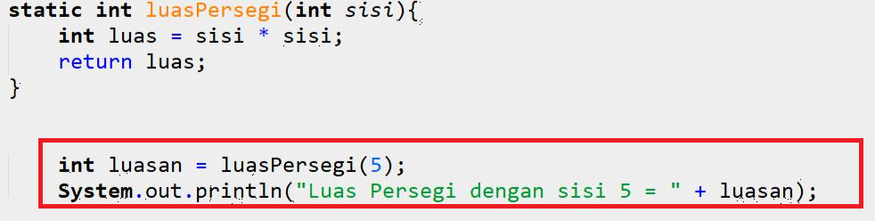

# JOBSHEET 13. Fungsi 1

## Tujuan
* Mahasiswa mampu memahami penggunaan fungsi static pada Java dengan parameter dan mengembalikan nilai.
* Mahasiswa mampu membuat program menggunakan fungsi static dan mengeksekusi fungsi tersebut.


## Alat dan Bahan
* PC/Laptop
* Browser
* Koneksi internet
* Anaconda3 + Java kernel (opsional)

## Praktikum

### Percobaan 1: Fungsi Void (tidak menggunakan return value)

1.	Buat fungsi **beriSalam** bertipe void yang digunakan untuk mencetak **“Halo! Selamat Pagi”**.


2. Eksekusi atau panggil fungsi **beriSalam**.


```Java
// Tuliskan kode program Percobaan 1 Langkah 1 & 2
static void beriSalam(){
    System.out.println("Halo! Selamat Pagi");
}
static void beriSalam(){
    System.out.println("Halo Selamat Pagi");
}
beriSalam();
```

    Halo Selamat Pagi


3. Buat fungsi **beriUcapan** dengan sebuah parameter bertipe String.


4. Buatlah variabel **salam** bertipe String kemudian eksekusi atau panggil fungsi **beriUcapan** dengan mengisi parameternya dengan variable **salam** yang sudah dibuat.


```Java
// Tuliskan kode program Percobaan 1 Langkah 1, 2, 3 & 4
static void beriSalam(){
    System.out.println("Halo! Selamat Pagi");
}

static void beriUcapan(String ucapan){
    System.out.println(ucapan);
}


    beriSalam();
    String salam = "Selamat datang di pemrograman Java";
    beriUcapan(salam);

```

    Halo! Selamat Pagi
    Selamat datang di pemrograman Java


#### Pertanyaan
1. Jelaskan perbedaan fungsi **beriSalam** dan **beriUcapan** pada praktikum 1!

di sintaks beriSalam tidak terdapat nilai dan langsung memproses fungsi tanpa parameter, namun pada sintaks beriUcapan menampung nilai yang  diproses di dalam fungsi(parameter).

2. Jelaskan cara pemanggilan sebuah fungsi void yang berparameter dan tanpa parameter!

Cara pemanggilan yang memiliki parameter yang dimaksud adalah menambahkan nilai sebelum mebuat sinttaks fungsinya, seperti fungsi beriUcapan; Sedangkan yang tidak di dalam fungsinya, seprti fungsi beriSalam

### Percobaan 2: Fungsi dengan return value (Bukan void)
Pada Percobaan 2, kode program yang dibuat digunakan untuk menghitung luas persegi dengan membuat fungsi **luasPersegi** yang menggunakan parameter.
1. Buat fungsi **luasPersegi**  untuk menghitung luas persegi yang mengembalikan nilai luas (int) dan parameter masukan sisi (int).


2.	Eksekusi atau panggil fungsi luasPersegi dengan cara membuat variabel baru yaitu **luasan**, kemudian isi variabel tersebut dengan memanggil fungsi luasPersegi dan mengisi parameter sisi. Selanjutnya cetak variabel luasan untuk menampilkan luas persegi panjang



```Java
// Tuliskan kode program Percobaan 2 Langkah 1 & 2
static int luasPerseg(int sisi){
    int luas = sisi * sisi; 
    return luas;
}
static int luasPersegi(int sisi){
    int luas = sisi * sisi;
    return luas;
}
    int luasan = luasPersegi(5);
    System.out.println("luas Persegi dengan sisi 5 = " + luasan);
```

    luas Persegi dengan sisi 5 = 25


#### Pertanyaan
1. jelaskan mengapa ketika memanggil fungsi **luasPersegi** harus membuat variabel baru yaitu luasan?

fungsi luasPersegi adalah parameter, maka kita harus membuat variabel terlebih dahulu ,baru bisa untuk menampung fungsi agar memudahkan untuk membuat kode program selanjutnya, karena jika tidak membuat variabel baru, maka pemanggilan fungsi harus menulis luuasPersegi(5) yang tentu saja akan susah jika fungsi yang sering digunakan 

2. Jelaskan kegunaan **return luas** pada percobaan 2 diatas!

luas berfungsi sebagai petunjuk untuk mengemnbalikan sebuah nilai agar fungsi bisa diproses di program selanjutnya 

3. Modifikasilah program di percobaan 2, dengan membuat panjang **sisi** sebagai inputan!


```Java
// Tuliskan jawaban nomor 2
import java.util.Scanner;
Scanner input = new Scanner(System.in);
System.out.print("Masukkan sisi: ");
int sisi = input.nextInt();
int ls = luasPersegi(sisi);
System.out.println("Luas Persegi dengan sisi " + sisi + " adalah " + ls);
static int luasPersegi(int sisi){
    int luas = sisi * sisi;
    return luas;
}


```

    Masukkan sisi: 2
    Luas Persegi dengan sisi 2 adalah 4


### Percobaan 3: Fungsi dapat meng-CALL Fungsi Lain
Pada Percobaan 3, kode program yang dibuat digunakan untuk mengimplementasikan bahwa fungsi dapat meng-CALL fungsi yang lain. Dimana dalam percobaan ini terdapat fungsi **Kali dan Kurang**. 
1. Buatlah fungsi **Kali** yang mengembalikan nilai H (int) dan parameter masukan C dan D (int).


2.	Buatlah fungsi **Kurang** yang mengembalikan nilai X (int) dan parameter masukan A dan B (int) dan memanggil fungsi Kali.


3. Lakukan import class Scanner sebagai inputan di langkah selajutnya.

4. Eksekusi atau panggil fungsi **Kurang** .


```Java
// Tuliskan kode program Percobaan 3 Langkah 1, 2, 3 & 4
static int kali(int C, int D) {
    int H;
    H = (C + 10) % (D + 19);
    return H;
}
static int Kurang(int A, int B) {
    int X;
    A = A + 7;
    B = B + 4;
    X = kali(A, B);
    return X;
}
int nilai1, nilai2;
Scanner input =new Scanner (System.in);
System.out.println("Masukkan Nilai 1:");
nilai1=input.nextInt();
System.out.println("Masukkan Nilai 2:");
nilai2=input.nextInt();
int hasil = Kurang(nilai1, nilai2);
System.out.println("Hasil akhir adalah " + hasil);


```

    Masukkan Nilai 1:
    4
    Masukkan Nilai 2:
    6
    Hasil akhir adalah 21


#### Pertanyaan
1. Modifikasilah percobaan diatas dimana di fungsi **Kali** dapat memanggil fungsi **Kurang** kemudian eksekusi atau panggil fungsi Kali


```Java
// Tuliskan jawaban nomor 1
```

2. Jelaskan alur jalannya program di percobaan 3 mulai dari input sampai keluar output!

### Percobaan 4: Mengubah Program Tidak Menggunakan Fungsi dan Menggunakan Fungsi
Pada Percobaan 4, kode program yang dibuat digunakan untuk menghitung luas persegi panjang dan volume balok tanpa menggunakan fungsi dan dengan menggunakan fungsi.
1. Import dan deklarasikan Scanner dengan nama **input**


2. Buatlah inputan panjang, lebar, dan tinggi 


3. Hitung luas persegi panjang dan volume balok


```Java
// Tuliskan kode program Percobaan 4 Langkah 1, 2, & 3
import java.util.Scanner;
Scanner input =new Scanner(System.in);
int p,l,t,L,vol;
System.out.println("Masukkan panjang");
p=input.nextInt();
System.out.println("Masukkan lebar");
l=input.nextInt();
System.out.println("Masukkan tinggi");
t=input.nextInt();
L=p*l;
System.out.println("Luas Persegi panjang adalah "+L);

vol=p*l*t;
System.out.println("Volume balok adalah "+vol);   
```

    Masukkan panjang
    12
    Masukkan lebar
    6
    Masukkan tinggi
    3
    Luas Persegi panjang adalah 72
    Volume balok adalah 216


4. Program menghitung luas persegi dan volume balok diatas jika dibuatkan fungsi maka terdapat 3 fungsi yaitu hitungLuas, hitungVolume dan fungsi main, seperti dibawah ini:

Fungsi hitungLuas


Fungsi hitungVolume


5. Eksekusi/panggil fungsi **hitungLuas** dan **hitungVolume**


```Java
// Tuliskan kode program Percobaan 4 Langkah 1, 2, & 3
static int hitungLuas (int pjg, int lb){
    int Luas=pjg*lb;
    return Luas;
}
static int hitungVolume (int tinggi, int a, int b){
    int volume= hitungLuas(a,b)*tinggi;
    return volume;
}
Scanner input =new Scanner (System.in);
int p,l,t,L, vol;
System.out.println("Masukkan panjang");
p=input.nextInt();
System.out.println("Masukkan lebar");
l=input.nextInt();
System.out.println("Masukkan tinggi");
t=input.nextInt();

L=hitungLuas(p,l);
System.out.println("Luas Persegi Panjangg adalah "+L);
vol=hitungVolume(t,p,l);
System.out.println("Volume Balok adalah "+vol);
```

    Masukkan panjang
    12
    Masukkan lebar
    6
    Masukkan tinggi
    3
    Luas Persegi Panjangg adalah 72
    Volume Balok adalah 216


#### Pertanyaan
1. Jelaskan kegunaan parameter yang terdapat didalam fungsi hitungLuas dan hitungVolume!

parameter yang terdapat di dalam fungsi hitungLuas yaitu untuk membuat fungsi perkalian dengan 2 variabel yang nantinya akan diproses menggunakan variabel baru yang diinputkan(int pjg, int lb = p,l)
Parameter yang terdapat didalam fungsi hitungVolume yaitu untuk membuat fungsi perkalian dengan 3 variabel yang nantinya akan diproses menggunakan variabel baru yang diinputkan(int tinggi, int a, int b = t,p,l)

2. Setelah melakukan percobaan 4, menurut anda manakah program yg lebih efisien apakah menggunakan fungsi atau tanpa fungsi? Jelaskan!


```Java
// Jawaban Nomor 2
Dengan fungsi, karena dengan menggunakan kode program akan menjadi rapi serta untuk membikin rumus baru, kita hany memangil  
fungsi yang sudah kita buat dan hal tersebut jelas membuat waktu menngerjakan semakin epat dan effisien 

```

### Percobaan 5: Fungsi Menggunakan Array dan Variabel Global
Pada Percobaan 5, kode program yang dibuat digunakan untuk menghitung total nilai yang ada didalam array dengan membuat 3 fungsi yaitu isiarray, hitTol, dan tampilArray.
1. Buatlah **variable global total dan i** bertipe int


2. Buatlah fungsi **isiarray** bertipe int dengan parameter angka bertipe int 


3. Buatlah fungsi **tampilArray** bertipe **void** dengan parameter data array **arr** bertipe int


4. Buatlah fungsi **hitTot** bertipe int dengan parameter data array **arr** bertipe int


5. Import dan deklarasikan Scanner dengan nama **input**


6. Eksekusi atau panggil ketiga fungsi yaitu **isiarray, tampilArray, dan hitTot**, kemudian jalankan program!


```Java
// Tuliskan kode program Percobaan 4 Langkah 1 s/d 6
static int total = 0, i;
static int [] isiarray (int angka){
    Scanner input = new Scanner(System.in);
    int array[] = new int[angka];
    for(i = 0; i < array.length; i++){
        System.out.println("Masukkan data ke- " + i);
        array[i] = input.nextInt();
    }
    return array;
}
static void tampilArray(int [] arr){
    for(i = 0; i < arr.length; i++){
        System.out.println("Nilai yang anda inputkan ke " + i);
        System.out.println(arr[i]);
    }
}
static int hitTot(int [] arr){
    for(i = 0; i < arr.length; i++){
        total += arr[i];
    }
    return total;
}
import java.util.Scanner;
Scanner input = new Scanner(System.in);
System.out.println("Masukkan jumlah data yang ingin anda inputkan: ");
int jum = input.nextInt();
int [] dataArray = isiarray(jum);
tampilArray(dataArray);
total = hitTot(dataArray);
System.out.println("Total nilai = " + total);
```

    Masukkan jumlah data yang ingin anda inputkan: 
    3
    Masukkan data ke- 0
    6
    Masukkan data ke- 1
    8
    Masukkan data ke- 2
    9
    Nilai yang anda inputkan ke 0
    6
    Nilai yang anda inputkan ke 1
    8
    Nilai yang anda inputkan ke 2
    9
    Total nilai = 23


#### Pertanyaan
1. Jelaskan mengapa fungsi tampil array dibuat bertipe void, sedangkan isiarray dan hitTot bertipe int!

fungsi yang tampil pada array tidak bisa menampung nilai dan hanya menampilkan nilai, sedangkan fungsi isiarray dan hitTot fungsinya yiatu menampung nilai

2. Menurut pendapat anda apakah fugsi isiarray dan hitTot dapat diganti dengan tipe void? Jelaskan dan buktikan dengan program!


```Java
// Tuliskan jawaban nomor 2
tidak bisa karena nanti akan terjadi program error 

```


```Java
// contoh prgraam salah menggunkan tipe void
static int total=0, i;
static void [] isiarray (int angka){
Scanner input = new Scanner (System.in);
int array[] = new int [angka];
for (i = 0; i < array.length; i++){
System.out.println("Masukkan Data Ke-" + (i+1));
array[i]=input.nextInt();
}
return array;
}
static void tampilArray(int [] arr){
for (i=0; i<arr.length; i++){
System.out.println("Nilai Yang Anda Inputkan Ke " + (i+1));
System.out.println(arr[i]);
}
}
static void hitTot(int []arr){
for (i = 0; i<arr.length; i++){
total+=arr[i];
}
return total;
}
import java.util.Scanner;
Scanner input = new Scanner(System.in);
System.out.println("Masukkan Jumlah Data Yang Ingin Anda Inputkan: ");
int jum=input.nextInt();
int []dataArray=isiarray(jum);
tampilArray(dataArray);
total = hitTot(dataArray);
System.out.println("Total nilai = " + total);

```


    |   static void [] isiarray (int angka){

    illegal start of expression

    

    |   static void [] isiarray (int angka){

    ';' expected

    

    |   static void [] isiarray (int angka){

    '.class' expected

    

    |   static void [] isiarray (int angka){

    ';' expected

    

    |   static void [] isiarray (int angka){

    unexpected type

      required: value

      found:    class

    

    |   int array[] = new int [angka];

    cannot find symbol

      symbol:   variable angka

    


## Tugas

1. Buatlah sebuah static method yang bernama Max3(int bil1, int bil2, int bil3) yang menerima 3 buah parameter bilangan integer dan mengembalikan sebuah bilangan integer yang merupakan nilai maksimum diantara ketiga bilangan tersebut. 


```Java
// Tuliskan jawaban nomor 1
Scanner input = new Scanner (System.in);
System.out.print("Masukkan Angka berikut yang Ke-1: ");
int pertama = input.nextInt();
System.out.print("Masukkan Angka berikut yang Ke-2: ");
int kedua = input.nextInt();
System.out.print("Masukkan Angka berikut yang Ke-3: ");
int ketiga = input.nextInt();
static int Max3(int bil1, int bil2, int bil3){
int i, max = 0;
        if (bil1 > max){
            max = bil1;
        } if(bil2 > max){
           max = bil2;
        } if (bil3 > max){
            max = bil3;
        }
    return max;
}
int terbesar = Max3(pertama, kedua, ketiga);
System.out.print("Nilai Terbesar Adalah: " + terbesar);
```

    Masukkan Angka berikut yang Ke-1: 12
    Masukkan Angka berikut yang Ke-2: 13
    Masukkan Angka berikut yang Ke-3: 14
    Nilai Terbesar Adalah: 14

// Penjelasan Soal Nomor 1
kesatu user dminta untukk menginputkan 3 nilai
Lalu variabel nilai tersebut akan dipindahkan variabelnya ke dalam fungsi "Max3", dan juga akan dipndahakan ke dalam satu fungsi  yang akan  memgelluarakan putputnya. Setelah itu, program akan mengoperasikan dengan menyeleksi fungsi . Jika user sudah menginputkan smpai 3 kali dan dimana output nanti akan keluar yag terbesar.


2. Disebuah restoran terdapat 3 menu yang dijual yaitu nasi goreng, soto, dan sate. Harga nasi goreng Rp. 20.000, soto Rp. 15.000, dan sate Rp. 25.000. Restoran tersebut buka dari hari senin sampai jumat. Berikut ini merupakan tabel pejualan perhari untuk masing-masing menu di restoran tersebut dari hari senin sampai jumat


Buatlah Fungsi sebagai berikut:
 * Fungsi menampilkan menu favorit di hari selasa dan jumat (menu favorit diasumsikan adalah menu yang paling banyak terjual di hari tersebut)
 * Fungsi untuk menghitung pemasukan restoran tersebut mulai hari senin sampai jumat.
 * Fungsi untuk menghitung berapa porsi yang terjual untuk masing-masing menu yaitu nasi goreng, soto, dan sate mulai senin sampai jumat.


```Java
// Tuliskan jawaban nomor 2
int[][] porsi = {
    {20, 15, 35, 24, 70},
    {30, 40, 10, 28, 35},
    {5, 10, 50, 48, 15}
};
String[] hari = {"Senin", "Selasa", "Rabu", "Kamis", "Jumat"};
String[] makanan = {"Nasi Goreng", "Soto", "Sate"};
static void menuYangFavorit(){
int favorit = 0;
int max = 0;
for(int i = 0; i < makanan.length; i++){
        if(porsi[i][1] > max){
            max = porsi[i][1];
            favorit = (int) i;
        }
        
}
System.out.println("Makanan yang paling Favorit Di Hari Selasa Adalah " + makanan[favorit]);
}
static void menuYangFavorit1(){
int favorit1 = 0;
int max1 = 0;
for(int j = 0; j < makanan.length; j++){
        if(porsi[j][4] > max1){
            max1 = porsi[j][4];
            favorit1 = (int) j;
        }
        
}
System.out.println("Makanan yang paling Favorit Di Hari Jumat Adalah " + makanan[favorit1]);
}
static void pemasukan(){
int totalPemasukan = 0;
int jumlahNasgor = 0;
int jumlahSoto = 0;
int jumlahSate = 0;
int nasGor = 20000;
int Soto = 15000;
int Sate = 25000;
for(int i = 0; i < porsi[0].length; ++i){
jumlahNasgor += porsi[0][i];
jumlahSoto += porsi[1][i];
jumlahSate += porsi[2][i];
}
int pemasukanNasgor = jumlahNasgor * nasGor;
int pemasukanSoto = jumlahSoto * Soto;
int pemasukanSate = jumlahSate * Sate;
int pemasukanTotal = pemasukanNasgor + pemasukanSoto + pemasukanSate;
System.out.println("Pemasukan Restoran Tersebut Dari Senin Sampai Jumat Adalah: Rp." + pemasukanTotal);
}
static void terjual(){
int jumlahNasgor = 0;
int jumlahSoto = 0;
int jumlahSate = 0;
for(int i = 0; i < porsi[0].length; ++i){
jumlahNasgor += porsi[0][i];
jumlahSoto += porsi[1][i];
jumlahSate += porsi[2][i];
}
System.out.println("Jumlah Nasi Goreng Yang Terjual Adalah " + jumlahNasgor + " porsi");
System.out.println("Jumlah Soto Yang Terjual Adalah " + jumlahSoto + " porsi");
System.out.println("Jumlah Sate Yang Terjual Adalah " + jumlahSate + " porsi");
}

menuYangFavorit();
menuYangFavorit1();
pemasukan();
terjual();

```

    Makanan yang paling Favorit Di Hari Selasa Adalah Soto
    Makanan yang paling Favorit Di Hari Jumat Adalah Nasi Goreng
    Pemasukan Restoran Tersebut Dari Senin Sampai Jumat Adalah: Rp.8625000
    Jumlah Nasi Goreng Yang Terjual Adalah 164 porsi
    Jumlah Soto Yang Terjual Adalah 143 porsi
    Jumlah Sate Yang Terjual Adalah 128 porsi


```Java
Penjelasan: Pada kode program diatas pertama kita menulis array pada program, lalu yang terdapat pada menu favorit (selasa dan jumat), memproses data yang diiputlan menggunakan looping dengan deklarasi max = 0, jika angka yang tersedia , maka angka tersebut akan menggantikan  nilai yang tedapat pada  max, berlaku untuk begitu seterusnya. Lalu setelah menemukan angka, maka  akan membuat string [] makanan dan dilanjutkan system.out.print yang dimana padad program tersebut
maka disana kita bisa menambahkan string(makanan), lalu system.out.print (makanan) berikuu berlaku pada lalu
juga untu selasa dan jum'at lalu dimasukkan dari pemasukan restoran yang dimana kita haru menghitung satu persatu denggan mneggunakan looping
penjumlahan, lalu kemudian kita kalikan dengan hasil dengan jenis jenis makanan, lalu kita lopping dengan mengunakan ssytem.out
dan lalu kita bisa mnegalika jumlah total makan dikalikan dengan
ara yang hampir sama dengan harga total, namun lebih sederhana. Setiap makanan dimasukkan di sebuah looping untuk dijumlah total dari suatu jenis makanan tersebut, lalu setelah menemukan jumlah total ketiga makanan tersebut, sistem akan mengeluarkan print out berupa jumlah total makanan, yaitu jumlah total nasi goreng, jumlah total soto, dan jumlah total sate. Setelah itu kode program berhenti dan selesai.
```
