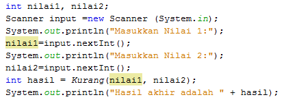

# JOBSHEET 13. Fungsi 1

## Tujuan
* Mahasiswa mampu memahami penggunaan fungsi static pada Java dengan parameter dan mengembalikan nilai.
* Mahasiswa mampu membuat program menggunakan fungsi static dan mengeksekusi fungsi tersebut.


## Alat dan Bahan
* PC/Laptop
* Browser
* Koneksi internet
* Anaconda3 + Java kernel (opsional)

## Praktikum

### Percobaan 1: Fungsi Void (tidak menggunakan return value)

1.	Buat fungsi **beriSalam** bertipe void yang digunakan untuk mencetak **“Halo! Selamat Pagi”**.


2. Eksekusi atau panggil fungsi **beriSalam**.


```Java
// Tuliskan kode program Percobaan 1 Langkah 1 & 2
static void beriSalam(){
    System.out.println("Halo! Selamat Pagi");
}
beriSalam();
```

    Halo! Selamat Pagi


3. Buat fungsi **beriUcapan** dengan sebuah parameter bertipe String.


4. Buatlah variabel **salam** bertipe String kemudian eksekusi atau panggil fungsi **beriUcapan** dengan mengisi parameternya dengan variable **salam** yang sudah dibuat.


```Java
// Tuliskan kode program Percobaan 1 Langkah 1, 2, 3 & 4
static void beriSalam(){
    System.out.println("Halo! Selamat Pagi");
}

static void beriUcapan(String ucapan){
    System.out.println(ucapan);
}

beriSalam();
String salam = "Selamat datang di pemrograman Java";
beriUcapan(salam);
```

    Halo! Selamat Pagi
    Selamat datang di pemrograman Java


#### Pertanyaan
1. Jelaskan perbedaan fungsi **beriSalam** dan **beriUcapan** pada praktikum 1!

**Jawaban :**
Fungsi beriSalam bekerja tanpa parameter, sedangkan fungsi beriUcapan bekerja dengan parameter yang sudah dimasukkan atau parameter berfungsi untuk menjalankan fungsi beriUcapan yang menggunakan tipe data string.

2. Jelaskan cara pemanggilan sebuah fungsi void yang berparameter dan tanpa parameter!

**Jawaban :**
**Dengan Parameter :** namaFungsi()}
**Tanpa Parameter :** public static void main (String[] args){namaFungsi():}

### Percobaan 2: Fungsi dengan return value (Bukan void)
Pada Percobaan 2, kode program yang dibuat digunakan untuk menghitung luas persegi dengan membuat fungsi **luasPersegi** yang menggunakan parameter.
1. Buat fungsi **luasPersegi**  untuk menghitung luas persegi yang mengembalikan nilai luas (int) dan parameter masukan sisi (int).


2.	Eksekusi atau panggil fungsi luasPersegi dengan cara membuat variabel baru yaitu **luasan**, kemudian isi variabel tersebut dengan memanggil fungsi luasPersegi dan mengisi parameter sisi. Selanjutnya cetak variabel luasan untuk menampilkan luas persegi panjang


```Java
// Tuliskan kode program Percobaan 2 Langkah 1 & 2
static int luasPersegi(int sisi){
    int luas = sisi * sisi;
    return luas;
}

    int luasan = luasPersegi(5);
    System.out.println("Luas Persegi dengan sisi 5 = " + luasan);
```

    Luas Persegi dengan sisi 5 = 25


#### Pertanyaan
1. jelaskan mengapa ketika memanggil fungsi **luasPersegi** harus membuat variabel baru yaitu luasan?

**Jawaban :**
Karena untuk menampung variabel baru yang akan menjadi hasil keluaran dari pemrograman diatas.

2. Jelaskan kegunaan **return luas** pada percobaan 2 diatas!

**Jawaban :**
Fungsi dari **return luas** sendiri adalah mengembalikan nilai int luas.

3. Modifikasilah program di percobaan 2, dengan membuat panjang **sisi** sebagai inputan!


```Java
// Tuliskan jawaban nomor 2
import java.util.Scanner;
Scanner input = new Scanner (System.in);
int sisi = 0;
System.out.println("Masukkan panjang sisi Persegi :");
int sisi = input.nextInt();

static int luasPersegi(int sisi){
    int luas = sisi * sisi;
    return luas;
}
   
    int luasan = luasPersegi(sisi);
    System.out.printf("Luas Persegi dengan sisi %d = %d", sisi, luasan);
```

    Masukkan panjang sisi Persegi :
    7
    Luas Persegi dengan sisi 7 = 49


    java.io.PrintStream@5741bc1a


### Percobaan 3: Fungsi dapat meng-CALL Fungsi Lain
Pada Percobaan 3, kode program yang dibuat digunakan untuk mengimplementasikan bahwa fungsi dapat meng-CALL fungsi yang lain. Dimana dalam percobaan ini terdapat fungsi **Kali dan Kurang**. 
1. Buatlah fungsi **Kali** yang mengembalikan nilai H (int) dan parameter masukan C dan D (int).


2.	Buatlah fungsi **Kurang** yang mengembalikan nilai X (int) dan parameter masukan A dan B (int) dan memanggil fungsi Kali.


3. Lakukan import class Scanner sebagai inputan di langkah selajutnya.

4. Eksekusi atau panggil fungsi **Kurang** .



```Java
// Tuliskan kode program Percobaan 3 Langkah 1, 2, 3 & 4
static int Kali(int C, int D){
    int H;
    H = (C + 10) % (D + 19);
    return H;
}

static int Kurang(int A, int B){
    int X;
    A = A + 7;
    B = B + 4;
    X = Kali(A, B);
    return X;
}

int nilai1, nilai2;
Scanner input = new Scanner(System.in);
System.out.println("Masukkan Nilai 1: ");
nilai1 = input.nextInt();
System.out.println("Masukkan Nilai 2: ");
nilai2 = input.nextInt();
int hasil = Kurang(nilai1, nilai2);
System.out.println("Hasil akhir adalah " + hasil);
```

    Masukkan Nilai 1: 
    2
    Masukkan Nilai 2: 
    6
    Hasil akhir adalah 19


#### Pertanyaan
1. Modifikasilah percobaan diatas dimana di fungsi **Kali** dapat memanggil fungsi **Kurang** kemudian eksekusi atau panggil fungsi Kali


```Java
// Tuliskan jawaban nomor 1
static int Kali(int C, int D) {
    int H;
    H = (C + 10) % (D + 19);
    return H;
}
static int Kurang(int A, int B){
    int X;
    A = A + 7;
    B = B + 4;
    X = A - B;
    return X;
}
int nilai1, nilai2;
Scanner input = new Scanner (System.in);
System.out.println("Masukkan Nilai 1:");
nilai1 = input.nextInt();
System.out.println("Masukkan Nilai 2:");
nilai2 = input.nextInt();
int hasil = Kali(nilai1, nilai2);
System.out.println("Hasil akhir adalah " + hasil);
```

    Masukkan Nilai 1:
    4
    Masukkan Nilai 2:
    5
    Hasil akhir adalah 14


2. Jelaskan alur jalannya program di percobaan 3 mulai dari input sampai keluar output!

**Jawaban :**
Disini pengguna harus memasukan 2 nilai yaitu 1 dan 2 yang berfungsi untuk menjalankan parameter fungsi kurang. Lalu pada nilai 1, nilai yang dimasukkan pengguna akan ditambahkan dengan 7 dan pada nilai 2, nilai yang dimasukkan akan ditambah dengan 4. Lalu akan diproses kembali melalui perhitungan (C + 10) % (D + 19). Lalu hasil dari C dan D akan ditambahkan pada hasil fungsi kurang tadi dan muncul sebagai nilai keluaran.

### Percobaan 4: Mengubah Program Tidak Menggunakan Fungsi dan Menggunakan Fungsi
Pada Percobaan 4, kode program yang dibuat digunakan untuk menghitung luas persegi panjang dan volume balok tanpa menggunakan fungsi dan dengan menggunakan fungsi.
1. Import dan deklarasikan Scanner dengan nama **input**


2. Buatlah inputan panjang, lebar, dan tinggi 


3. Hitung luas persegi panjang dan volume balok


```Java
// Tuliskan kode program Percobaan 4 Langkah 1, 2, & 3
import java.util.Scanner;
Scanner input = new Scanner(System.in);

int p,l,t,L,vol;

System.out.println("Masukkan panjang");
p=input.nextInt();
System.out.println("Masukkan lebar");
l=input.nextInt();
System.out.println("Masukkan tinggi");
t=input.nextInt();

L=p*l;
System.out.println("Luas Persegi panjang adalah "+L);

vol=p*l*t;
System.out.println("Volume balok adalah "+vol);
```

    Masukkan panjang
    7
    Masukkan lebar
    8
    Masukkan tinggi
    9
    Luas Persegi panjang adalah 56
    Volume balok adalah 504


4. Program menghitung luas persegi dan volume balok diatas jika dibuatkan fungsi maka terdapat 3 fungsi yaitu hitungLuas, hitungVolume dan fungsi main, seperti dibawah ini:

Fungsi hitungLuas


Fungsi hitungVolume


5. Eksekusi/panggil fungsi **hitungLuas** dan **hitungVolume**


```Java
// Tuliskan kode program Percobaan 4 Langkah 1, 2, & 3
static int hitungLuas(int pjg, int lbr){
    int Luas = pjg * lbr;
    return Luas;
}

static int hitungVolume(int tinggi, int a, int b){
    int volume = hitungLuas(a,b) * tinggi;
    return volume;
}

import java.util.Scanner;
Scanner input = new Scanner(System.in);
int p, l, t, L, vol;
System.out.print("Masukkan panjang : ");
p = input.nextInt();
System.out.print("Masukkan lebar : ");
l = input.nextInt();
System.out.print("Masukkan tinggi : ");
t = input.nextInt();

L = hitungLuas(p, l);
System.out.println("Luas Persegi panjang adalah : " + L);

vol = hitungVolume(t, p, l);
System.out.println("Volume Balok adalah : " + vol);
```

    Masukkan panjang : 7
    Masukkan lebar : 7
    Masukkan tinggi : 6
    Luas Persegi panjang adalah : 49
    Volume Balok adalah : 294


#### Pertanyaan
1. Jelaskan kegunaan parameter yang terdapat didalam fungsi hitungLuas dan hitungVolume!

**Jawaban :**
Fungsi dari parameter fungsi hitungLuas dan hitungVolume bekerja sebagai penampung nilai yang dimasukkan untuk fungsi hitungLuas dan hitungVolume, dengan adanya parameter maka kita dapat melakukan panggilan fungsi dengan nilai masukkan yang berbeda.

2. Setelah melakukan percobaan 4, menurut anda manakah program yg lebih efisien apakah menggunakan fungsi atau tanpa fungsi? Jelaskan!

**Jawaban :**
Menurut saya lebih efisien menggunakan fungsi karena pemanggilan fungsi dapat diberlakukan berkali-kali dengan nilai yang berbeda.

### Percobaan 5: Fungsi Menggunakan Array dan Variabel Global
Pada Percobaan 5, kode program yang dibuat digunakan untuk menghitung total nilai yang ada didalam array dengan membuat 3 fungsi yaitu isiarray, hitTol, dan tampilArray.
1. Buatlah **variable global total dan i** bertipe int


2. Buatlah fungsi **isiarray** bertipe int dengan parameter angka bertipe int 


3. Buatlah fungsi **tampilArray** bertipe **void** dengan parameter data array **arr** bertipe int


4. Buatlah fungsi **hitTot** bertipe int dengan parameter data array **arr** bertipe int


5. Import dan deklarasikan Scanner dengan nama **input**


6. Eksekusi atau panggil ketiga fungsi yaitu **isiarray, tampilArray, dan hitTot**, kemudian jalankan program!


```Java
// Tuliskan kode program Percobaan 4 Langkah 1 s/d 6
import java.util.Scanner;
static int total = 0, i;

static int[] isiarray(int angka){
    Scanner sc = new Scanner(System.in);
    int array[] = new int[angka];
    for(int i = 0; i < array.length; i++){
        System.out.printf("Masukkan data ke-%d :",i);
        array[i] = sc.nextInt();
    }
    return array;
}

static void tampilArray(int[] arr){
    for(int i = 0; i < arr.length; i++){
        System.out.println("Nilai yang anda inputkan ke- " + i);
        System.out.println(arr[i]);
    }
    
}

static int hitTot(int[] arr){
    for(int i = 0; i < arr.length; i++){
        total += arr[i];
    }
    return total;
}

Scanner input = new Scanner(System.in);
System.out.print("Masukkan jumlah data yang ingin anda inputkan: ");
int jum = input.nextInt();
int []dataArray = isiarray(jum);
tampilArray(dataArray);
total = hitTot(dataArray);
System.out.println("Total nilai = " + total);
```

    Masukkan jumlah data yang ingin anda inputkan: 2
    Masukkan data ke-0 :2
    Masukkan data ke-1 :3
    Nilai yang anda inputkan ke- 0
    2
    Nilai yang anda inputkan ke- 1
    3
    Total nilai = 5


#### Pertanyaan
1. Jelaskan mengapa fungsi tampil array dibuat bertipe void, sedangkan isiarray dan hitTot bertipe int!

**Jawaban :**
Fungsi void sendiri adalah tidak mengembalikan nilai tanpa perintah **"Return"**, maka fungsi tampil array menggunakan void untuk mendapatkan nilai kembali tanpa menggunakan perintah **"Return"**. 

Pada fungsi isi array dan hitTot menggunakan **"Int"** berfungsi untuk mengembalikan nilai yang bertipe **"Int"** dan untuk mengembalikan nilai ini dibutuhkan perintah **"Return"**.

2. Menurut pendapat anda apakah fugsi isiarray dan hitTot dapat diganti dengan tipe void? Jelaskan dan buktikan dengan program!

**Jawaban :**
Bisa, dengan merubah semua ke fungsi **"Void"** maka perintah **"Return"** harus dihilangkan. Lalu untuk total dari program diatas akan dipindah dalam bentuk variabel, yang berarti menggunakan perintah tipe data untuk menampilkan total keseluruhan.


```Java
// Tuliskan jawaban nomor 2
import java.util.Scanner;
static int total = 0, i;

static int[] isiarray(int angka){
    Scanner sc = new Scanner(System.in);
    int array[] = new int[angka];
    for(int i = 0; i < array.length; i++){
        System.out.printf("Masukkan data ke-:",i);
        array[i] = sc.nextInt();
    }
    return array;
}

static void tampilArray(int[] arr){
    for(int i = 0; i < arr.length; i++){
        System.out.println("Nilai yang anda inputkan ke- " + i);
        System.out.println(arr[i]);
    }
    
}

static void hitTot(int[] arr){
    for(int i = 0; i < arr.length; i++){
        total += arr[i];
    }
}

Scanner input = new Scanner(System.in);
System.out.print("Masukkan jumlah data yang ingin anda inputkan: ");
int jum = input.nextInt();
int []dataArray = isiarray(jum);
tampilArray(dataArray);
hitTot(dataArray);
System.out.println("Total nilai = " + total);
```

    Masukkan jumlah data yang ingin anda inputkan: 5
    Masukkan data ke-:3
    Masukkan data ke-:4
    Masukkan data ke-:5
    Masukkan data ke-:6
    Masukkan data ke-:7
    Nilai yang anda inputkan ke- 0
    3
    Nilai yang anda inputkan ke- 1
    4
    Nilai yang anda inputkan ke- 2
    5
    Nilai yang anda inputkan ke- 3
    6
    Nilai yang anda inputkan ke- 4
    7
    Total nilai = 25


## Tugas

1. Buatlah sebuah static method yang bernama Max3(int bil1, int bil2, int bil3) yang menerima 3 buah parameter bilangan integer dan mengembalikan sebuah bilangan integer yang merupakan nilai maksimum diantara ketiga bilangan tersebut. 


```Java
// Tuliskan jawaban nomor 1
static int Max3(int bil1, int bil2, int bil3) {
    int maxi = 0;
    if (bil1 > bil2 && bil1 > bil3){
        maxi = bil1;
    }else if (bil2 > bil1 && bil2 > bil3){
            maxi = bil2;
        }else{
            maxi = bil3;
    }
    return maxi;
}
System.out.println("Nilai Max 1 :");
System.out.println(Max3(1, 2, 3));
System.out.println("Nilai Max 2 :");
System.out.println(Max3(1, 3, 5));
System.out.println("Nilai Max 3 :");
System.out.println(Max3(10, 20, 30));
```

    Nilai Max 1 :
    3
    Nilai Max 2 :
    5
    Nilai Max 3 :
    30


2. Disebuah restoran terdapat 3 menu yang dijual yaitu nasi goreng, soto, dan sate. Harga nasi goreng Rp. 20.000, soto Rp. 15.000, dan sate Rp. 25.000. Restoran tersebut buka dari hari senin sampai jumat. Berikut ini merupakan tabel pejualan perhari untuk masing-masing menu di restoran tersebut dari hari senin sampai jumat


Buatlah Fungsi sebagai berikut:
 * Fungsi menampilkan menu favorit di hari selasa dan jumat (menu favorit diasumsikan adalah menu yang paling banyak terjual di hari tersebut)
 * Fungsi untuk menghitung pemasukan restoran tersebut mulai hari senin sampai jumat.
 * Fungsi untuk menghitung berapa porsi yang terjual untuk masing-masing menu yaitu nasi goreng, soto, dan sate mulai senin sampai jumat.


```Java
// Tuliskan jawaban nomor 2// Tuliskan jawaban nomor 2
String namaMakanan[] = {"Nasi Goreng", "Soto", "Sate"};
String hari[] = {"Senin", "Selasa", "Rabu", "Kamis", "Jum'at"};

int porsi[][] = {
    {20, 15, 35, 24, 70},
    {30, 40, 10, 28, 35},
    {5, 10, 50, 48, 15}
};

static void kesukaan1(){
    int suka = 0;
    int maks = 0;
    for (int a = 0; a < namaMakanan.length; a++){
        if (porsi[a][1] > maks){
            maks = porsi[a][1];
            suka = a;
        }
    }
System.out.println("\nMenu Favorit");
     System.out.println("\nMenu makanan favorit di Hari Selasa adalah" + namaMakanan[suka]); 
}

static void kesukaan2(){
    int suka1 = 0;
    int maks1 = 0;
    for (int b = 0; b < namaMakanan.length; b++){
        if (porsi[b][4] > maks1){
            maks1 = porsi[b][4];
            suka1 = b;
        }
    }
     System.out.println("\nMenu makanan favorit di Hari Jum'at adalah" + namaMakanan[suka1]);
}

static void pendapatan(){
    int totNasgor = 0;
    int totSoto = 0;
    int totSate = 0;
    int hargaNasgor = 20000;
    int hargaSoto = 15000;
    int hargaSate = 25000;
    
    for (int a = 0; a < porsi[0].length; a++){
        totNasgor = totNasgor + porsi[0][a];
        totSoto = totSoto + porsi[1][a];
        totSate = totSate + porsi[2][a];
    }
double untungNasigoreng = totNasgor * hargaNasgor;
double untungSoto = totSoto * hargaSoto;
double untungSate = totSate * hargaSate;
double masukkan = untungNasigoreng + untungSoto + untungSate;
System.out.println("\nPendapatan Rumah Makan");
System.out.println("Pendapatan Rumah Makan setiap hari Senin - Jum'at sekitar Rp " + masukkan);
}

static void terjual(){
    int totNasgor = 0;
    int totSoto = 0;
    int totSate = 0;
    
    for (int a = 0; a < porsi[0].length; a++){
       totNasgor = totNasgor + porsi[0][a];
       totSoto = totSoto + porsi[1][a];
       totSate = totSate + porsi[2][a]; 
    }
     System.out.println("\nTotal menu makanan yang terjual");
     System.out.println("Total Nasi goreng yang terjual : " + totNasgor);
     System.out.println("Jumlah Soto yang terjual : " + totSoto);
     System.out.println("Jumlah Sate yang terjual : " + totSate);
}
kesukaan1();
   kesukaan2();
   pendapatan();
   terjual();
```

    
    Menu Favorit
    
    Menu makanan favorit di Hari Selasa adalahSoto
    
    Menu makanan favorit di Hari Jum'at adalahNasi Goreng
    
    Pendapatan Rumah Makan
    Pendapatan Rumah Makan setiap hari Senin - Jum'at sekitar Rp 8625000.0
    
    Total menu makanan yang terjual
    Total Nasi goreng yang terjual : 164
    Jumlah Soto yang terjual : 143
    Jumlah Sate yang terjual : 128

