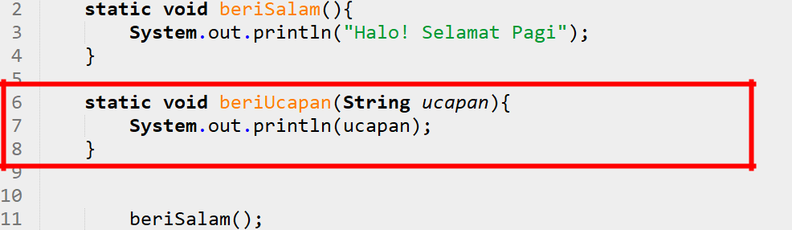

# JOBSHEET 13. Fungsi 1

## Tujuan
* Mahasiswa mampu memahami penggunaan fungsi static pada Java dengan parameter dan mengembalikan nilai.
* Mahasiswa mampu membuat program menggunakan fungsi static dan mengeksekusi fungsi tersebut.


## Alat dan Bahan
* PC/Laptop
* Browser
* Koneksi internet
* Anaconda3 + Java kernel (opsional)

## Praktikum

### Percobaan 1: Fungsi Void (tidak menggunakan return value)

1.	Buat fungsi **beriSalam** bertipe void yang digunakan untuk mencetak **“Halo! Selamat Pagi”**.


2. Eksekusi atau panggil fungsi **beriSalam**.


```Java
// Tuliskan kode program Percobaan 1 Langkah 1 & 2
static void beriSalam(){
    System.out.println("Halo! Selamat Pagi");
}
beriSalam();
```

    Halo! Selamat Pagi


3. Buat fungsi **beriUcapan** dengan sebuah parameter bertipe String.


4. Buatlah variabel **salam** bertipe String kemudian eksekusi atau panggil fungsi **beriUcapan** dengan mengisi parameternya dengan variable **salam** yang sudah dibuat.


```Java
// Tuliskan kode program Percobaan 1 Langkah 1, 2, 3 & 4
static void beriSalam(){
    System.out.println("Halo! Selamat Pagi");
}
static void beriUcapan(String ucapan){
    System.out.println(ucapan);
}
beriSalam();
String salam = "Selamat datang di pemrograman Java";
beriUcapan(salam);
```

    Halo! Selamat Pagi
    Selamat datang di pemrograman Java


#### Pertanyaan
1. Jelaskan perbedaan fungsi **beriSalam** dan **beriUcapan** pada praktikum 1!

perbedaan antara kedua fungsi tersebut adalah ada dan tidak adanya parameter pada fungsi. Fungsi beriSalam tidak berparameter, jadi untuk memanggilnya tidak perlu mengikutsertakan suatu value pada parameternya. Sebaliknya, Fungsi beriUcapan itu berparameter, harus mengikutsertakan value ketika memanggilnya

2. Jelaskan cara pemanggilan sebuah fungsi void yang berparameter dan tanpa parameter!

fungsi void yang berparameter harus mengikutsertakan value ketika dipanggil dan value itu harus memiliki tipe data yang sama dengan parameternya. Contoh static void fungsiHitung(int a, int b). Maka untuk memanggilnya harus fungsiHitung(3,2). Untuk fungsi void tanpa parameter, cukup dengan menuliskan nama fungsi itu secara lengkap. contoh static void fungsiSalam();, maka memanggilnya harus, fungsiSalam();

### Percobaan 2: Fungsi dengan return value (Bukan void)
Pada Percobaan 2, kode program yang dibuat digunakan untuk menghitung luas persegi dengan membuat fungsi **luasPersegi** yang menggunakan parameter.
1. Buat fungsi **luasPersegi**  untuk menghitung luas persegi yang mengembalikan nilai luas (int) dan parameter masukan sisi (int).


2.	Eksekusi atau panggil fungsi luasPersegi dengan cara membuat variabel baru yaitu **luasan**, kemudian isi variabel tersebut dengan memanggil fungsi luasPersegi dan mengisi parameter sisi. Selanjutnya cetak variabel luasan untuk menampilkan luas persegi panjang


```Java
// Tuliskan kode program Percobaan 2 Langkah 1 & 2
static int luasPersegi(int sisi){
    int luas = sisi * sisi;
    return luas;
}
int luasan = luasPersegi(5);
System.out.println("Luas Persegi dengan sisi 5 = " + luasan);
```

    Luas Persegi dengan sisi 5 = 25


#### Pertanyaan
1. jelaskan mengapa ketika memanggil fungsi **luasPersegi** harus membuat variabel baru yaitu luasan?

Karena hasil yang dikembalikan pada fungsi luasPersegi adalah integer, maka untuk menampung nilai itu, kita harus membuat suatu variabel yang bertipe data sama yaitu integer.

2. Jelaskan kegunaan **return luas** pada percobaan 2 diatas!

return luas digunakan untuk mengembalikan hasil pada suatu fungsi tersebut, maksudnya adalah jika kita panggil, maka yang akan muncul adalah apa yang direturn pada fungsi tersebut.

3. Modifikasilah program di percobaan 2, dengan membuat panjang **sisi** sebagai inputan!


```Java
// Tuliskan jawaban nomor 2
static int luasPersegi(int sisi){
    int luas = sisi * sisi;
    return luas;
}
Scanner in = new Scanner(System.in);
int a = in.nextInt();
int luasan = luasPersegi(a);
System.out.println("Luas Persegi dengan sisi "+ a + " = " + luasan);
```

    9
    Luas Persegi dengan sisi 9 = 81


### Percobaan 3: Fungsi dapat meng-CALL Fungsi Lain
Pada Percobaan 3, kode program yang dibuat digunakan untuk mengimplementasikan bahwa fungsi dapat meng-CALL fungsi yang lain. Dimana dalam percobaan ini terdapat fungsi **Kali dan Kurang**. 
1. Buatlah fungsi **Kali** yang mengembalikan nilai H (int) dan parameter masukan C dan D (int).


2.	Buatlah fungsi **Kurang** yang mengembalikan nilai X (int) dan parameter masukan A dan B (int) dan memanggil fungsi Kali.


3. Lakukan import class Scanner sebagai inputan di langkah selajutnya.

4. Eksekusi atau panggil fungsi **Kurang** .


```Java
// Tuliskan kode program Percobaan 3 Langkah 1, 2, 3 & 4
static int kali(int c,int d){
    int H = (c+10)%(d+19);
    return H;
}
static int kurang(int a,int b){
    a += 7;
    b += 4;
    int X = kali(a,b);
    return X;
}
int nilai1,nilai2;
Scanner input = new Scanner(System.in);
System.out.println("masukkan nilai 1:");
nilai1 = input.nextInt();
System.out.println("masukkan nilai 2:");
nilai2 = input.nextInt();
int hasil = kurang(nilai1,nilai2);
System.out.println("hasil akhir adalah " + hasil);
```

    masukkan nilai 1:
    9
    masukkan nilai 2:
    9
    hasil akhir adalah 26


#### Pertanyaan
1. Modifikasilah percobaan diatas dimana di fungsi **Kali** dapat memanggil fungsi **Kurang** kemudian eksekusi atau panggil fungsi Kali


```Java
// Tuliskan jawaban nomor 1
static int kali(int c,int d){
    int H = (c+10)%(d+19);
    int Y = kurang(c,d);
    return Y;
}
static int kurang(int a,int b){
    a += 7;
    b += 4;
    int X = a+b;
    return X;
}
int nilai1,nilai2;
Scanner input = new Scanner(System.in);
System.out.println("masukkan nilai 1:");
nilai1 = input.nextInt();
System.out.println("masukkan nilai 2:");
nilai2 = input.nextInt();
int hasil = kali(nilai1,nilai2);
System.out.println("hasil akhir adalah " + hasil);
```

    masukkan nilai 1:
    9
    masukkan nilai 2:
    9
    hasil akhir adalah 29


2. Jelaskan alur jalannya program di percobaan 3 mulai dari input sampai keluar output!

1. membuat fungsi int kali yang memiliki 2 parameter bertipe data int yang mereturn H. H adalah variabel bertipe data integer yang valuenya adalah operasi dari (c+10)%(d+19). 
2. membuat fungsi int kurang yang memiliki 2 parameter bertipe data int yang mereturn X. X adalah variabel bertipe data integer yang valuenya adalah fungsi kali(a,b). Maksudnya adalah, fungsi ini memanggil fungsi kali dengan mengisi parameter dengan variabel a dan variabel b yang didapatkan dari parameter fungsi kurang. value dari variabel a dan b juga telah ditambah nilainya dengan 7 untuk variabel a, 4 untuk variabel b.
3. langkah ke tiga adalah meng eksekusi fungsi kali,value parameter dari fungsi kali tersebut(int a, int b), diisi oleh value dari nilai1 dan nilai 2. lalu ditampung ke variabel hasil dan kemudian diprint

### Percobaan 4: Mengubah Program Tidak Menggunakan Fungsi dan Menggunakan Fungsi
Pada Percobaan 4, kode program yang dibuat digunakan untuk menghitung luas persegi panjang dan volume balok tanpa menggunakan fungsi dan dengan menggunakan fungsi.
1. Import dan deklarasikan Scanner dengan nama **input**


2. Buatlah inputan panjang, lebar, dan tinggi 


3. Hitung luas persegi panjang dan volume balok


```Java
// Tuliskan kode program Percobaan 4 Langkah 1, 2, & 3
import java.util.Scanner;

Scanner in = new Scanner(System.in);
int p,l,t,L,vol;

System.out.println("masukkan panjang");
p = in.nextInt();
System.out.println("masukkan lebar");
l = in.nextInt();
System.out.println("masukkan tinggi");
t = in.nextInt();

L = p*l;
System.out.println("Luas Persegi panjang adalah " + L);
vol = p*l*t;
System.out.println("Volume balok adalah " + vol);
```

    masukkan panjang
    3
    masukkan lebar
    4
    masukkan tinggi
    5
    Luas Persegi panjang adalah 12
    Volume balok adalah 60


4. Program menghitung luas persegi dan volume balok diatas jika dibuatkan fungsi maka terdapat 3 fungsi yaitu hitungLuas, hitungVolume dan fungsi main, seperti dibawah ini:

Fungsi hitungLuas


Fungsi hitungVolume


5. Eksekusi/panggil fungsi **hitungLuas** dan **hitungVolume**


```Java
// Tuliskan kode program Percobaan 4 Langkah 1, 2, & 3
import java.util.Scanner;

static int hitungLuas(int a, int b){
    int c = a*b;
    return c;
}
static int hitungVolume(int a, int b,int c){
    int d = hitungLuas(a,b)*c;
    return d;
}
Scanner in = new Scanner(System.in);
int p,l,t,L,vol;

System.out.println("masukkan panjang");
p = in.nextInt();
System.out.println("masukkan lebar");
l = in.nextInt();
System.out.println("masukkan tinggi");
t = in.nextInt();

L = hitungLuas(p,l);
System.out.println("Luas Persegi panjang adalah " + L);
vol = hitungVolume(p,l,t);
System.out.println("Volume balok adalah " + vol);

```

    masukkan panjang
    3
    masukkan lebar
    4
    masukkan tinggi
    5
    Luas Persegi panjang adalah 12
    Volume balok adalah 60


#### Pertanyaan
1. Jelaskan kegunaan parameter yang terdapat didalam fungsi hitungLuas dan hitungVolume!

2. Setelah melakukan percobaan 4, menurut anda manakah program yg lebih efisien apakah menggunakan fungsi atau tanpa fungsi? Jelaskan!

### Percobaan 5: Fungsi Menggunakan Array dan Variabel Global
Pada Percobaan 5, kode program yang dibuat digunakan untuk menghitung total nilai yang ada didalam array dengan membuat 3 fungsi yaitu isiarray, hitTol, dan tampilArray.
1. Buatlah **variable global total dan i** bertipe int


2. Buatlah fungsi **isiarray** bertipe int dengan parameter angka bertipe int 


3. Buatlah fungsi **tampilArray** bertipe **void** dengan parameter data array **arr** bertipe int


4. Buatlah fungsi **hitTot** bertipe int dengan parameter data array **arr** bertipe int


5. Import dan deklarasikan Scanner dengan nama **input**


6. Eksekusi atau panggil ketiga fungsi yaitu **isiarray, tampilArray, dan hitTot**, kemudian jalankan program!


```Java
// Tuliskan kode program Percobaan 4 Langkah 1 s/d 6
static int total=0,i;
static int [] isiArray(int angka){
    Scanner in = new Scanner(System.in);
    int array[]=new int[angka];
    for(int i = 0;i<array.length;i++){
        System.out.println("Masukkan data ke- " + i);
        array[i] = in.nextInt();
    }
    return array;
}
static void tampilArray(int [] arr){
    for(int i = 0; i<arr.length;i++){
        System.out.println("Nilai yang ada inputkan ke " +i);
        System.out.println(arr[i]);
    }
}
static int hitTot(int arr[]){
    for(int i =0; i<arr.length;i++){
        total += arr[i];
    }
    return total;
}
import java.util.Scanner;
Scanner in = new Scanner(System.in);
System.out.println("Masukkan jumlah data yang anda inginkan");
int jum = in.nextInt();
int [] dataArray = isiArray(jum);
tampilArray(dataArray);
total= hitTot(dataArray);
System.out.println("Total nilai = " + total);
```

    Masukkan jumlah data yang anda inginkan
    6
    Masukkan data ke- 0
    1
    Masukkan data ke- 1
    2
    Masukkan data ke- 2
    3
    Masukkan data ke- 3
    4
    Masukkan data ke- 4
    5
    Masukkan data ke- 5
    6
    Nilai yang ada inputkan ke 0
    1
    Nilai yang ada inputkan ke 1
    2
    Nilai yang ada inputkan ke 2
    3
    Nilai yang ada inputkan ke 3
    4
    Nilai yang ada inputkan ke 4
    5
    Nilai yang ada inputkan ke 5
    6
    Total nilai = 21


#### Pertanyaan
1. Jelaskan mengapa fungsi tampil array dibuat bertipe void, sedangkan isiarray dan hitTot bertipe int!

karena tujuan dari pembuatan fungsi tampilArray adalah untuk mencetak suatu vartiabel, hal ini hanya bisa dilakukan jika kita membuat fungsi bertipe void. sedangkan fungsi isiArray dan hitTot bertipe int bertujuan untuk mengembalikan suatu nilai bertipe data int.

2. Menurut pendapat anda apakah fugsi isiarray dan hitTot dapat diganti dengan tipe void? Jelaskan dan buktikan dengan program!

tidak bisa, karena tipe void tidak dapat mengembalikan suatu variabel ketika dipanggil


```Java
// Tuliskan jawaban nomor 2
static int total=0,i;
static void [] isiArray(int angka){
    Scanner in = new Scanner(System.in);
    int array[]=new int[angka];
    for(int i = 0;i<array.length;i++){
        System.out.println("Masukkan data ke- " + i);
        array[i] = in.nextInt();
    }
    return array;
}
static void tampilArray(int [] arr){
    for(int i = 0; i<arr.length;i++){
        System.out.println("Nilai yang ada inputkan ke " +i);
        System.out.println(arr[i]);
    }
}
static void hitTot(int arr[]){
    for(int i =0; i<arr.length;i++){
        total += arr[i];
    }
    return total;
}
import java.util.Scanner;
Scanner in = new Scanner(System.in);
System.out.println("Masukkan jumlah data yang anda inginkan");
int jum = in.nextInt();
int [] dataArray = isiArray(jum);
tampilArray(dataArray);
total= hitTot(dataArray);
System.out.println("Total nilai = " + total);
```


    |   static void [] isiArray(int angka){

    illegal start of expression

    

    |   static void [] isiArray(int angka){

    ';' expected

    

    |   static void [] isiArray(int angka){

    '.class' expected

    

    |   static void [] isiArray(int angka){

    ';' expected

    

    |   static void [] isiArray(int angka){

    unexpected type

      required: value

      found:    class

    

    |       int array[]=new int[angka];

    cannot find symbol

      symbol:   variable angka

    


## Tugas

1. Buatlah sebuah static method yang bernama Max3(int bil1, int bil2, int bil3) yang menerima 3 buah parameter bilangan integer dan mengembalikan sebuah bilangan integer yang merupakan nilai maksimum diantara ketiga bilangan tersebut. 


```Java
// Tuliskan jawaban nomor 1
static int Max3(int a, int b, int c){
    int x =0;
    if(a >b && a>c){
        x = a;
    }
    if(b >a && b>c){
        x = b;
    } 
    if(c >b && c>a){
        x = c;
    }
    return x;
}
import java.util.Scanner;
Scanner in = new Scanner(System.in);
System.out.print("nilai x ");
int x = in.nextInt();
System.out.print("nilai y ");
int y = in.nextInt();
System.out.print("nilai z ");
int z = in.nextInt();
System.out.print("bilangan maximum dari ketiga bilangan tersebut adalah ");
System.out.println(Max3(x,y,z));

```

    nilai x 66
    nilai y 78
    nilai z 12
    bilangan maximum dari ketiga bilangan tersebut adalah 78

Penjelasan
untuk mencari bilangan yang terbesar dengan fungsi, maka kita harus membuat program dalam fungsi yang bisa menyeleksi setiap bilangan yang diinputkan. Cara kerjanya sederhana, yaitu, menyeleksi apakah 1 bilangan itu lebih besar dari yang lain, jika iya, maka bilangan itulah yang terbesar. lalu jika sudah menyeleksi bilangan yang terbesar, kita masukkan bilangan terbesar itu pada variabel sehingga kita bisa mengembalikan bilangan terbesar tersebut melalui variabel yaitu "x". Setelah itu kita tinggal membuat program(di luar fungsi tersebut) yang dapat menampung inputtan user, inputtan itu disimpan dalam variabel. Kemudian kita hanya perlu mencetak fungsi yang telah kita buat di awal dengan parameter berupa variabel yang menampung inputan user.


2. Disebuah restoran terdapat 3 menu yang dijual yaitu nasi goreng, soto, dan sate. Harga nasi goreng Rp. 20.000, soto Rp. 15.000, dan sate Rp. 25.000. Restoran tersebut buka dari hari senin sampai jumat. Berikut ini merupakan tabel pejualan perhari untuk masing-masing menu di restoran tersebut dari hari senin sampai jumat


Buatlah Fungsi sebagai berikut:
 * Fungsi menampilkan menu favorit di hari selasa dan jumat (menu favorit diasumsikan adalah menu yang paling banyak terjual di hari tersebut)
 * Fungsi untuk menghitung pemasukan restoran tersebut mulai hari senin sampai jumat.
 * Fungsi untuk menghitung berapa porsi yang terjual untuk masing-masing menu yaitu nasi goreng, soto, dan sate mulai senin sampai jumat.


```Java
// Tuliskan jawaban nomor 2
static void menuFavorit(int a[][],String hari [],String menu[]){
    int indexMax =-1;
    int nMax = 0;
    for(int i = 0;i < a[0].length;i++){
        indexMax = 0;
        nMax = a[0][i];
        for(int j =0;j<a.length;j++){
            if (a[j][i] > nMax){
                indexMax = j;
                nMax = a[j][i];
            }
        }
        System.out.println("menu favorit pada hari " + hari[i] +" adalah " + menu[indexMax]);
    }
}
static int pemasukkan(int a[][]){
    int penghasilan[] = new int[a[0].length];
    int penghasilanMenu = 0;
    int penghasilanPerHari = 0;
    int penghasilanTotal = 0;
    for (int i = 0; i<a[0].length;i++){
        penghasilan[i] =0;
        penghasilanPerHari = 0;
        for(int j =0;j<a.length;j++){
            if (j == 0){
                penghasilanMenu = a[j][i]*20000;
            }else if(j == 1){
                penghasilanMenu = a[j][i]*15000;
            }else{
                penghasilanMenu = a[j][i]*25000;
            }
            penghasilanPerHari += penghasilanMenu;
        }
        penghasilan[i] = penghasilanPerHari;
        penghasilanTotal += penghasilan[i];

    }
    return penghasilanTotal;
}
static int [] totalPorsi(int a[][]){
    int totalPorsiHari[] = new int[a.length];
    for (int i = 0; i<a.length;i++){
        int totalPorsiMenu = 0;
        for (int j = 0;j<a[0].length;j++){
            totalPorsiMenu += a[i][j];
        }
        totalPorsiHari[i] = totalPorsiMenu;
    }
    return  totalPorsiHari;
}
int porsiHari[][] = {{20,15,35,24,70}, {30,40,10,28,35}, {5,10,50,48,15}};
String menu[] = {"Nasi goreng","Soto","Sate"};
String hari[] = {"Senin","Selasa","Rabu","Kamis","Jumat"};
menuFavorit(porsiHari,hari,menu);

System.out.println("");

int []dataArray = pemasukkan(porsiHari);
for (int i = 0;i < dataArray.length;i++){
    System.out.println("Penghasilan pada hari " + hari[i] + " adalah " + dataArray[i] + " rupiah");
}

System.out.println("");

int []dataPorsi = totalPorsi(porsiHari);
for (int i = 0;i <dataPorsi.length;i++){
    System.out.println("Total porsi terjual dari menu "+ menu[i] + " adalah " + dataPorsi[i]);
}

```
    menu favorit pada hari Senin adalah Soto
    menu favorit pada hari Selasa adalah Soto
    menu favorit pada hari Rabu adalah Sate
    menu favorit pada hari Kamis adalah Sate
    menu favorit pada hari Jumat adalah Nasi goreng

    Pemasukkan total mulai dari Senin hingga jumat adalah 8625000 rupiah

    Total porsi terjual dari menu Nasi goreng adalah 164
    Total porsi terjual dari menu Soto adalah 143
    Total porsi terjual dari menu Sate adalah 128

Process finished with exit code 0


Penjelasan

1. Membuat array 2 dimensi bertipe integer yang akan berisi jumlah porsi seperti yang tertera pada tabel
2. membuat 2 array 1 dimensi bertipe string yang dapat menampung nama menu, dan nama hari
3. Membuat fungsi void dengan parameter 1 array 2 dimensi bertipe int, dan 2 array 1 dimensi bertipe string, agar semua value pada array - array yang telah kita buat dapat kita ikut sertakan pada fungsi. Dalam Fungsi tersebut terdapat perulangan untuk mencari nilai terbesar pada setiap baris, lalu ketika sudah diketahui nilai terbesar pada baris itu, kita bisa mencari menu apa yang memiliki nilai terbesar pada hari itu dengan cara menginputkan posisi [j] pada suatu variabel yaitu indexMax lalu ketika variabel telah terisi oleh value dari j, maka kita hanya perlu untuk meletakkan variabel tersebut pada array menu[], sehingga jadi seperti ini menu[indexMax]. Karena array menu memiliki anggota yang merupakan string dari menu pada tabel, maka ketika kita mencetak array menu pada posisi tertentu, yang tercetak adalah menu pada posisi tersebut.
4. Membuat fungsi int dengan parameter array2 Dimensi. Untuk menghitung pemasukkan restaurant tersebut selama 5 hari, maka kita harus membuat fungsi yang dapat mengembalikan nilai int. Dalam fungsi tersebut, kita harus membuat program yang dapat mengambil nilai dari setiap kolom yang ada pada tabel, kemudian membuat program kondisi yang dapat menyeleksi, apakah itu terletak pada baris 1,2, atau 3. jika value tabel tersebut berada pada baris 1, maka value itu dikali 20.000, pada baris 2 dikali 15.000, dan pada baris 3 dikali 25.00. Setelah program mengkali setiap value pada tabel pada kolom tersebut, maka value akan ditambah lalu disimpan pada variabel. Proses itu terus berulang hingga loop sudah tidak memenuhi kondisi. Setelah membuat fungsi, untuk memanggilnya, kita hanya perlu mencetak fungsi tersebut dengan cara menulis kode untuk mencetak yang berisi fungsi terseubt, fungsi tersebut diisi parameter array porsi hari agar datanya bisa dihitung pada fungsi pemasukkan tersebut.
5. Membuat Fungsi int dengan parameter array 2 Dimensi. Untuk membuat fungsi yang dapat menghitung total porsi yang terjual selama 5 hari tersebut,kita harus membuat fungsi int array 1 dimensi dengan parameter array 2Dimensi(data yang akan dihitung) agar dapat mengembalikan nilai berupa array 1 dimensi. Dalam fungsi tersebut kita membuat program untuk mengambil data pada array 2 dimensi tersebut per baris. Tentu saja hal ini membutuhkan perulangan bersarang. Cara kerjanya adalah, kita membuat variabel untuk menampung hasil dari data yang akan ditambah, dan array 1 dimensi untuk menampung value dari variabel tersebut. Setiap melakukan perulangan, variabel tersebut ditambah dengan data yang didapat pada baris tersebut. Hal ini terus berulang hingga kolom pada baris itu habis. Setelah itu, nilai variabel dimasukkan ke dalam array 1 dimensi kemudian value dalam variabel itu di 0 kan agar penghitungan porsi pada menu berikutnya start dari 0. Hal ini terus berulang hingga baris pada kolom selesai. Setelah membuat fungsi, cara untuk mencetaknya adalah dengan membuat array 1 dimensi bertipe data int yang valuenya adalah fungsi yang kita buat sebelumnya, parameter dari fungsi tersebut adalah porsihari.Lalu kita menggunakan perulangan untuk mencetak setiap value dari array tersebut. Dalam perulangan itu kita mencetak setiap value dari array 1 dimensi yang telah kita buat.
