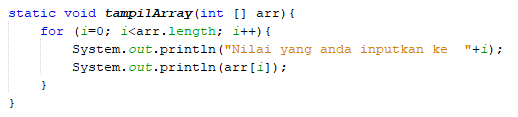

# JOBSHEET 13. Fungsi 1

## Tujuan
* Mahasiswa mampu memahami penggunaan fungsi static pada Java dengan parameter dan mengembalikan nilai.
* Mahasiswa mampu membuat program menggunakan fungsi static dan mengeksekusi fungsi tersebut.


## Alat dan Bahan
* PC/Laptop
* Browser
* Koneksi internet
* Anaconda3 + Java kernel (opsional)

## Praktikum

### Percobaan 1: Fungsi Void (tidak menggunakan return value)

1.	Buat fungsi **beriSalam** bertipe void yang digunakan untuk mencetak **“Halo! Selamat Pagi”**.


2. Eksekusi atau panggil fungsi **beriSalam**.


```Java
static void beriSalam(){
    System.out.println("Halo! Selamat Pagi");
}
beriSalam();
```

    Halo! Selamat Pagi


3. Buat fungsi **beriUcapan** dengan sebuah parameter bertipe String.


4. Buatlah variabel **salam** bertipe String kemudian eksekusi atau panggil fungsi **beriUcapan** dengan mengisi parameternya dengan variable **salam** yang sudah dibuat.


```Java
static void beriSalam(){
    System.out.println("Halo! Selamat Pagi");
}

static void beriUcapan(String ucapan){
    System.out.println(ucapan);
}


    beriSalam();
    String salam = "Selamat datang di pemrograman Java";
    beriUcapan(salam);
```

    Halo! Selamat Pagi
    Selamat datang di pemrograman Java


> Penjelasan Percobaan 1 : Kode program di atas menggunakan 2 fungsi void, yaitu fungsi void berparameter dan fungsi void tanpa parameter. Pada fungsi void tanpa parameter berisi perintah untuk menge-print "Halo! Selamat Pagi", sedangkan pada fungsi void berparameter berisi perintah untuk menge-print variabel salam bertipe data String yang berisi "Selamat datang di pemrograman Java".

#### Pertanyaan
1. Jelaskan perbedaan fungsi **beriSalam** dan **beriUcapan** pada praktikum 1!

> Fungsi **beriSalam** merupakan fungsi void tanpa parameter. Sedangkan fungsi **beriUcapan** merupakan fungsi void berparameter. Parameter sendiri adalah variabel yang menampung nilai untuk diproses di dalam fungsi.

2. Jelaskan cara pemanggilan sebuah fungsi void yang berparameter dan tanpa parameter!

> Cara pemanggilan sebuah fungsi void yang berparameter adalah dengan cara mengetik nama fungsinya lalu diberi parenthesis(...). Di dalam parenthesis (...) tersebut diketikkan nama variabel yang telah dideklarasikan. Sedangkan pada pemanggilan sebuah fungsi void tanpa parameter, bisa dengan cara mengetik nama fungsi yang ingin dipanggil diikuti parenthesis (...) saja tanpa ada isinya (variabel di dalam parenthesis).

### Percobaan 2: Fungsi dengan return value (Bukan void)
Pada Percobaan 2, kode program yang dibuat digunakan untuk menghitung luas persegi dengan membuat fungsi **luasPersegi** yang menggunakan parameter.
1. Buat fungsi **luasPersegi**  untuk menghitung luas persegi yang mengembalikan nilai luas (int) dan parameter masukan sisi (int).


2.	Eksekusi atau panggil fungsi luasPersegi dengan cara membuat variabel baru yaitu **luasan**, kemudian isi variabel tersebut dengan memanggil fungsi luasPersegi dan mengisi parameter sisi. Selanjutnya cetak variabel luasan untuk menampilkan luas persegi panjang


```Java
static int luasPersegi(int sisi){
    int luas = sisi * sisi;
    return luas;
}


    int luasan = luasPersegi(5);
    System.out.println("Luas Persegi dengan sisi 5 = " + luasan);
```

    Luas Persegi dengan sisi 5 = 25


> Penjelasan Percobaan 2 : Kode program di atas menggunakan fungsi berparameter. Lalu, nilai dari variabel luas akan dikembalikan menjadi nilai fungsi luasPersegi. Kemudian, membuat variabel baru untuk memanggil fungsi tersebut dan variabel sisi diberi nilai 5, dan terakhir akan diprint-kan hasilnya.

#### Pertanyaan
1. Jelaskan mengapa ketika memanggil fungsi **luasPersegi** harus membuat variabel baru yaitu luasan?

> Agar nilai dari fungsi luasPersegi dapat ditampung di variabel luasan.

2. Jelaskan kegunaan **return luas** pada percobaan 2 diatas!

> return luas berfungsi untuk mengembalikan nilai dari variabel luas ke fungsi itu sendiri. Dengan kata lain, nilai dari variabel luas akan menjadi nilai dari fungsi luasPersegi.

3. Modifikasilah program di percobaan 2, dengan membuat panjang **sisi** sebagai inputan!


```Java
import java.util.Scanner;
static int luasPersegi(int sisi){
    int luas = sisi * sisi;
    return luas;
}

    Scanner sc = new Scanner(System.in);
    System.out.print("Masukkan panjang sisi persegi : ");
    int sisi = sc.nextInt();

    int luasan = luasPersegi(sisi);
    System.out.println("Luas Persegi dengan sisi " + sisi + " = "+ luasan);
```

    Masukkan panjang sisi persegi : 4
    Luas Persegi dengan sisi 4 = 16


> Penjelasan : Modifikasinya adalah dengan memasukkan scanner. Lalu, sebelum program menjalankan perkalian untuk mencari luas persegi, program akan minta inputan dari user terlebih dahulu untuk memberi panjang sisi persegi. Kemudian, variabel sisi akan menggantikan 5 sebagai parameter.

### Percobaan 3: Fungsi dapat meng-CALL Fungsi Lain
Pada Percobaan 3, kode program yang dibuat digunakan untuk mengimplementasikan bahwa fungsi dapat meng-CALL fungsi yang lain. Dimana dalam percobaan ini terdapat fungsi **Kali dan Kurang**. 
1. Buatlah fungsi **Kali** yang mengembalikan nilai H (int) dan parameter masukan C dan D (int).


2.	Buatlah fungsi **Kurang** yang mengembalikan nilai X (int) dan parameter masukan A dan B (int) dan memanggil fungsi Kali.


3. Lakukan import class Scanner sebagai inputan di langkah selajutnya.

4. Eksekusi atau panggil fungsi **Kurang** .


```Java
import java.util.Scanner;
static int Kali(int C, int D){
    int H;
    H = (C + 10) % (D + 19);
    return H;
}

static int Kurang(int A, int B){
    int X;
    A = A + 7;
    B = B + 4;
    X = Kali(A, B);
    return X;
}

int nilai1, nilai2;
Scanner input = new Scanner(System.in);
System.out.println("Masukkan Nilai 1 : ");
nilai1 = input.nextInt();
System.out.println("Masukkan Nilai 2 : ");
nilai2 = input.nextInt();
int hasil = Kurang(nilai1, nilai2);
System.out.println("Hasil akhir adalah " + hasil);
```

    Masukkan Nilai 1 : 
    2
    Masukkan Nilai 2 : 
    3
    Hasil akhir adalah 19


#### Pertanyaan
1. Modifikasilah percobaan diatas dimana di fungsi **Kali** dapat memanggil fungsi **Kurang** kemudian eksekusi atau panggil fungsi Kali


```Java
static int Kali(int C, int D) {
    int H;
    H = Kurang((C + 10), (D + 19));
    return H;
}
static int Kurang(int A, int B) {
    int X;
    A = A + 7;
    B = B + 4;
    X = A + B;
    return X;
}
import java.util.Scanner;
int nilai1, nilai2;
Scanner input = new Scanner(System.in);
System.out.println("Masukkan nilai 1 : ");
nilai1 = input.nextInt();
System.out.println("Masukkan nilai 2 : ");
nilai2 = input.nextInt();
int hasil = Kali(nilai1, nilai2);
System.out.println("Hasil akhir adalah " + hasil);
```

    Masukkan nilai 1 :
    2
    Masukkan nilai 2 :
    3
    Hasil akhir adalah 45


> Penjelasan Nomor 1 : Pada kode program di atas, user akan diminta menginputkan nilai1 dan nilai2. Lalu, nilai-nilai ini akan masuk ke fungsi Kali. Kemudian pada fungsi Kali, nilai ini akan diproses dengan operasi yang ada di fungsi Kali. Selanjutnya pada H = Kurang((C + 10), (D + 19)), nilai tersebut akan masuk ke fungsi Kurang. Lalu pada fungsi Kurang, nilai-nilai tersebut diproses kembali sampai di-return. Kemudian setelah mendapat hasil dari proses operasi itu, fungsi Kurang akan mendapatkan nilainya dan dimasukkan kembali ke nilai H pada fungsi Kali. Setelah itu di-return kembali ke fungsi Kali sehingga fungsi tersebut mendapatkan nilainya yang disamadengankan dengan variabel hasil. Terakhir, hasil akan di-printkan di akhir program.

2. Jelaskan alur jalannya program di percobaan 3 mulai dari input sampai keluar output!

> Pada kode program percobaan 3, user akan diminta menginputkan nilai1 dan nilai2. Lalu, nilai-nilai ini akan masuk ke fungsi Kurang. Kemudian pada fungsi kurang, nilai ini akan diproses dengan operasi yang ada di fungsi Kurang. Selanjutnya pada X = Kali(A, B), nilai tersebut akan masuk ke fungsi Kali. Lalu pada fungsi Kali, nilai-nilai tersebut diproses kembali sampai di-return. Kemudian setelah mendapat hasil dari proses operasi itu, fungsi Kali akan mendapatkan nilainya dan dimasukkan kembali ke nilai X pada fungsi Kurang. Setelah itu di-return kembali ke fungsi Kurang sehingga fungsi tersebut mendapatkan nilainya yang disamadengankan dengan variabel hasil. Terakhir, hasil akan di-printkan di akhir program.

### Percobaan 4: Mengubah Program Tidak Menggunakan Fungsi dan Menggunakan Fungsi
Pada Percobaan 4, kode program yang dibuat digunakan untuk menghitung luas persegi panjang dan volume balok tanpa menggunakan fungsi dan dengan menggunakan fungsi.
1. Import dan deklarasikan Scanner dengan nama **input**


2. Buatlah inputan panjang, lebar, dan tinggi 


3. Hitung luas persegi panjang dan volume balok


```Java
import java.util.Scanner;
Scanner input = new Scanner(System.in);
int p,l,t,L,vol;

System.out.println("Masukkan panjang");
p = input.nextInt();
System.out.println("Masukkan lebar");
l = input.nextInt();
System.out.println("Masukkan tinggi");
t = input.nextInt();

L = p*l;
System.out.println("Luas Persegi panjang adalah " + L);

vol = p*l*t;
System.out.println("Volume balok adalah " + vol);
```

    Masukkan panjang
    4
    Masukkan lebar
    5
    Masukkan tinggi
    6
    Luas Persegi panjang adalah 20
    Volume balok adalah 120


4. Program menghitung luas persegi dan volume balok diatas jika dibuatkan fungsi maka terdapat 3 fungsi yaitu hitungLuas, hitungVolume dan fungsi main, seperti dibawah ini:

Fungsi hitungLuas


Fungsi hitungVolume


5. Eksekusi/panggil fungsi **hitungLuas** dan **hitungVolume**


```Java
static int hitungLuas(int pjg, int lb){
    int Luas = pjg*lb;
    return Luas;
}
static int hitungVolume(int tinggi, int a, int b){
    int volume = hitungLuas(a,b)*tinggi;
    return volume;
}
Scanner input = new Scanner(System.in);
int p,l,t,L,vol;
System.out.println("Masukkan panjang");
p = input.nextInt();
System.out.println("Masukkan lebar");
l = input.nextInt();
System.out.println("Masukkan tinggi");
t = input.nextInt();

L = hitungLuas(p,l);
System.out.println("Luas Persegi Panjang adalah " + L);
vol = hitungVolume(t,p,l);
System.out.println("Volume Balok adalah " + vol);
```

    Masukkan panjang
    12
    Masukkan lebar
    2
    Masukkan tinggi
    4
    Luas Persegi Panjang adalah 24
    Volume Balok adalah 96


> Penjelasan Percobaan 4 : Kode program tersebut ada 2, yaitu kode program menghitung luas persegi dan volume balok menggunakan fungsi dan yang tidak menggunakan fungsi. Di awal program, user akan diminta panjang dari panjang persegi, lebar persegi panjang, dan tinggi persegi panjang. Lalu untuk mencari luas persegi panjang, panjang dan lebar akan dikalikan, sedangkan untuk mencari volume balok, ketiga inputan tersebut akan dikalikan.

#### Pertanyaan
1. Jelaskan kegunaan parameter yang terdapat didalam fungsi hitungLuas dan hitungVolume!

> Kegunaan parameter tersebut adalah untuk menampung sementara nilai dari variabel yang diinputkan. Kemudian, akan diproses di dalam fungsi tersebut.

2. Setelah melakukan percobaan 4, menurut anda manakah program yg lebih efisien apakah menggunakan fungsi atau tanpa fungsi? Jelaskan!

> Menurut saya, program yang lebih efisien adalah program yang tidak menggunakan fungsi. Karena program hanya menghitung luas dan volume dari suatu bangun, yaitu dengan cara mengkalikan inputan dari user.

### Percobaan 5: Fungsi Menggunakan Array dan Variabel Global
Pada Percobaan 5, kode program yang dibuat digunakan untuk menghitung total nilai yang ada didalam array dengan membuat 3 fungsi yaitu isiarray, hitTol, dan tampilArray.
1. Buatlah **variable global total dan i** bertipe int


2. Buatlah fungsi **isiarray** bertipe int dengan parameter angka bertipe int 


3. Buatlah fungsi **tampilArray** bertipe **void** dengan parameter data array **arr** bertipe int



4. Buatlah fungsi **hitTot** bertipe int dengan parameter data array **arr** bertipe int


5. Import dan deklarasikan Scanner dengan nama **input**


6. Eksekusi atau panggil ketiga fungsi yaitu **isiarray, tampilArray, dan hitTot**, kemudian jalankan program!


```Java
static int total=0,i;

static int [] isiArray (int angka){
    Scanner input = new Scanner(System.in);
    int array[] = new int[angka];
    for(int i = 0; i < array.length; i++){
        System.out.println("Masukkan data ke- " + i);
        array[i] = input.nextInt();
    }
    return array;
}
static void tampilArray(int [] arr){
    for(int i = 0; i < arr.length; i++){
        System.out.println("Nilai yang Anda inputkan ke " + i);
        System.out.println(arr[i]);
    }
}
static int hitTot(int []arr){
    for(int i = 0; i < arr.length; i++){
        total+=arr[i];
    }
    return total;
}
import java.util.Scanner;
Scanner input = new Scanner(System.in);

System.out.println("Masukkan jumlah data yang ingin Anda inputkan : ");
int jum = input.nextInt();
int []dataArray = isiArray(jum);
tampilArray(dataArray);
total = hitTot(dataArray);
System.out.println("Total nilai = " + total);
```

    Masukkan jumlah data yang ingin Anda inputkan : 
    3
    Masukkan data ke- 0
    1
    Masukkan data ke- 1
    2
    Masukkan data ke- 2
    3
    Nilai yang Anda inputkan ke 0
    1
    Nilai yang Anda inputkan ke 1
    2
    Nilai yang Anda inputkan ke 2
    3
    Total nilai = 6


> Penjelasan Percobaan 5 : Kode program di atas akan meminta inputan dari user jumlah data yang ingin diinputkan. Inputan ini akan menjadi panjang array kode di atas. Kemudian, user akan diminta inputan sebanyak inputan sebelumnya (panjang array). Setelah user menginputkan data-data tersebut, akan ditampilkan data-data yang telah diinputkan. Dan terakhir, program akan menampilkan penjumlahan data atau nilai yang telah diinputkan user.

#### Pertanyaan
1. Jelaskan mengapa fungsi tampil array dibuat bertipe void, sedangkan isiarray dan hitTot bertipe int!

> Karena fungsi tampilArray tidak memerlukan pengembalian nilai atau return. Sedangkan fungsi isiArray dan hitTot memerlukan return.

2. Menurut pendapat anda apakah fugsi isiarray dan hitTot dapat diganti dengan tipe void? Jelaskan dan buktikan dengan program!


```Java
static int total=0,i;

static void [] isiArray (int angka){
    Scanner input = new Scanner(System.in);
    int array[] = new int[angka];
    for(int i = 0; i < array.length; i++){
        System.out.println("Masukkan data ke- " + i);
        array[i] = input.nextInt();
    }
    return array;
}
static void tampilArray(int [] arr){
    for(int i = 0; i < arr.length; i++){
        System.out.println("Nilai yang Anda inputkan ke " + i);
        System.out.println(arr[i]);
    }
}
static void hitTot(int []arr){
    for(int i = 0; i < arr.length; i++){
        total+=arr[i];
    }
    return total;
}
import java.util.Scanner;
Scanner input = new Scanner(System.in);

System.out.println("Masukkan jumlah data yang ingin Anda inputkan : ");
int jum = input.nextInt();
int []dataArray = isiArray(jum);
tampilArray(dataArray);
total = hitTot(dataArray);
System.out.println("Total nilai = " + total);
```


    |   static void [] isiArray (int angka){

    illegal start of expression

    

    |   static void [] isiArray (int angka){

    ';' expected

    

    |   static void [] isiArray (int angka){

    '.class' expected

    

    |   static void [] isiArray (int angka){

    ';' expected

    

    |   static void [] isiArray (int angka){

    unexpected type

      required: value

      found:    class

    

    |       int array[] = new int[angka];

    cannot find symbol

      symbol:   variable angka

    


> Penjelasan Nomor 2 : Tidak bisa, akan terjadi error. Karena untuk menampilkan fungsi void tidak memerlukan return atau pengembalian nilai.

## Tugas

1. Buatlah sebuah static method yang bernama Max3(int bil1, int bil2, int bil3) yang menerima 3 buah parameter bilangan integer dan mengembalikan sebuah bilangan integer yang merupakan nilai maksimum diantara ketiga bilangan tersebut. 


```Java
static int Max3(int bil1, int bil2, int bil3){
    int max[] = {bil1, bil2, bil3};
    int maksimum = 0;
    for(int i = 0; i < max.length; i++){
        if(max[i] > maksimum){
            maksimum = max[i];
        }
    }
    return maksimum;
}
Scanner in = new Scanner(System.in);
System.out.print("Masukkan nilai pertama\t: ");
int nilai1 = in.nextInt();
System.out.print("Masukkan nilai kedua\t: ");
int nilai2 = in.nextInt();
System.out.print("Masukkan nilai ketiga\t: ");
int nilai3 = in.nextInt();
System.out.print("Nilai maksimum dari ketiga nilai tersebut adalah: " + Max3(nilai1, nilai2, nilai3));
```

    Masukkan nilai pertama	: 4
    Masukkan nilai kedua	: 6
    Masukkan nilai ketiga	: 2
    Nilai maksimum dari ketiga nilai tersebut adalah: 6


> Penjelasan : Kode program di atas, akan memninta user menginputkan angka random sebanyak 3 angka. Kemudian, program akan otomatis mencari nilai tertinggi dari ketiga inputan user tersebut, yaitu dengan menggunakan fungsi dan perulangan lalu mengganti nilai variabel maksimum apabila terdapat nilai yang lebih tinggi. Terakhir, menge-print nilai tertinggi tersebut.

2. Disebuah restoran terdapat 3 menu yang dijual yaitu nasi goreng, soto, dan sate. Harga nasi goreng Rp. 20.000, soto Rp. 15.000, dan sate Rp. 25.000. Restoran tersebut buka dari hari senin sampai jumat. Berikut ini merupakan tabel pejualan perhari untuk masing-masing menu di restoran tersebut dari hari senin sampai jumat


Buatlah Fungsi sebagai berikut:
 * Fungsi menampilkan menu favorit di hari selasa dan jumat (menu favorit diasumsikan adalah menu yang paling banyak terjual di hari tersebut)
 * Fungsi untuk menghitung pemasukan restoran tersebut mulai hari senin sampai jumat.
 * Fungsi untuk menghitung berapa porsi yang terjual untuk masing-masing menu yaitu nasi goreng, soto, dan sate mulai senin sampai jumat.


```Java
static int makanan[][] = { { 20, 15, 35, 24, 70 }, { 30, 40, 10, 28, 35 }, { 5, 10, 50, 48, 15 } };
    static void favorit(){
        int max = 0, indeksTertinggi = 0;
        for(int i = 0; i < makanan.length; i++){
            if(makanan[i][1] > max){
                max = makanan[i][1];
                indeksTertinggi = i;
            }
        }
        switch(indeksTertinggi){
        case 0:
            System.out.println("Menu favorit pada hari Selasa adalah Nasi Goreng");
            break;
        case 1:
            System.out.println("Menu favorit pada hari Selasa adalah Soto");
            break;
        case 2:
            System.out.println("Menu favorit pada hari Selasa adalah Sate");
            break;
        default:
            break;
        }
        max = 0;
        for(int i = 0; i < makanan.length; i++){
            if(makanan[i][4] > max){
                max = makanan[i][4];
                indeksTertinggi = i;
            }
        }
        switch (indeksTertinggi) {
        case 0:
            System.out.println("Menu favorit pada hari Jumat adalah Nasi Goreng");
            break;
        case 1:
            System.out.println("Menu favorit pada hari Jumat adalah Soto");
            break;
        case 2:
            System.out.println("Menu favorit pada hari Jumat adalah Sate");
            break;
        default:
            break;
        }
    }

    static int pemasukan(){
        int nasgor = 20000, soto = 15000, sate = 25000;
        int jumlahNasgor = 0, jumlahSoto = 0, jumlahSate = 0;
        for(int i = 0; i < makanan[0].length; i++){
            jumlahNasgor += makanan[0][i];
            jumlahSoto += makanan[1][i];
            jumlahSate += makanan[2][i];
        }
        jumlahNasgor *= nasgor;
        jumlahSate *= sate;
        jumlahSoto *= soto;

        int jumlah = jumlahNasgor + jumlahSate + jumlahSoto;
        return jumlah;
    }

    static int Nasgor(){
        int jumlahNasgor = 0;
        for(int i = 0; i < makanan[0].length; i++){
            jumlahNasgor += makanan[0][i];
        }
        return jumlahNasgor;
    }

    static int Soto(){
        int jumlahSoto = 0;
        for(int i = 0; i < makanan[0].length; i++){
            jumlahSoto += makanan[1][i];
        }
        return jumlahSoto;
    }

    static int Sate(){
        int jumlahSate = 0;
        for(int i = 0; i < makanan[0].length; i++){
            jumlahSate += makanan[2][i];
        }
        return jumlahSate;
    }

        favorit();
        System.out.println();
        System.out.println("Jumlah pemasukan dari Senin sampai Jumat adalah " + pemasukan());
        System.out.println();
        System.out.println("Jumlah porsi yang terjual untuk Nasi Goreng adalah " + Nasgor());
        System.out.println("Jumlah porsi yang terjual untuk Soto adalah " + Soto());
        System.out.println("Jumlah porsi yang terjual untuk Sate adalah " + Sate());
```

    Menu favorit pada hari Selasa adalah Soto
    Menu favorit pada hari Jumat adalah Nasi Goreng
    
    Jumlah pemasukan dari Senin sampai Jumat adalah 8625000
    
    Jumlah porsi yang terjual untuk Nasi Goreng adalah 164
    Jumlah porsi yang terjual untuk Soto adalah 143
    Jumlah porsi yang terjual untuk Sate adalah 128

> Penjelasan : Pada awal program akan diinisialisasi array secara global. Untuk mencari makanan terfavorit, diperlukan pengecekan pada kolom ke-1 (Selasa) dan kolom ke-4 (Jumat). Untuk menghitung total pemasukan restoran dari hari Senin sampai Jumat, diperlukan penjumlahan total makanan (per baris) kemudian dikalikan dengan harga masing-masing makanan, lalu dijumlahkan semua. Untuk mencari total porsi makanan yang terjual dari hari Senin sampai Jumat, diperlukan penjumlahan per baris makanan, kemudian di-printkan dari masing-masing itu.