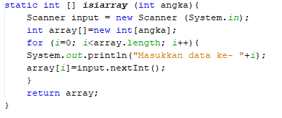

# JOBSHEET 13. Fungsi 1

## Tujuan
* Mahasiswa mampu memahami penggunaan fungsi static pada Java dengan parameter dan mengembalikan nilai.
* Mahasiswa mampu membuat program menggunakan fungsi static dan mengeksekusi fungsi tersebut.


## Alat dan Bahan
* PC/Laptop
* Browser
* Koneksi internet
* Anaconda3 + Java kernel (opsional)

## Praktikum

### Percobaan 1: Fungsi Void (tidak menggunakan return value)

1.	Buat fungsi **beriSalam** bertipe void yang digunakan untuk mencetak **“Halo! Selamat Pagi”**.


2. Eksekusi atau panggil fungsi **beriSalam**.


```Java
// Tuliskan kode program Percobaan 1 Langkah 1 & 2
static void beriSalam(){
    System.out.println("Halo! Selamat Pagi");
}

beriSalam();
```

    Halo! Selamat Pagi


3. Buat fungsi **beriUcapan** dengan sebuah parameter bertipe String.


4. Buatlah variabel **salam** bertipe String kemudian eksekusi atau panggil fungsi **beriUcapan** dengan mengisi parameternya dengan variable **salam** yang sudah dibuat.


```Java
// Tuliskan kode program Percobaan 1 Langkah 1, 2, 3 & 4
static void beriSalam(){
    System.out.println("Halo! Selamat Pagi");
}

static void beriUcapan(String ucapan){
    System.out.println(ucapan);
}

beriSalam();
String salam = "Selamat datang di pemrograman Java";
beriUcapan(salam);
```

    Halo! Selamat Pagi
    Selamat datang di pemrograman Java


#### Pertanyaan
1. Jelaskan perbedaan fungsi **beriSalam** dan **beriUcapan** pada praktikum 1!

Fungsi **beriSalam** tidak memiliki parameter sehingga statement dalam fungsi tersebut bersifat statis atau tidak dapat berubah, sedangkan fungsi **beriUcapan** memiliki parameter sehingga statement dalam fungsi tersebut dapat berubah sesuai dengan nilai dari parameter yang diterima.

2. Jelaskan cara pemanggilan sebuah fungsi void yang berparameter dan tanpa parameter!

Fungsi void berarti fungsi tersebut tidak memiliki nilai kembalian atau _return_. Cara untuk memanggil fungsi void yang berparameter dilakukan dengan memanggil nama fungsi tersebut kemudian diberi kurung, di dalam kurung berisi parameter yang harus disesuaikan dengan kebutuhan fungsi tersebut. Jika parameter yang dibutuhkan fungsi tersebut ada 2 dan bertipe integer, maka ketika memanggil fungsi tersebut, didalam kurung kita juga harus memberi 2 parameter yang harus bertipe integer juga. Sedangkan untuk memanggil fungsi void yang tanpa parameter kita dapat memanggilnya dengan memanggil nama fungsinya kemudian diberi kurung.

### Percobaan 2: Fungsi dengan return value (Bukan void)
Pada Percobaan 2, kode program yang dibuat digunakan untuk menghitung luas persegi dengan membuat fungsi **luasPersegi** yang menggunakan parameter.
1. Buat fungsi **luasPersegi**  untuk menghitung luas persegi yang mengembalikan nilai luas (int) dan parameter masukan sisi (int).


2.	Eksekusi atau panggil fungsi luasPersegi dengan cara membuat variabel baru yaitu **luasan**, kemudian isi variabel tersebut dengan memanggil fungsi luasPersegi dan mengisi parameter sisi. Selanjutnya cetak variabel luasan untuk menampilkan luas persegi panjang


```Java
// Tuliskan kode program Percobaan 2 Langkah 1 & 2
static int luasPersegi(int sisi){
    int luas = sisi * sisi;
    return luas;
}

    int luasan = luasPersegi(5);
    System.out.println("Luas Persegi dengan sisi 5 = " + luasan);
```

    Luas Persegi dengan sisi 5 = 25


#### Pertanyaan
1. jelaskan mengapa ketika memanggil fungsi **luasPersegi** harus membuat variabel baru yaitu luasan?

Supaya dapat menampung nilai kembalian dari fungsi **luasPersegi**

2. Jelaskan kegunaan **return luas** pada percobaan 2 diatas!

**return luas** berfungsi untuk mengembalikan nilai dari operasi perkalian yang telah dilakukan pada fungsi tersebut

3. Modifikasilah program di percobaan 2, dengan membuat panjang **sisi** sebagai inputan!


```Java
// Tuliskan jawaban nomor 2

import java.util.Scanner;
Scanner input = new Scanner(System.in);

static int luasPersegi(int sisi){
    int luas = sisi * sisi;
    return luas;
}

    System.out.print("Masukkan panjang sisi: ");
    int sisi = input.nextInt();
    int luasan = luasPersegi(sisi);
    System.out.printf("Luas Persegi dengan sisi %d = %d", sisi, luasan);
```

    Masukkan panjang sisi: 10
    Luas Persegi dengan sisi 10 = 100


    java.io.PrintStream@1540de22


### Percobaan 3: Fungsi dapat meng-CALL Fungsi Lain
Pada Percobaan 3, kode program yang dibuat digunakan untuk mengimplementasikan bahwa fungsi dapat meng-CALL fungsi yang lain. Dimana dalam percobaan ini terdapat fungsi **Kali dan Kurang**. 
1. Buatlah fungsi **Kali** yang mengembalikan nilai H (int) dan parameter masukan C dan D (int).


2.	Buatlah fungsi **Kurang** yang mengembalikan nilai X (int) dan parameter masukan A dan B (int) dan memanggil fungsi Kali.


3. Lakukan import class Scanner sebagai inputan di langkah selajutnya.

4. Eksekusi atau panggil fungsi **Kurang** .


```Java
// Tuliskan kode program Percobaan 3 Langkah 1, 2, 3 & 4
static int Kali(int C, int D){
    int H;
    H = (C + 10) % (D + 19);
    return H;
}

static int Kurang(int A, int B){
    int X;
    A = A + 7;
    B = B + 4;
    X = Kali(A, B);
    return X;
}

int nilai1, nilai2;
Scanner input = new Scanner(System.in);
System.out.println("Masukkan Nilai 1: ");
nilai1 = input.nextInt();
System.out.println("Masukkan Nilai 2: ");
nilai2 = input.nextInt();
int hasil = Kurang(nilai1, nilai2);
System.out.println("Hasil akhir adalah " + hasil);
```

    Masukkan Nilai 1: 
    10
    Masukkan Nilai 2: 
    2
    Hasil akhir adalah 2


#### Pertanyaan
1. Modifikasilah percobaan diatas dimana di fungsi **Kali** dapat memanggil fungsi **Kurang** kemudian eksekusi atau panggil fungsi Kali


```Java
// Tuliskan jawaban nomor 1

static int Kurang(int A, int B, int C){
    int X, counter = C;
    A = A + 7;
    B = B + 4;
    X = Kali(A, B, counter);
    return X;
}

static int Kali(int C, int D, int F){
    int H, E, X;
    H = (C + 10) % (D + 19);
    if(F <= 0){
        F+=1;
        E = Kurang(H, D, F);   
    }
    else if(F <= 1){
        F+=1;
        X = Kali(H, D, F);
    }
    return H;
}

int nilai1, nilai2;
Scanner input = new Scanner(System.in);
System.out.println("Masukkan Nilai 1: ");
nilai1 = input.nextInt();
System.out.println("Masukkan Nilai 2: ");
nilai2 = input.nextInt();
int hasil = Kurang(nilai1, nilai2, 0);
System.out.println("Hasil akhir adalah " + hasil);
```

    Masukkan Nilai 1: 
    10
    Masukkan Nilai 2: 
    2
    Hasil akhir adalah 2


2. Jelaskan alur jalannya program di percobaan 3 mulai dari input sampai keluar output!

Pada program di percobaan 3, awalnya kita akan dimintai 2 inputan. Setelah itu program akan memanggil fungsi **Kurang**, didalam fungsi kurang parameter pertama akan dijumlah dengan 7 sedangkan parameter kedua akan dijumlah dengan 4, setelah itu variabel X yang pada awal fungsi sudah di deklarasi akan di isi dengan nilai kembalian/_return_ dari fungsi **Kali** yang akan dipanggil. Pada fungsi **Kali** yang akan mengembalikan nilai ke variabel X di fungsi **Kurang** parameter pertama akan terlebih dahulu dijumlah dengan 10 kemudian akan dimodulus dengan parameter kedua yang dijumlah dengan 19, hasil dari modulus tadi akan dikembalikan ke variabel X di fungsi **Kurang** yang kemudian di _return_ kembali pada baris kode di bawah yang memanggil fungsi **Kurang** tersebut.

### Percobaan 4: Mengubah Program Tidak Menggunakan Fungsi dan Menggunakan Fungsi
Pada Percobaan 4, kode program yang dibuat digunakan untuk menghitung luas persegi panjang dan volume balok tanpa menggunakan fungsi dan dengan menggunakan fungsi.
1. Import dan deklarasikan Scanner dengan nama **input**


2. Buatlah inputan panjang, lebar, dan tinggi 


3. Hitung luas persegi panjang dan volume balok


```Java
// Tuliskan kode program Percobaan 4 Langkah 1, 2, & 3
import java.util.Scanner;
Scanner input = new Scanner(System.in);

int p, l, t, L, vol;

System.out.println("Masukkan panjang");
p = input.nextInt();
System.out.println("Masukkan lebar");
l = input.nextInt();
System.out.println("Masukkan tinggi");
t = input.nextInt();

L = p * l;
System.out.println("Luas Persegi panjang adalah " + L);

vol = p * l * t;
System.out.println("Volume balok adalah " + vol);
```

    Masukkan panjang
    5
    Masukkan lebar
    10
    Masukkan tinggi
    3
    Luas Persegi panjang adalah 50
    Volume balok adalah 150


4. Program menghitung luas persegi dan volume balok diatas jika dibuatkan fungsi maka terdapat 3 fungsi yaitu hitungLuas, hitungVolume dan fungsi main, seperti dibawah ini:

Fungsi hitungLuas


Fungsi hitungVolume


5. Eksekusi/panggil fungsi **hitungLuas** dan **hitungVolume**


```Java
// Tuliskan kode program Percobaan 4 Langkah 1, 2, & 3
Scanner input = new Scanner(System.in);
int p, l, t, L, vol;
System.out.println("Masukkan panjang");
p = input.nextInt();
System.out.println("Masukkan lebar");
l = input.nextInt();
System.out.println("Masukkan tinggi");
t = input.nextInt();

static int hitungLuas(int pjg, int lb){
    int Luas = pjg * lb;
    return Luas;
}

static int hitungVolume(int tinggi, int a, int b){
    int volume = hitungLuas(a, b) * tinggi;
    return volume;
}

L = hitungLuas(p,l);
System.out.println("Luas Persegi panjang adalah " + L);

vol = hitungVolume(t,p,l);
System.out.println("Volume balok adalah " + vol);
```

    Masukkan panjang
    10
    Masukkan lebar
    5
    Masukkan tinggi
    3
    Luas Persegi panjang adalah 50
    Volume balok adalah 150


#### Pertanyaan
1. Jelaskan kegunaan parameter yang terdapat didalam fungsi hitungLuas dan hitungVolume!

Pada fungsi hitungLuas, parameter pjg menampung panjang dari persegi panjang, sedangkan lb menampung lebar dari persegi panjang. Pada fungsi hitungVolume, parameter tinggi menampung tinggi dari balok, sedangkan a menampung panjang dari persegi panjang alas balok dan parameter b menampung lebar dari persegi panjang alas balok.

2. Setelah melakukan percobaan 4, menurut anda manakah program yg lebih efisien apakah menggunakan fungsi atau tanpa fungsi? Jelaskan!

Menurut saya akan lebih efisien jika menggunakan fungsi, karena kita dapat memanfaat fungsi secara berulangkali, apabila terdapat perhitungan balok lagi dibawahnya, kita dapat memanggil fungsi yang sudah dideklarasi daripada menulis program kembali.

### Percobaan 5: Fungsi Menggunakan Array dan Variabel Global
Pada Percobaan 5, kode program yang dibuat digunakan untuk menghitung total nilai yang ada didalam array dengan membuat 3 fungsi yaitu isiarray, hitTol, dan tampilArray.
1. Buatlah **variable global total dan i** bertipe int


2. Buatlah fungsi **isiarray** bertipe int dengan parameter angka bertipe int 



3. Buatlah fungsi **tampilArray** bertipe **void** dengan parameter data array **arr** bertipe int


4. Buatlah fungsi **hitTot** bertipe int dengan parameter data array **arr** bertipe int


5. Import dan deklarasikan Scanner dengan nama **input**


6. Eksekusi atau panggil ketiga fungsi yaitu **isiarray, tampilArray, dan hitTot**, kemudian jalankan program!


```Java
// Tuliskan kode program Percobaan 4 Langkah 1 s/d 6

static int total = 0, i;
static int [] isiarray (int angka){
    Scanner input = new Scanner(System.in);
    int array[] = new int[angka];
    for(i = 0; i<array.length; i++){
        System.out.println("Masukkan data ke- " + i);
        array[i] = input.nextInt();
    }
    return array;
}

static void tampilArray(int [] arr){
    for (i = 0; i<arr.length; i++){
        System.out.println("Nilai yang anda inputkan ke "+i);
        System.out.println(arr[i]);
    }
}

static int hitTot(int []arr){
    for (i = 0; i<arr.length; i++){
        total+=arr[i];
    }
    return total;
}

import java.util.Scanner;
Scanner input = new Scanner(System.in);

System.out.println("Masukkan jumlah data yang ingin anda inputkan: ");
int jum = input.nextInt();
int []dataArray = isiarray(jum);;
tampilArray(dataArray);
total = hitTot(dataArray);
System.out.println("Total nilai = " + total);
```

    Masukkan jumlah data yang ingin anda inputkan: 
    3
    Masukkan data ke- 0
    6
    Masukkan data ke- 1
    8
    Masukkan data ke- 2
    5
    Nilai yang anda inputkan ke 0
    6
    Nilai yang anda inputkan ke 1
    8
    Nilai yang anda inputkan ke 2
    5
    Total nilai = 19


#### Pertanyaan
1. Jelaskan mengapa fungsi tampil array dibuat bertipe void, sedangkan isiarray dan hitTot bertipe int!

Karena fungsi tampilArray tidak mengembalikan nilai / _return_ nilai dari fungsi sehingga bertipe void, sedangkan fungsi isiArray dan hitTot mengembalikan nilai yang bertipe integer.

2. Menurut pendapat anda apakah fugsi isiarray dan hitTot dapat diganti dengan tipe void? Jelaskan dan buktikan dengan program!


```Java
// Tidak bisa, karena jika begitu akan terjadi error, pada program diatas kedua fungsi tersebut terdapat return yang harus
// mengembalikan nilai, sedangkan jika diubah ke tipe void maka tidak mengembalikan nilai.


static int total = 0, i;
static void [] isiarray (int angka){
    Scanner input = new Scanner(System.in);
    int array[] = new int[angka];
    for(i = 0; i<array.length; i++){
        System.out.println("Masukkan data ke- " + i);
        array[i] = input.nextInt();
    }
    return array;
}

static void tampilArray(int [] arr){
    for (i = 0; i<arr.length; i++){
        System.out.println("Nilai yang anda inputkan ke "+i);
        System.out.println(arr[i]);
    }
}

static void hitTot(int []arr){
    for (i = 0; i<arr.length; i++){
        total+=arr[i];
    }
    return total;
}

import java.util.Scanner;
Scanner input = new Scanner(System.in);

System.out.println("Masukkan jumlah data yang ingin anda inputkan: ");
int jum = input.nextInt();
int []dataArray = isiarray(jum);;
tampilArray(dataArray);
total = hitTot(dataArray);
System.out.println("Total nilai = " + total);
```


    |   static void [] isiarray (int angka){

    illegal start of expression

    

    |   static void [] isiarray (int angka){

    ';' expected

    

    |   static void [] isiarray (int angka){

    '.class' expected

    

    |   static void [] isiarray (int angka){

    ';' expected

    

    |   static void [] isiarray (int angka){

    unexpected type

      required: value

      found:    class

    

    |       int array[] = new int[angka];

    cannot find symbol

      symbol:   variable angka

    


## Tugas

1. Buatlah sebuah static method yang bernama Max3(int bil1, int bil2, int bil3) yang menerima 3 buah parameter bilangan integer dan mengembalikan sebuah bilangan integer yang merupakan nilai maksimum diantara ketiga bilangan tersebut. 


```Java
// Tuliskan jawaban nomor 1
import java.util.Scanner;
Scanner input = new Scanner(System.in);

static int Max3(int bil1, int bil2, int bil3){
    int max = 0;
    int arr[] = {bil1, bil2, bil3};
    for(int i = 0; i < arr.length; i++){
        if(arr[i] > max){
            max = arr[i];
        }
    }
    
    return max;
}

static int isiBilangan(int urutan){
    int bil;
    System.out.print("Masukkan bilangan ke-" + urutan + ": ");
    bil = input.nextInt();
    return bil;
}

int bil1, bil2, bil3, max;

bil1 = isiBilangan(1);
bil2 = isiBilangan(2);
bil3 = isiBilangan(3);

max = Max3(bil1, bil2, bil3);

System.out.printf("Bilangan terbesar dari %d, %d, %d adalah %d", bil1, bil2, bil3, max);

// Program diatas menggunakan perulangan untuk mencari bilangan terbesar, dan terdapat dua fungsi. Fungsi Max3 berfungsi untuk 
// mencari bilangan terbesar. Sedangkan fungsi isiBilangan berfungsi untuk mengisi bilangan sesuai urutan menurut parameternya.
```

    Masukkan bilangan ke-1: 12
    Masukkan bilangan ke-2: 21
    Masukkan bilangan ke-3: 55
    Bilangan terbesar dari 12, 21, 55 adalah 55


    java.io.PrintStream@1540de22


2. Disebuah restoran terdapat 3 menu yang dijual yaitu nasi goreng, soto, dan sate. Harga nasi goreng Rp. 20.000, soto Rp. 15.000, dan sate Rp. 25.000. Restoran tersebut buka dari hari senin sampai jumat. Berikut ini merupakan tabel pejualan perhari untuk masing-masing menu di restoran tersebut dari hari senin sampai jumat


Buatlah Fungsi sebagai berikut:
 * Fungsi menampilkan menu favorit di hari selasa dan jumat (menu favorit diasumsikan adalah menu yang paling banyak terjual di hari tersebut)
 * Fungsi untuk menghitung pemasukan restoran tersebut mulai hari senin sampai jumat.
 * Fungsi untuk menghitung berapa porsi yang terjual untuk masing-masing menu yaitu nasi goreng, soto, dan sate mulai senin sampai jumat.


```Java
// Tuliskan jawaban nomor 2

int jumlahJual[][] = {{20, 15, 35, 24, 70}, 
                    {30, 40, 10, 28, 35},
                    {5, 10, 50, 48, 15}};

String menu[] = {"Nasi goreng", "Soto", "Sate"};
int harga[] = {20000, 15000, 25000};

static String menuFavorit(){
    int totalMenu[] = {0,0,0};
    int max = 0;
    String favorit = "";
    for(int i = 0; i < jumlahJual.length; i++){
        totalMenu[i] = jumlahJual[i][1] + jumlahJual[i][4];
        if(totalMenu[i] > max){
            max = totalMenu[i];
            favorit = menu[i];
        }
    }
    return favorit;
}

static int hitungTotal(){
    int total = 0;
    int jumlah[] = totalJual();
    for(int i = 0; i < jumlahJual.length; i++){
        total+=jumlah[i]*harga[i];
    }
    return total;
}

static int[] totalJual(){
    int total[] = {0,0,0};
    for(int i = 0; i < jumlahJual.length; i++){
        for(int a = 0; a < jumlahJual[i].length; a++){
            total[i]+=jumlahJual[i][a];
        }
    }
    return total;
}

String menuFavorit;
int total_pendapatan;
int total_porsi[] = new int[menu.length];

menuFavorit = menuFavorit();
total_pendapatan = hitungTotal();
total_porsi = totalJual();

System.out.println("Menu favorit hari selasa dan jumat\t: " + menuFavorit);
System.out.println("Total pendapatan dalam 1 minggu\t\t: " + total_pendapatan);

for(int i = 0; i < jumlahJual.length; i++){
    if(menu[i] == "Nasi goreng"){
        System.out.printf("Total menu %s terjual\t\t: %d \n", menu[i], total_porsi[i]);
    }
    else{
        System.out.printf("Total menu %s terjual\t\t\t: %d \n", menu[i], total_porsi[i]);
    }
}

// Program diatas terdapat tiga fungsi yang semuanya memiliki nilai kembalian / return. Fungsi menuFavorit berfungsi untuk 
// mencari menu dengan total penjualan terbanyak pada hari selasa dan jumat, kita dapat mencari dengan menggunakan perulangan
// dan mereturn sesuai dengan index menu. Fungsi hitungTotal berfungsi untuk mencari total penjualan, kita bisa memanggil 
// fungsi totalJual untuk mendapatkan jumlah masing masing menu dan mengalikan sesuai dengan harga dan melakukan penjumlahan di
// dalam perulangan untuk menghitung total. Fungsi totalJual berfungsi untuk mengembalikan total masing masing menu dalam bentuk
// array.
```

    Menu favorit hari selasa dan jumat	: Nasi goreng
    Total pendapatan dalam 1 minggu		: 8625000
    Total menu Nasi goreng terjual		: 164 
    Total menu Soto terjual			: 143 
    Total menu Sate terjual			: 128 


```Java

```
