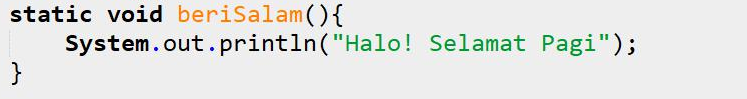
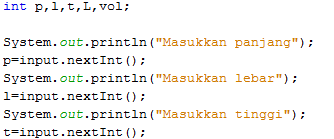

# JOBSHEET 13. Fungsi 1

## Tujuan
* Mahasiswa mampu memahami penggunaan fungsi static pada Java dengan parameter dan mengembalikan nilai.
* Mahasiswa mampu membuat program menggunakan fungsi static dan mengeksekusi fungsi tersebut.


## Alat dan Bahan
* PC/Laptop
* Browser
* Koneksi internet
* Anaconda3 + Java kernel (opsional)

## Praktikum

### Percobaan 1: Fungsi Void (tidak menggunakan return value)

1.	Buat fungsi **beriSalam** bertipe void yang digunakan untuk mencetak **“Halo! Selamat Pagi”**.


2. Eksekusi atau panggil fungsi **beriSalam**.


```Java
// Tuliskan kode program Percobaan 1 Langkah 1 & 2
static void beriSalam() {
    System.out.println("Halo! Selamat Pagi");
}

beriSalam()

```

    Halo! Selamat Pagi


3. Buat fungsi **beriUcapan** dengan sebuah parameter bertipe String.


4. Buatlah variabel **salam** bertipe String kemudian eksekusi atau panggil fungsi **beriUcapan** dengan mengisi parameternya dengan variable **salam** yang sudah dibuat.


```Java
// Tuliskan kode program Percobaan 1 Langkah 1, 2, 3 & 4
static void beriUcapan(String ucapan) {
    System.out.println(ucapan);
}

String salam = "Selamat datang di pemrograman Java";
beriUcapan(salam);

```

    Selamat datang di pemrograman Java


#### Pertanyaan
1. Jelaskan perbedaan fungsi **beriSalam** dan **beriUcapan** pada praktikum 1!

2. Jelaskan cara pemanggilan sebuah fungsi void yang berparameter dan tanpa parameter!

### Percobaan 2: Fungsi dengan return value (Bukan void)
Pada Percobaan 2, kode program yang dibuat digunakan untuk menghitung luas persegi dengan membuat fungsi **luasPersegi** yang menggunakan parameter.
1. Buat fungsi **luasPersegi**  untuk menghitung luas persegi yang mengembalikan nilai luas (int) dan parameter masukan sisi (int).


2.	Eksekusi atau panggil fungsi luasPersegi dengan cara membuat variabel baru yaitu **luasan**, kemudian isi variabel tersebut dengan memanggil fungsi luasPersegi dan mengisi parameter sisi. Selanjutnya cetak variabel luasan untuk menampilkan luas persegi panjang


```Java
// Tuliskan kode program Percobaan 2 Langkah 1 & 2
static int luasPersegi(int sisi) {
    int luas = sisi * sisi;
    
    return luas;
}

int luasan = luasPersegi(5);
System.out.println("Luas Persegi dengan sisi 5 = " + luasan);

```

    Luas Persegi dengan sisi 5 = 25


#### Pertanyaan
1. jelaskan mengapa ketika memanggil fungsi **luasPersegi** harus membuat variabel baru yaitu luasan?

2. Jelaskan kegunaan **return luas** pada percobaan 2 diatas!

3. Modifikasilah program di percobaan 2, dengan membuat panjang **sisi** sebagai inputan!


```Java
// Tuliskan jawaban nomor 2
import java.util.Scanner;

Scanner input = new Scanner(System.in);

System.out.print("Masukan sisi: ");
int luasan = luasPersegi input.nextInt();
System.out.print("Luas Persegi = " + luasan);

```

    Masukan sisi: 


    |   int luasan = luasPersegi input.nextInt();

    ';' expected

    


### Percobaan 3: Fungsi dapat meng-CALL Fungsi Lain
Pada Percobaan 3, kode program yang dibuat digunakan untuk mengimplementasikan bahwa fungsi dapat meng-CALL fungsi yang lain. Dimana dalam percobaan ini terdapat fungsi **Kali dan Kurang**. 
1. Buatlah fungsi **Kali** yang mengembalikan nilai H (int) dan parameter masukan C dan D (int).


2.	Buatlah fungsi **Kurang** yang mengembalikan nilai X (int) dan parameter masukan A dan B (int) dan memanggil fungsi Kali.


3. Lakukan import class Scanner sebagai inputan di langkah selajutnya.

4. Eksekusi atau panggil fungsi **Kurang** .


```Java
// Tuliskan kode program Percobaan 3 Langkah 1, 2, 3 & 4
static int Kali(int C, int D) {
    int H;
    H = Kurang(C, D) * Kurang(D, C);
    return H - Kurang(C * D, D * C);
}

static int Kurang(int A, int B) {
    int X;
    
    A += 7;
    B += 4;
    
    return A -B;
}

int nilai1, nilai2;
Scanner i = new Scanner(System.in);

System.out.print("Masukan Nilai 1: ");
nilai1 = i.nextInt();
System.out.print("Masukan Nilai 2: ");
nilai2 = i.nextInt();

int hasil = Kali(nilai1, nilai2);
System.out.println("Hasil akhir adalah " + hasil);

```

    Masukan Nilai 1: 1
    Masukan Nilai 2: 2
    Hasil akhir adalah 5


#### Pertanyaan
1. Modifikasilah percobaan diatas dimana di fungsi **Kali** dapat memanggil fungsi **Kurang** kemudian eksekusi atau panggil fungsi Kali


```Java
// Tuliskan jawaban nomor 1
```

2. Jelaskan alur jalannya program di percobaan 3 mulai dari input sampai keluar output!

### Percobaan 4: Mengubah Program Tidak Menggunakan Fungsi dan Menggunakan Fungsi
Pada Percobaan 4, kode program yang dibuat digunakan untuk menghitung luas persegi panjang dan volume balok tanpa menggunakan fungsi dan dengan menggunakan fungsi.
1. Import dan deklarasikan Scanner dengan nama **input**


2. Buatlah inputan panjang, lebar, dan tinggi 


3. Hitung luas persegi panjang dan volume balok


```Java
// Tuliskan kode program Percobaan 4 Langkah 1, 2, & 3
import java.util.Scanner;
Scanner input = new Scanner(System.in);

int p, l, t, L, vol;

System.out.print("Masukkan panjang : ");
p = input.nextInt();
System.out.print("Masukkan lebar : ");
l = input.nextInt();
System.out.print("Masukkan tinggi : ");
t = input.nextInt();

L = p * l;
System.out.println("Luas Persegi panjang adalah : " + L);

vol = p * l * t;
System.out.println("Volume balok adalah : " + vol);

```

    Masukkan panjang : 10
    Masukkan lebar : 5
    Masukkan tingg : 15
    Luas Persegi panjang adalah : 50
    Volume balok adalah : 750


4. Program menghitung luas persegi dan volume balok diatas jika dibuatkan fungsi maka terdapat 3 fungsi yaitu hitungLuas, hitungVolume dan fungsi main, seperti dibawah ini:

Fungsi hitungLuas


Fungsi hitungVolume


5. Eksekusi/panggil fungsi **hitungLuas** dan **hitungVolume**


```Java
// Tuliskan kode program Percobaan 4 Langkah 1, 2, & 3
static int hitungLuas(int pjg, int lbr){
    int Luas = pjg * lbr;
    return Luas;
}

static int hitungVolume(int tinggi, int a, int b){
    int volume = hitungLuas(a,b) * tinggi;
    return volume;
}

import java.util.Scanner;
Scanner input = new Scanner(System.in);
int p, l, t, L, vol;
System.out.print("Masukkan panjang : ");
p = input.nextInt();
System.out.print("Masukkan lebar : ");
l = input.nextInt();
System.out.print("Masukkan tinggi : ");
t = input.nextInt();

L = hitungLuas(p, l);
System.out.println("Luas Persegi panjang adalah : " + L);

vol = hitungVolume(t, p, l);
System.out.println("Volume Balok adalah : " + vol);

```

    Masukkan panjang : 10
    Masukkan lebar : 12
    Masukkan tinggi : 11
    Luas Persegi panjang adalah : 120
    Volume Balok adalah : 1320


#### Pertanyaan
1. Jelaskan kegunaan parameter yang terdapat didalam fungsi hitungLuas dan hitungVolume!

2. Setelah melakukan percobaan 4, menurut anda manakah program yg lebih efisien apakah menggunakan fungsi atau tanpa fungsi? Jelaskan!

### Percobaan 5: Fungsi Menggunakan Array dan Variabel Global
Pada Percobaan 5, kode program yang dibuat digunakan untuk menghitung total nilai yang ada didalam array dengan membuat 3 fungsi yaitu isiarray, hitTol, dan tampilArray.
1. Buatlah **variable global total dan i** bertipe int


2. Buatlah fungsi **isiarray** bertipe int dengan parameter angka bertipe int 


3. Buatlah fungsi **tampilArray** bertipe **void** dengan parameter data array **arr** bertipe int


4. Buatlah fungsi **hitTot** bertipe int dengan parameter data array **arr** bertipe int


5. Import dan deklarasikan Scanner dengan nama **input**


6. Eksekusi atau panggil ketiga fungsi yaitu **isiarray, tampilArray, dan hitTot**, kemudian jalankan program!


```Java
// Tuliskan kode program Percobaan 4 Langkah 1 s/d 6
import java.util.Scanner;
static int total = 0, i;

static int[] isiarray(int angka){
    Scanner sc = new Scanner(System.in);
    int array[] = new int[angka];
    for(int i = 0; i < array.length; i++){
        System.out.printf("Masukkan data ke-%d :",i);
        array[i] = sc.nextInt();
    }
    return array;
}

static void tampilArray(int[] arr){
    for(int i = 0; i < arr.length; i++){
        System.out.println("Nilai yang anda inputkan ke- " + i);
        System.out.println(arr[i]);
    }
    
}

static int hitTot(int[] arr){
    for(int i = 0; i < arr.length; i++){
        total += arr[i];
    }
    return total;
}

Scanner input = new Scanner(System.in);
System.out.print("Masukkan jumlah data yang ingin anda inputkan: ");
int jum = input.nextInt();
int []dataArray = isiarray(jum);
tampilArray(dataArray);
total = hitTot(dataArray);
System.out.println("Total nilai = " + total);

```

    Masukkan jumlah data yang ingin anda inputkan: 3
    Masukkan data ke-0 :1
    Masukkan data ke-1 :2
    Masukkan data ke-2 :3
    Nilai yang anda inputkan ke- 0
    1
    Nilai yang anda inputkan ke- 1
    2
    Nilai yang anda inputkan ke- 2
    3
    Total nilai = 6


#### Pertanyaan
1. Jelaskan mengapa fungsi tampil array dibuat bertipe void, sedangkan isiarray dan hitTot bertipe int!

2. Menurut pendapat anda apakah fugsi isiarray dan hitTot dapat diganti dengan tipe void? Jelaskan dan buktikan dengan program!


```Java
// Tuliskan jawaban nomor 2
import java.util.Scanner;
static int total = 0, i;

static void isiarray(int[] array){
    Scanner input = new Scanner(System.in);
    
    for(int i = 0; i < array.length; i++){
        System.out.printf("Masukkan data ke-%d :",i);
        array[i] = input.nextInt();
    }
}

static void tampilArray(int[] arr){
    for(int i = 0; i < arr.length; i++){
        System.out.println("Nilai yang anda inputkan ke- " + i);
        System.out.println(arr[i]);
    }
    
}

static void hitTot(int[] arr){
    for(int i = 0; i < arr.length; i++){
        total += arr[i];
    }
    
    System.out.println("Total nilai = " + total);
}

Scanner input = new Scanner(System.in);
System.out.print("Masukkan jumlah data yang ingin anda inputkan: ");
int jum = input.nextInt();
int []dataArray = new int[jum];

isiarray(dataArray);
tampilArray(dataArray);
hitTot(dataArray);

```

    Masukkan jumlah data yang ingin anda inputkan: 2
    Masukkan data ke-0 :1
    Masukkan data ke-1 :2
    Nilai yang anda inputkan ke- 0
    1
    Nilai yang anda inputkan ke- 1
    2
    Total nilai = 3


## Tugas

1. Buatlah sebuah static method yang bernama Max3(int bil1, int bil2, int bil3) yang menerima 3 buah parameter bilangan integer dan mengembalikan sebuah bilangan integer yang merupakan nilai maksimum diantara ketiga bilangan tersebut. 


```Java
// Tuliskan jawaban nomor 1
import java.util.Scanner;
Scanner input = new Scanner(System.in);

static int Max3(int bil1, int bil2, int bil3){
    int max = 0;
    int array[] = {bil1, bil2, bil3};
    for(int i = 0; i < array.length; i++){
        if(array[i] > max){
            max = array[i];
        }
    }
    
    return max;
}

static int isiBilangan(int urutan){
    int bil;
    System.out.print("Masukkan bilangan ke-" + urutan + ": ");
    bil = input.nextInt();
    return bil;
}

int bil1, bil2, bil3, max;

bil1 = isiBilangan(1);
bil2 = isiBilangan(2);
bil3 = isiBilangan(3);

max = Max3(bil1, bil2, bil3);

System.out.printf("Bilangan terbesar dari %d, %d, %d adalah %d", bil1, bil2, bil3, max);
```

    Masukkan bilangan ke-1: 1
    Masukkan bilangan ke-2: 2
    Masukkan bilangan ke-3: 3
    Bilangan terbesar dari 1, 2, 3 adalah 3


    java.io.PrintStream@7932485c


2. Disebuah restoran terdapat 3 menu yang dijual yaitu nasi goreng, soto, dan sate. Harga nasi goreng Rp. 20.000, soto Rp. 15.000, dan sate Rp. 25.000. Restoran tersebut buka dari hari senin sampai jumat. Berikut ini merupakan tabel pejualan perhari untuk masing-masing menu di restoran tersebut dari hari senin sampai jumat


Buatlah Fungsi sebagai berikut:
 * Fungsi menampilkan menu favorit di hari selasa dan jumat (menu favorit diasumsikan adalah menu yang paling banyak terjual di hari tersebut)
 * Fungsi untuk menghitung pemasukan restoran tersebut mulai hari senin sampai jumat.
 * Fungsi untuk menghitung berapa porsi yang terjual untuk masing-masing menu yaitu nasi goreng, soto, dan sate mulai senin sampai jumat.


```Java
// Tuliskan jawaban nomor 2
// Tuliskan jawaban nomor 2

int jumlahJual[][] = {{20, 15, 35, 24, 70}, 
                    {30, 40, 10, 28, 35},
                    {5, 10, 50, 48, 15}};

String menu[] = {"Nasi goreng", "Soto", "Sate"};
int harga[] = {20000, 15000, 25000};
String hariJual[] = {"Senin", "Selasa", "Rabu", "Kamis", "Jumat"};

static String menuFavorit(String hari){
    int totalMenu[] = {0,0,0};
    int indexHari = Arrays.asList(hariJual).indexOf(hari);
    int max = 0;
    String favorit = "";
    for(int i = 0; i < jumlahJual.length; i++){
        totalMenu[i] = jumlahJual[i][indexHari];
        if(totalMenu[i] > max){
            max = totalMenu[i];
            favorit = menu[i];
        }
    }
    return favorit;
}

static int hitungTotal(){
    int total = 0;
    int jumlah[] = totalJual();
    for(int i = 0; i < jumlahJual.length; i++){
        total+=jumlah[i]*harga[i];
    }
    return total;
}

static int[] totalJual(){
    int total[] = {0,0,0};
    for(int i = 0; i < jumlahJual.length; i++){
        for(int a = 0; a < jumlahJual[i].length; a++){
            total[i]+=jumlahJual[i][a];
        }
    }
    return total;
}

String menuFavoritSelasa, menuFavoritJumat;
int total_pendapatan;
int total_perPorsi[] = new int[menu.length];

menuFavoritSelasa = menuFavorit("Selasa");
menuFavoritJumat = menuFavorit("Jumat");
total_pendapatan = hitungTotal();
total_porsi = totalJual();

System.out.println("Menu favorit");
System.out.println("Menu favorit hari selasa adalah " + menuFavoritSelasa);
System.out.println("Menu favorit hari jumat adalah " + menuFavoritJumat);

System.out.println("\nTotal  Pendapatan");
System.out.println("Total pendapatan dalam 1 minggu adalah Rp." + total_pendapatan);

System.out.println("\nTotal Penjualan Setiap Menu");
for(int i = 0; i < jumlahJual.length; i++){
    System.out.printf("Total menu %s terjual adalah %d \n", menu[i], total_porsi[i]);
}


```

    Menu favorit
    Menu favorit hari selasa adalah Soto
    Menu favorit hari jumat adalah Nasi goreng
    
    Total  Pendapatan
    Total pendapatan dalam 1 minggu adalah Rp.8625000
    
    Total Penjualan Setiap Menu
    Total menu Nasi goreng terjual adalah 164 
    Total menu Soto terjual adalah 143 
    Total menu Sate terjual adalah 128 


```Java

```


```Java

```
