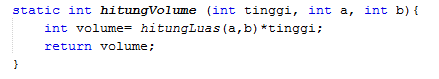

# JOBSHEET 13. Fungsi 1

## Tujuan
* Mahasiswa mampu memahami penggunaan fungsi static pada Java dengan parameter dan mengembalikan nilai.
* Mahasiswa mampu membuat program menggunakan fungsi static dan mengeksekusi fungsi tersebut.


## Alat dan Bahan
* PC/Laptop
* Browser
* Koneksi internet
* Anaconda3 + Java kernel (opsional)

## Praktikum

### Percobaan 1: Fungsi Void (tidak menggunakan return value)

1.	Buat fungsi **beriSalam** bertipe void yang digunakan untuk mencetak **“Halo! Selamat Pagi”**.


2. Eksekusi atau panggil fungsi **beriSalam**.


```Java
// Tuliskan kode program Percobaan 1 Langkah 1 & 2
static void beriSalam(){
    System.out.println("Halo! Selamat Pagi");
}
beriSalam();
```

    Halo! Selamat Pagi


3. Buat fungsi **beriUcapan** dengan sebuah parameter bertipe String.


4. Buatlah variabel **salam** bertipe String kemudian eksekusi atau panggil fungsi **beriUcapan** dengan mengisi parameternya dengan variable **salam** yang sudah dibuat.


```Java
// Tuliskan kode program Percobaan 1 Langkah 1, 2, 3 & 4
static void beriSalam(){
    System.out.println("Halo! Selamat Pagi");
}

static void beriUcapan(String ucapan){
    System.out.println(ucapan);
}


    beriSalam();
    String salam = "Selamat datang di pemrograman Java";
    beriUcapan(salam);
```

    Halo! Selamat Pagi
    Selamat datang di pemrograman Java


#### Pertanyaan
1. Jelaskan perbedaan fungsi **beriSalam** dan **beriUcapan** pada praktikum 1!

jawaban : didalam beriSalam tanpa mneggunakan parameter atau langsung mengerjakan dalam fungsi, sedangkan pada beriUcapan dengan mengunakan parameter yang bertipe data String dan menampung nilai yang diproses dalam fungsi.

2. Jelaskan cara pemanggilan sebuah fungsi void yang berparameter dan tanpa parameter!

jawaban : pemanggilan sebuah fungsi void yang berparameter dengan cara menambahkan dalam kurung berparameter yang diikuti tipe datanya. dan pemanggilan fungsi void tanpa parameter dengan cara menambahkan dalam kurung kosong atau tidak berparameter.

### Percobaan 2: Fungsi dengan return value (Bukan void)
Pada Percobaan 2, kode program yang dibuat digunakan untuk menghitung luas persegi dengan membuat fungsi **luasPersegi** yang menggunakan parameter.
1. Buat fungsi **luasPersegi**  untuk menghitung luas persegi yang mengembalikan nilai luas (int) dan parameter masukan sisi (int).


2.	Eksekusi atau panggil fungsi luasPersegi dengan cara membuat variabel baru yaitu **luasan**, kemudian isi variabel tersebut dengan memanggil fungsi luasPersegi dan mengisi parameter sisi. Selanjutnya cetak variabel luasan untuk menampilkan luas persegi panjang


```Java
// Tuliskan kode program Percobaan 2 Langkah 1 & 2
static int luasPersegi(int sisi){
    int luas = sisi * sisi;
    return luas;
}

    int luasan = luasPersegi(5);
    System.out.println("Luas Persegi dengan sisi 5 = " + luasan);
```

    Luas Persegi dengan sisi 5 = 25


#### Pertanyaan
1. jelaskan mengapa ketika memanggil fungsi **luasPersegi** harus membuat variabel baru yaitu luasan?

jawaban : fungsi luasPersegi merupakan fungsi yang berparameter maka untuk menampung fungsi tersebut membutuhkan variabel baru untuk memudahkan kode pemrograman

2. Jelaskan kegunaan **return luas** pada percobaan 2 diatas!

jawaban : return luas digunakan untuk mengembalikan nilai operasi variabel luas.

3. Modifikasilah program di percobaan 2, dengan membuat panjang **sisi** sebagai inputan!


```Java
// Tuliskan jawaban nomor 2
static int luasPersegi(int sisi){
    int luas = sisi * sisi;
    return luas;
}

Scanner input = new Scanner(System.in);
System.out.print("Masukkan panjang sisi : ");
int p = input.nextInt();

int L = luasPersegi(p);
System.out.println("Luas Persegi adalah " + L);
```

    Masukkan panjang sisi : 5
    Luas Persegi adalah 25


### Percobaan 3: Fungsi dapat meng-CALL Fungsi Lain
Pada Percobaan 3, kode program yang dibuat digunakan untuk mengimplementasikan bahwa fungsi dapat meng-CALL fungsi yang lain. Dimana dalam percobaan ini terdapat fungsi **Kali dan Kurang**. 
1. Buatlah fungsi **Kali** yang mengembalikan nilai H (int) dan parameter masukan C dan D (int).


2.	Buatlah fungsi **Kurang** yang mengembalikan nilai X (int) dan parameter masukan A dan B (int) dan memanggil fungsi Kali.


3. Lakukan import class Scanner sebagai inputan di langkah selajutnya.

4. Eksekusi atau panggil fungsi **Kurang** .


```Java
// Tuliskan kode program Percobaan 3 Langkah 1, 2, 3 & 4
static int Kali(int C, int D){
    int H;
    H = (C + 10) % (D + 19);
    return H;
}
static int Kurang(int A, int B){
    int X;
    A = A + 7;
    B = B + 4;
    X = Kali(A, B);
    return X;
}
int nilai1, nilai2;
Scanner input = new Scanner(System.in);
System.out.println("Masukkan Nilai 1:");
nilai1 = input.nextInt();
System.out.println("Masukkan Nilai 2:");
nilai2 = input.nextInt();
int hasil = Kurang(nilai1, nilai2);
System.out.println("Hasil akhir adalah " + hasil);
```

    Masukkan Nilai 1:
    20
    Masukkan Nilai 2:
    10
    Hasil akhir adalah 4


#### Pertanyaan
1. Modifikasilah percobaan diatas dimana di fungsi **Kali** dapat memanggil fungsi **Kurang** kemudian eksekusi atau panggil fungsi Kali


```Java
// Tuliskan jawaban nomor 1
static int Kali(int C, int D){
    int X;
    C += 7;
    D += 4;
    X = Kurang(C, D);
    return X;
}
static int Kurang(int A, int B){
    int H;
    H = (A + 10) % (B + 19);
    return H;
}
int nilai1, nilai2;
Scanner input = new Scanner(System.in);
System.out.println("Masukkan Nilai 1:");
nilai1 = input.nextInt();
System.out.println("Masukkan Nilai 2:");
nilai2 = input.nextInt();
int hasil = Kali(nilai1, nilai2);
System.out.println("Hasil akhir adalah " + hasil);
```

    Masukkan Nilai 1:
    2
    Masukkan Nilai 2:
    3
    Hasil akhir adalah 19


2. Jelaskan alur jalannya program di percobaan 3 mulai dari input sampai keluar output!

jawaban : alur jalannya program percobaan 2 dimaulai dari menginputkan nilai 1 dan nilai 2 yang digunakan sebagai parameter fungsi Kurang, kemudian didalam fungsi kurang nilai 1 akan ditambah 7 dan nilai 2 ditambah dengan 4, hasil dari penambahan nilai tersebut akan digunakan pada fungsi Kali. di fungsi Kali melakukan operasi (C + 10) % (D + 19), C dan D adalah hasil penambahan pada fungsi Kurang tersebut. kemudian akan mendapatkan dan menampilkan hasilnya.

### Percobaan 4: Mengubah Program Tidak Menggunakan Fungsi dan Menggunakan Fungsi
Pada Percobaan 4, kode program yang dibuat digunakan untuk menghitung luas persegi panjang dan volume balok tanpa menggunakan fungsi dan dengan menggunakan fungsi.
1. Import dan deklarasikan Scanner dengan nama **input**


2. Buatlah inputan panjang, lebar, dan tinggi 


3. Hitung luas persegi panjang dan volume balok


```Java
// Tuliskan kode program Percobaan 4 Langkah 1, 2, & 3
import java.util.Scanner;
Scanner input = new Scanner(System.in);
int p,l,t,L,vol;

System.out.println("Masukkan panjang");
p = input.nextInt();
System.out.println("Masukkan lebar");
l = input.nextInt();
System.out.println("Masukkan tinggi");
t = input.nextInt();

L = p * l;
System.out.println("Luas Persegi panjang " + L);

vol = p * l * t;
System.out.println("Volume balok adalah " + vol);
```

    Masukkan panjang
    2
    Masukkan lebar
    3
    Masukkan tinggi
    4
    Luas Persegi panjang 6
    Volume balok adalah 24


4. Program menghitung luas persegi dan volume balok diatas jika dibuatkan fungsi maka terdapat 3 fungsi yaitu hitungLuas, hitungVolume dan fungsi main, seperti dibawah ini:

Fungsi hitungLuas


Fungsi hitungVolume



5. Eksekusi/panggil fungsi **hitungLuas** dan **hitungVolume**


```Java
// Tuliskan kode program Percobaan 4 Langkah 1, 2, & 3
static int hitungLuas (int pjg, int lb){
    int Luas = pjg * lb;
    return Luas;
}
static int hitungVolume (int tinggi, int a, int b){
    int volume = hitungLuas (a,b) * tinggi;
    return volume;
}
Scanner input = new Scanner(System.in);
int p,l,t,L,vol;
System.out.println("Masukkan panjang");
p = input.nextInt();
System.out.println("Masukkan lebar");
l = input.nextInt();
System.out.println("Masukkan tinggi");
t = input.nextInt();

L = hitungLuas(p,l);
System.out.println("Luas Persegi panjang " + L);
vol = hitungVolume(t,p,l);
System.out.println("Volume balok adalah " + vol);
```

    Masukkan panjang
    2
    Masukkan lebar
    3
    Masukkan tinggi
    4
    Luas Persegi panjang 6
    Volume balok adalah 24


#### Pertanyaan
1. Jelaskan kegunaan parameter yang terdapat didalam fungsi hitungLuas dan hitungVolume!

jawaban : parameter pada fungsi hitungLuas(int pjg, int lb) dan hitungVolume(int tinggi, int a, int b) berguna untuk data masukkan guna mendapatkan nilai yang nantinya akan digunakan untuk perhitungan luas dan volume, sehingga kita bisa memanggil fungsi tersebut.

2. Setelah melakukan percobaan 4, menurut anda manakah program yg lebih efisien apakah menggunakan fungsi atau tanpa fungsi? Jelaskan!

jawaban : menurut saya lebih efisien yang menggunakan fungsi, karena dapat memanggil perhitungan berkali-kali dengan nilai dan hasil yang berbeda.

### Percobaan 5: Fungsi Menggunakan Array dan Variabel Global
Pada Percobaan 5, kode program yang dibuat digunakan untuk menghitung total nilai yang ada didalam array dengan membuat 3 fungsi yaitu isiarray, hitTol, dan tampilArray.
1. Buatlah **variable global total dan i** bertipe int


2. Buatlah fungsi **isiarray** bertipe int dengan parameter angka bertipe int 


3. Buatlah fungsi **tampilArray** bertipe **void** dengan parameter data array **arr** bertipe int


4. Buatlah fungsi **hitTot** bertipe int dengan parameter data array **arr** bertipe int


5. Import dan deklarasikan Scanner dengan nama **input**


6. Eksekusi atau panggil ketiga fungsi yaitu **isiarray, tampilArray, dan hitTot**, kemudian jalankan program!


```Java
// Tuliskan kode program Percobaan 4 Langkah 1 s/d 6
static int total = 0, i;
static int [] isiarray (int angka){
    Scanner input = new Scanner(System.in);
    int array[] = new int[angka];
    for(i = 0; i < array.length; i++){
        System.out.println("Masukkan data ke- " + i);
        array[i] = input.nextInt();
    }
    return array;
}
static void tampilArray(int [] arr){
    for(i = 0; i < arr.length; i++){
        System.out.println("Nilai yang anda inputkan ke " + i);
        System.out.println(arr[i]);
    }
}
static int hitTot(int [] arr){
    for(i = 0; i < arr.length; i++){
        total += arr[i];
    }
    return total;
}
import java.util.Scanner;
Scanner input = new Scanner(System.in);
System.out.println("Masukkan jumlah data yang ingin anda inputkan: ");
int jum = input.nextInt();
int [] dataArray = isiarray(jum);
tampilArray(dataArray);
total = hitTot(dataArray);
System.out.println("Total nilai = " + total);
```

    Masukkan jumlah data yang ingin anda inputkan: 
    3
    Masukkan data ke- 0
    20
    Masukkan data ke- 1
    10
    Masukkan data ke- 2
    30
    Nilai yang anda inputkan ke 0
    20
    Nilai yang anda inputkan ke 1
    10
    Nilai yang anda inputkan ke 2
    30
    Total nilai = 60


#### Pertanyaan
1. Jelaskan mengapa fungsi tampil array dibuat bertipe void, sedangkan isiarray dan hitTot bertipe int!

jawaban : karena fungsi tampil array tidak ada nilai yang dikembalikan, sedangkan isiarray dan hitTot terdapat nilai yang dikembalikan.

2. Menurut pendapat anda apakah fugsi isiarray dan hitTot dapat diganti dengan tipe void? Jelaskan dan buktikan dengan program!


```Java
// Tuliskan jawaban nomor 2
```

## Tugas

1. Buatlah sebuah static method yang bernama Max3(int bil1, int bil2, int bil3) yang menerima 3 buah parameter bilangan integer dan mengembalikan sebuah bilangan integer yang merupakan nilai maksimum diantara ketiga bilangan tersebut. 


```Java
// Tuliskan jawaban nomor 1

static int Max3(int bil1, int bil2, int bil3){
    int [] bilangan = {bil1, bil2, bil3};
    int max = 0;
    for(byte i = 0; i < bilangan.length; i++){
        if(bilangan[i] > max) {
            max = bilangan[i];
        }
    }
    return max;
}
import java.util.Scanner;
Scanner input = new Scanner(System.in);
System.out.print("Masukkan Angka Ke-1: ");
int ang1 = input.nextInt();
System.out.print("Masukkan Angka Ke-2: ");
int ang2 = input.nextInt();
System.out.print("Masukkan Angka Ke-3: ");
int ang3 = input.nextInt();
int maksimal = Max3(ang1,ang2,ang3);
System.out.print("Nilai maksimum diantara ketiga bilangan adalah " + maksimal);
```

    Masukkan Angka Ke-1: 11
    Masukkan Angka Ke-2: 13
    Masukkan Angka Ke-3: 10
    Nilai maksimum diantara ketiga bilangan adalah 13

penjelasan : pada kode program tersebut 3 bilangan yang di inputan akan di proses di fungsi Max3 

2. Disebuah restoran terdapat 3 menu yang dijual yaitu nasi goreng, soto, dan sate. Harga nasi goreng Rp. 20.000, soto Rp. 15.000, dan sate Rp. 25.000. Restoran tersebut buka dari hari senin sampai jumat. Berikut ini merupakan tabel pejualan perhari untuk masing-masing menu di restoran tersebut dari hari senin sampai jumat


Buatlah Fungsi sebagai berikut:
 * Fungsi menampilkan menu favorit di hari selasa dan jumat (menu favorit diasumsikan adalah menu yang paling banyak terjual di hari tersebut)
 * Fungsi untuk menghitung pemasukan restoran tersebut mulai hari senin sampai jumat.
 * Fungsi untuk menghitung berapa porsi yang terjual untuk masing-masing menu yaitu nasi goreng, soto, dan sate mulai senin sampai jumat.


```Java
// Tuliskan jawaban nomor 2
static int porsi[][] = { { 20, 15, 35, 24, 70 }, { 30, 40, 10, 28, 35 }, { 5, 10, 50, 48, 15 } };
static void fav() {
    int max = 0, indexTertinggi = 0;
    for(int i = 0; i < porsi.length; i++){
        if(porsi[i][1] > max){
            max = porsi[i][1];
            indexTertinggi = i;
        }
    }
    switch(indexTertinggi){
    case 0:
        System.out.println("Menu favorit hari Selasa adalah Nasi Goreng");
        break;
    case 1:
        System.out.println("Menu favorit hari Selasa adalah Soto");
        break;
    case 2:
        System.out.println("Menu favorit hari Selasa adalah Sate");
        break;
    default:
        break;
    }
    max = 0;
    for(int i = 0; i < porsi.length; i++){
        if(porsi[i][4] > max){
            max = porsi[i][4];
            indexTertinggi = i;
        }
    }
    switch (indexTertinggi){
    case 0:
        System.out.println("Menu favorit hari Jum'at adalah Nasi Goreng");
        break;
    case 1:
        System.out.println("Menu favorit hari Jum'at adalah Soto");
        break;
    case 2:
        System.out.println("Menu favorit hari Jum'at adalah Sate");
        break;
    default:
        break;
    }
}
static int totalKeuntungan(){
    int nasiGoreng = 20000, soto = 15000, sate = 25000;
    int jumlahNasGor = 0, jumlahSoto = 0, jumlahSate = 0;
    for(int i = 0; i < porsi[0].length; i++){
        jumlahNasGor += porsi[0][i];
        jumlahSoto += porsi[1][i];
        jumlahSate += porsi[2][i];
    }
    jumlahNasGor *= nasiGoreng;
    jumlahSate *= sate;
    jumlahSoto *= soto;
    int jumlah = jumlahNasGor + jumlahSate + jumlahSoto;
    return jumlah;
}

static int NasiGoreng(){
    int jumlahNasGor = 0;
    for(int i = 0; i < porsi[0].length; i++){
        jumlahNasGor += porsi[0][i];
    }
    return jumlahNasGor;
}
static int Soto(){
    int jumlahSoto = 0;
    for(int i = 0; i < porsi[0].length; i++){
        jumlahSoto += porsi[1][i];
    }
    return jumlahSoto;
}
static int Sate(){
    int jumlahSate = 0;
    for(int i = 0; i < porsi[0].length; i++){
        jumlahSate += porsi[2][i];
    }
    return jumlahSate;
}

fav();
System.out.println("Jumlah pemasukan dari Senin sampai Jum'at adalah " + totalKeuntungan());
System.out.println("Jumlah porsi yang terjual untuk Nasi Goreng adalah " + NasiGoreng());
System.out.println("Jumlah porsi yang terjual untuk Soto adalah " + Soto());
System.out.println("Jumlah porsi yang terjual untuk Sate adalah " + Sate());
```

    Menu favorit hari Selasa adalah Soto
    Menu favorit hari Jum'at adalah Nasi Goreng
    Jumlah pemasukan dari Senin sampai Jum'at adalah 8625000
    Jumlah porsi yang terjual untuk Nasi Goreng adalah 164
    Jumlah porsi yang terjual untuk Soto adalah 143
    Jumlah porsi yang terjual untuk Sate adalah 128

penjelasan : pada kode progam diatas dimulai dengan menginisialisasi array secara global diawal program. kemudian membuat fungsi fav dengan memasukkan variabel max untuk mengetahui nilai terbesar dari porsi menu makanan. untuk menentukan jumlah pemasukan membuat fungsi totalKeuntungan dengan memasukkan harga setiap makanan kemudian membuat looping jumlah pemasukan setelah itu menjumlahkan semua jumlah harga makanan dengan porsi. pada fungsi NasiGoreng, Soto, dan Sate akan mengembalikan nilai jumlah dari tiap-tiap barisnya yang menunjukkan jumlah dari tiap menu. dan membuat kode program untuk mengeprint atau menampilkan nilai dari setiap jumlah porsi. 
