# JOBSHEET 13. Fungsi 1

## Tujuan
* Mahasiswa mampu memahami penggunaan fungsi static pada Java dengan parameter dan mengembalikan nilai.
* Mahasiswa mampu membuat program menggunakan fungsi static dan mengeksekusi fungsi tersebut.


## Alat dan Bahan
* PC/Laptop
* Browser
* Koneksi internet
* Anaconda3 + Java kernel (opsional)

## Praktikum

### Percobaan 1: Fungsi Void (tidak menggunakan return value)

1.	Buat fungsi **beriSalam** bertipe void yang digunakan untuk mencetak **“Halo! Selamat Pagi”**.


2. Eksekusi atau panggil fungsi **beriSalam**.
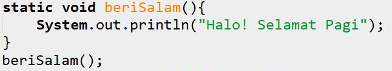


```Java
// Tuliskan kode program Percobaan 1 Langkah 1 & 2
static void beriSalam(){ // static, agar dapat secara langsung memanggil nama fungsi beriSalam yaitu Halo! Selamat pagi
            System.out.println("Halo! Selamat Pagi");
            }
        beriSalam();
```

    Halo! Selamat Pagi


3. Buat fungsi **beriUcapan** dengan sebuah parameter bertipe String.
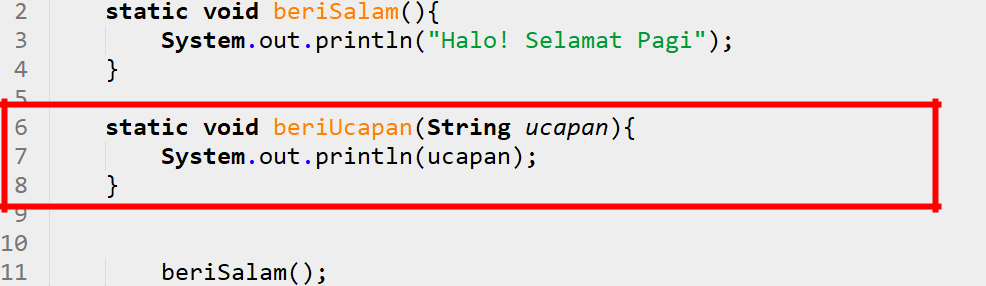

4. Buatlah variabel **salam** bertipe String kemudian eksekusi atau panggil fungsi **beriUcapan** dengan mengisi parameternya dengan variable **salam** yang sudah dibuat.
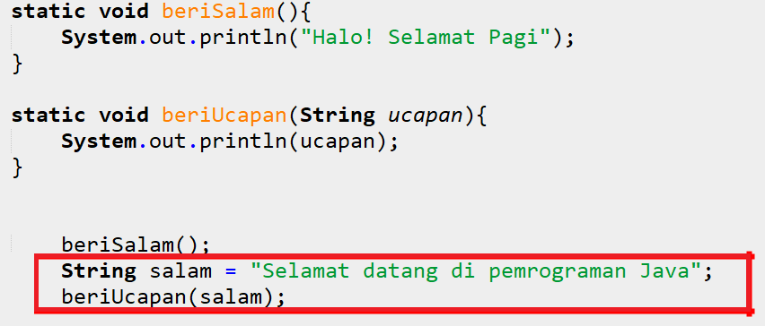


```Java
// Tuliskan kode program Percobaan 1 Langkah 1, 2, 3 & 4
 static void beriSalam(){ // static, agar dapat secara langsung memanggil nama fungsi beriSalam yaitu Halo! Selamat pagi
        System.out.println("Halo! Selamat Pagi");
    }
    
    static void beriUcapan(String ucapan){
        System.out.println(ucapan);
    }
        beriSalam();
        String salam = "Selamat datang di pemrograman Java";
        beriUcapan(salam);
```

    Halo! Selamat Pagi
    Selamat datang di pemrograman Java
    

#### Pertanyaan
1. Jelaskan perbedaan fungsi **beriSalam** dan **beriUcapan** pada praktikum 1!

Penjelasan : fungsi beriSalam untuk pembuatan fungsi,sedangkan
fungsi beriUcapan untuk pemamnggilan fungsi

2. Jelaskan cara pemanggilan sebuah fungsi void yang berparameter dan tanpa parameter!

Penjelasan :Parameter adalah variabel yang menampung nilai untuk diproses di dalam fungsi. Parameter berperan sebagai input untuk fungsi.
Pemanggilan fungsi Berparameter penulisannya namaFungsi(nilai parameter);
sedangkan fungsi tidak berparameter penulisannya namaFungsi() //didalamnya tidak terdapat nilai prameternya

### Percobaan 2: Fungsi dengan return value (Bukan void)
Pada Percobaan 2, kode program yang dibuat digunakan untuk menghitung luas persegi dengan membuat fungsi **luasPersegi** yang menggunakan parameter.
1. Buat fungsi **luasPersegi**  untuk menghitung luas persegi yang mengembalikan nilai luas (int) dan parameter masukan sisi (int).
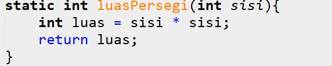

2.	Eksekusi atau panggil fungsi luasPersegi dengan cara membuat variabel baru yaitu **luasan**, kemudian isi variabel tersebut dengan memanggil fungsi luasPersegi dan mengisi parameter sisi. Selanjutnya cetak variabel luasan untuk menampilkan luas persegi panjang
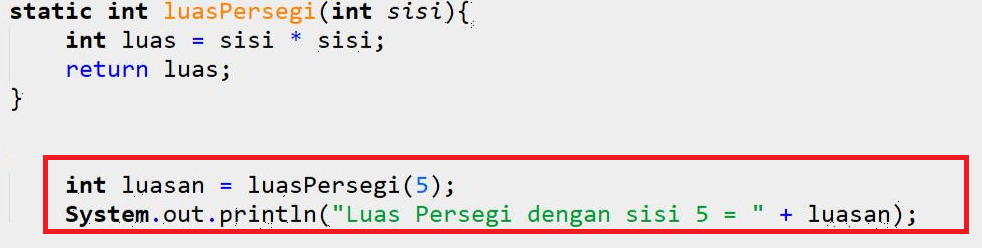


```Java
// Tuliskan kode program Percobaan 2 Langkah 1 & 2
 static int luasPersegi(int sisi){
     int luas = sisi * sisi;
     return luas;
     }
     int luasan = luasPersegi(5);
     System.out.println("Luas Persegi dengan sisi 5 = " + luasan);

```

    Luas Persegi dengan sisi 5 = 25


#### Pertanyaan
1. jelaskan mengapa ketika memanggil fungsi **luasPersegi** harus membuat variabel baru yaitu luasan?

Penjelasan : Karena untuk menampung pengembalian nilai dari fungsi luas persegi

2. Jelaskan kegunaan **return luas** pada percobaan 2 diatas!

Penjelasan :untuk mengembalikan nilai output luas sehingga bisa diolah ke proses berikutnya

3. Modifikasilah program di percobaan 2, dengan membuat panjang **sisi** sebagai inputan!


```Java
// Tuliskan jawaban nomor 2
static int luasPersegi(int sisi){
     int luas = sisi*sisi;
     return luas;
     }
     Scanner input = new Scanner (System.in);
     int sisi1;
     System.out.println("Masukkan Sisi:");      
     sisi1 = input.nextInt();
     int luasan = luasPersegi(sisi1);
     System.out.println("Luasan persegi dengan sisi 5 = " + luasan)

```

    Masukkan Sisi:
    2
    Luasan persegi dengan sisi 5 = 4
    

### Percobaan 3: Fungsi dapat meng-CALL Fungsi Lain
Pada Percobaan 3, kode program yang dibuat digunakan untuk mengimplementasikan bahwa fungsi dapat meng-CALL fungsi yang lain. Dimana dalam percobaan ini terdapat fungsi **Kali dan Kurang**. 
1. Buatlah fungsi **Kali** yang mengembalikan nilai H (int) dan parameter masukan C dan D (int).
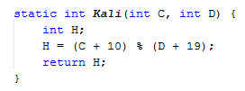

2.	Buatlah fungsi **Kurang** yang mengembalikan nilai X (int) dan parameter masukan A dan B (int) dan memanggil fungsi Kali.
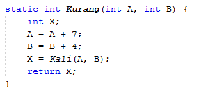

3. Lakukan import class Scanner sebagai inputan di langkah selajutnya.

4. Eksekusi atau panggil fungsi **Kurang** .
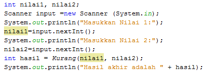


```Java
// Tuliskan kode program Percobaan 3 Langkah 1, 2, 3 & 4
static int Kali(int C, int D){
    int H;
    H = (C + 10) % (D + 19);
    return H;
}
static int Kurang(int A, int B){
    int X;
    A = A + 7;
    B = B + 4;
    X = Kali(A, B);
    return X;
}
int nilai1, nilai2;
Scanner input = new Scanner (System.in);
    System.out.println("Masukkan Nilai 1:");      
    nilai1 = input.nextInt();
    System.out.println("Masukkan Nilai 2 :");
    nilai2 = input.nextInt();
    int hasil = Kurang(nilai1, nilai2);
    System.out.println("Hasil akhir adalah " + hasil);
```

    Masukkan Nilai 1:
    1
    Masukkan Nilai 2 :
    2
    Hasil akhir adalah 18
    

#### Pertanyaan
1. Modifikasilah percobaan diatas dimana di fungsi **Kali** dapat memanggil fungsi **Kurang** kemudian eksekusi atau panggil fungsi Kali


```Java
// Tuliskan jawaban nomor 1
import java.util.Scanner;
static int Kurang(int C, int D){
    int H;
    H = (C + 10) % (D + 19);
    return H;
}
static int Kali(int A, int B){
    int X;
    A = A + 7;
    B = B + 4;
    X = Kurang(A, B);
    return X;
}
int nilai1, nilai2;
Scanner input = new Scanner (System.in);
    System.out.print("Masukkan Nilai 1:");      
    nilai1 = input.nextInt();
    System.out.print("Masukkan Nilai 2 :");
    nilai2 = input.nextInt();
    int hasil = Kali(nilai1, nilai2);
    System.out.println("Hasil akhir adalah " + hasil);
```

    Masukkan Nilai 1:2
    Masukkan Nilai 2 :3
    Hasil akhir adalah 19
    

2. Jelaskan alur jalannya program di percobaan 3 mulai dari input sampai keluar output!

Penjelasan : awalnya kita harus menggunakan import java.util.Scanner untuk agar kita dapat menginputkan nilai kemudian nilai akan dieksekusi pada kode blok kedua dimana nilai awal yang kita masukkan disebut nilai A dan nilai kedua yang kita inputkna disebut nilai B,nah disini nilai akan dieksekusi,untuk nilai A akan dijumlahkan dengan 7 dan hasil dari penjumlahan tersebut disebut nilai C(nilai yg saya inputkan 2,maka 2+7 = 9/nilai C)
kemudian lanjut ke nilai B akan dijumlahkan dengan angka 4 dan hasilnya disbut dengan nilai D(nilai yg saya inputkan yaitu 3,maka 3+4 = 7/nilai D).Proses selanjutnya yaitu kita deklarasikan int H digunakan untuk memproses hasil akhir,yaitu 19 % 26 maka outputnya 19.

### Percobaan 4: Mengubah Program Tidak Menggunakan Fungsi dan Menggunakan Fungsi
Pada Percobaan 4, kode program yang dibuat digunakan untuk menghitung luas persegi panjang dan volume balok tanpa menggunakan fungsi dan dengan menggunakan fungsi.
1. Import dan deklarasikan Scanner dengan nama **input**
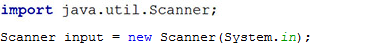

2. Buatlah inputan panjang, lebar, dan tinggi 
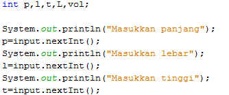

3. Hitung luas persegi panjang dan volume balok


```Java
// Tuliskan kode program Percobaan 4 Langkah 1, 2, & 3
import java.util.Scanner;
    Scanner input = new Scanner(System.in);
    int p,l,t,L,vol;
    System.out.println ("Masukkan panjang");
    p = input.nextInt();
    System.out.println("Masukkan lebarr");
    l = input.nextInt();
    System.out.println("Masukkan tinggi");
    t = input.nextInt();

    L=p*l;
    System.out.println("Luas Persegi panjang  adalah " + L);
    vol = p*l*t;
    System.out.println("Volume balok adalah " + vol);
```

    Masukkan panjang
    2
    Masukkan lebarr
    3
    Masukkan tinggi
    4
    Luas Persegi panjang  adalah 6
    Volume balok adalah 24
    

4. Program menghitung luas persegi dan volume balok diatas jika dibuatkan fungsi maka terdapat 3 fungsi yaitu hitungLuas, hitungVolume dan fungsi main, seperti dibawah ini:

Fungsi hitungLuas

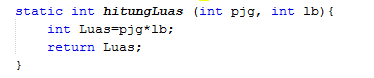

Fungsi hitungVolume


5. Eksekusi/panggil fungsi **hitungLuas** dan **hitungVolume**

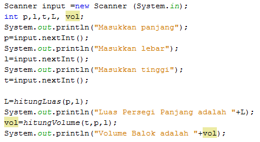


```Java
// Tuliskan kode program Percobaan 4 Langkah 1, 2, & 3
static int hitungLuas (int pjg, int lb){
    int Luas = pjg*lb;
    return Luas ;
}
static int hitungVolume (int tinggi, int a, int b){
    int volume = hitungLuas(a,b)*tinggi;
    return volume;
}
import java.util.Scanner;
    Scanner input = new Scanner(System.in);
    int p,l,t,L,vol;
    System.out.println ("Masukkan panjang");
    p = input.nextInt();
    System.out.println("Masukkan lebarr");
    l = input.nextInt();
    System.out.println("Masukkan tinggi");
    t = input.nextInt();

    L = hitungLuas(p,l);
    System.out.println("Luas Persegi Panjang adalah " + L);
    vol = hitungVolume(t,p,l);
    System.out.println("Volume Balok adalah " + vol);
```

    Masukkan panjang
    2
    Masukkan lebarr
    3
    Masukkan tinggi
    4
    Luas Persegi Panjang adalah 6
    Volume Balok adalah 24
    

#### Pertanyaan
1. Jelaskan kegunaan parameter yang terdapat didalam fungsi hitungLuas dan hitungVolume!

parameter pada hitungLuas untuk menampung nilai panjang dan lebar pada variabel bertipe data integer untuk diprosesi didalam fungsi hitungLuas
parameter pada hitungVolume untuk menampung nilai tinggi,nilai a(panjang) dan nilai b(lebar) pada variabel bertipe data integer untuk diproses dalam fungsi hitungVolume

2. Setelah melakukan percobaan 4, menurut anda manakah program yg lebih efisien apakah menggunakan fungsi atau tanpa fungsi? Jelaskan!


```Java
lebih efisien menggunakan fungsi karena jika menggunakan fungsi lebih terstruktur dan lebih efektif
```

### Percobaan 5: Fungsi Menggunakan Array dan Variabel Global
Pada Percobaan 5, kode program yang dibuat digunakan untuk menghitung total nilai yang ada didalam array dengan membuat 3 fungsi yaitu isiarray, hitTol, dan tampilArray.
1. Buatlah **variable global total dan i** bertipe int


2. Buatlah fungsi **isiarray** bertipe int dengan parameter angka bertipe int 

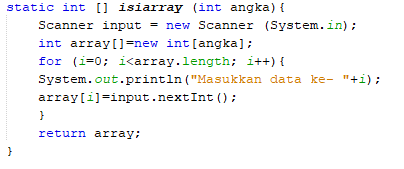

3. Buatlah fungsi **tampilArray** bertipe **void** dengan parameter data array **arr** bertipe int

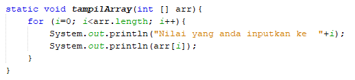

4. Buatlah fungsi **hitTot** bertipe int dengan parameter data array **arr** bertipe int

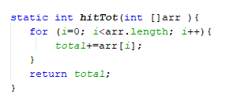

5. Import dan deklarasikan Scanner dengan nama **input**


6. Eksekusi atau panggil ketiga fungsi yaitu **isiarray, tampilArray, dan hitTot**, kemudian jalankan program!

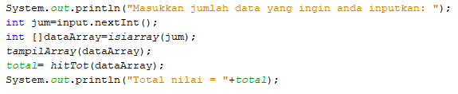


```Java
// Tuliskan kode program Percobaan 4 Langkah 1 s/d 6
static int total = 0,i;
static int [] isiarray (int angka){
Scanner input = new Scanner (System.in);
int array[] = new int[angka];
for(i = 0; i < array.length; i++){
    System.out.println("Masukkan data ke- " + i);
    array[i] = input.nextInt();
    }
    return array;
}

static void tampilArray(int [] arr){
for (i = 0; i<arr.length; i++){
    System.out.println("Nilai yang anda inputkan ke " + i);
    System.out.println(arr[i]);
}
}

static int hitTot(int []arr){
for (i = 0; i<arr.length; i++){
total+= arr[i];
}
return total;
}

import java.util.Scanner;
Scanner input = new Scanner(System.in);
System.out.println("Masukkan jumlah data yang ingin anda inputkan: ");
int jum = input.nextInt();
int []dataArray = isiarray(jum);
tampilArray(dataArray);
total = hitTot(dataArray);
System.out.println("Total nilai = " + total);
```

#### Pertanyaan
1. Jelaskan mengapa fungsi tampil array dibuat bertipe void, sedangkan isiarray dan hitTot bertipe int!

Penjelasan : array dibuat bertipe void karena tidak memerlukan return sedangkan isiarray dan hitTot bertipe int karena memerlukan return.

2. Menurut pendapat anda apakah fugsi isiarray dan hitTot dapat diganti dengan tipe void? Jelaskan dan buktikan dengan program!


```Java
// Tuliskan jawaban nomor 2
static void total = 0,i;
static void [] isiarray (int angka){
Scanner input = new Scanner (System.in);
int array[] = new int[angka];
for(i = 0; i < array.length; i++){
    System.out.println("Masukkan data ke- " + i);
    array[i] = input.nextInt();
    }
    
}

static int tampilArray(int [] arr){
for (i = 0; i<arr.length; i++){
    System.out.println("Nilai yang anda inputkan ke " + i);
    System.out.println(arr[i]);
}
}

static void hitTot(int []arr){
for (i = 0; i<arr.length; i++){
total+= arr[i];
}

}

import java.util.Scanner;
Scanner input = new Scanner(System.in);
System.out.println("Masukkan jumlah data yang ingin anda inputkan: ");
int jum = input.nextInt();
int []dataArray = isiarray(jum);
tampilArray(dataArray);
total = hitTot(dataArray);
System.out.println("Total nilai = " + total);
```


    |   static void total = 0,i;

    '(' expected

    


Penjelasan : hasilnya akan  error 

## Tugas

1. Buatlah sebuah static method yang bernama Max3(int bil1, int bil2, int bil3) yang menerima 3 buah parameter bilangan integer dan mengembalikan sebuah bilangan integer yang merupakan nilai maksimum diantara ketiga bilangan tersebut. 


```Java
// Tuliskan jawaban nomor 1
static int Max3(int bil1, int bil2, int bil3){ //membarikan nilai pada parameter yaitu beberapa bilangan bertipe data integer
    int max = 0; //mendeklarasikan int max
    if(bil1 > bil2 && bil1 > bil3){ //tedapat kondisi jika bil1 lebih besar dari bil2 & bil3 maka bilangan terbesarnya yaitu bil1
        max = bil1;
    }else if(bil2 > bil1 && bil2 > bil3){ //kondisi lain jika bil2 lebih besar dari bil1 & bil3 maka bilangan terbesarnya yaitu bil2
        max = bil2;
    }else{  //jika kedua kondisi diatas tidak ada yg sesuai maka kondisi akhir nya yaitu akan menghasilnya bilangan terbesar bil3
        max = bil3;
    }
        return max; //mengembalikan nilai max untuk diproses kembali
}
import java.util.Scanner; //library scanner untuk menginputkan nilai dari keyboard
Scanner input = new Scanner(System.in); 
System.out.println("Masukkan bil1 : "); //untuk mencetak Masukkan nilai bil1
int bil1 = input.nextInt();            // untuk menginputkan nilai user
System.out.println("Masukkan bil2 : "); //untuk mencetak Masukkan nilai bil2
int bil2 = input.nextInt();             // untuk menginputkan nilai user
System.out.println("Masukkan bil3 : "); //untuk mencetak Masukkan nilai bil3
int bil3 = input.nextInt();             // untuk menginputkan nilai user
int nilai = Max3(bil1,bil2,bil3);       //untuk menginputkan nilai user dari ketiga bilangan
System.out.println("Nilai Maksimum = " + nilai); //mencetak Nilai maksimum dari nilai yang di inputkan user

```

    Masukkan bil1 : 
    20
    Masukkan bil2 : 
    30
    Masukkan bil3 : 
    40
    Nilai Maksimum = 40
    

2. Disebuah restoran terdapat 3 menu yang dijual yaitu nasi goreng, soto, dan sate. Harga nasi goreng Rp. 20.000, soto Rp. 15.000, dan sate Rp. 25.000. Restoran tersebut buka dari hari senin sampai jumat. Berikut ini merupakan tabel pejualan perhari untuk masing-masing menu di restoran tersebut dari hari senin sampai jumat
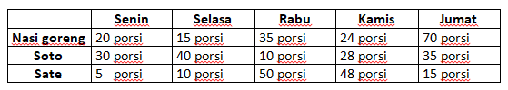

Buatlah Fungsi sebagai berikut:
 * Fungsi menampilkan menu favorit di hari selasa dan jumat (menu favorit diasumsikan adalah menu yang paling banyak terjual di hari tersebut)
 * Fungsi untuk menghitung pemasukan restoran tersebut mulai hari senin sampai jumat.
 * Fungsi untuk menghitung berapa porsi yang terjual untuk masing-masing menu yaitu nasi goreng, soto, dan sate mulai senin sampai jumat.


```Java
// Tuliskan jawaban nomor 2
int[][] dataJual = {  //memberikan nilai atau inisialisasi data jual dengan tipe data integer
    {20, 15, 35, 24, 70},
    {30, 40, 10, 28, 35},
    {5, 10, 50, 48, 15},
};

String[] dataHari = {"Senin", "Selasa", "Rabu", "Kamis", "Jumat"}; //memberikan nilai atau inisialisasi data hari dengan tipe data string
String[] dataMenu = {"Nasi Goreng", "Soto", "Sate"}; //memberikan nilai atau inisialisasi data menu dengan tipe data string
String menu, hari; //deklarasi menu dan hari dengan tipe data string
int total; //deklarasi total dengan tipe data integer

//menu favorit
static void favorit(){ //pembuatan fungsi tanpa parameter atau tidak memberikan nilai dan tidak mengulang data/return dengan ditandai void
    for(int i = 1; i < dataJual[0].length; i += 3){ //menggunakan perulangan dimana nilai i = 1 ,nilai i lebih kecil dari panjang datajual dan i+=3
    int maks = 0;                          //deklarasi maks=0 dengan tipe data integer
    for(int j = 0; j < dataJual.length; j++){ //terdapat perulangan 1 dimensi lagi yaitu dimana nilai j=0,j kurangdari panjang datajual,dan j decrement atau akan bertambah
         if (dataJual[j][i] > maks){ //terdapat kondisi dimana datajual [j][i] lebih besar dari maks
         maks = dataJual[j][i];  
         menu = dataMenu[j];
         hari = dataHari[i];
            } 
        }
        System.out.println("Masakan favorit hari " + hari + " adalah " + menu ); //menampilkan masakan favorit dari menu yang paling banyak terjual di hari tersebut
    }
}
//pemasukan
static void duit(){ //pembuatan fungsi tanpa parameter  atau tidak memberikan nilai dan tidak mengulang data/return dengan ditandai sintak void
    for(int i = 0; i < dataJual.length; i++){ //menggunakan perulangan dimana nilai i=0;i kurangdari panjang datajual dan nilai i decrement atau bertambah satu
    int totalJual = 0, totalHarga = 0; //deklarasi totaljual dan totalharga dengan tipedata integer
    for(int j = 0; j < dataJual[0].length; j++){ 
    totalJual += dataJual[i][j];
         if(i == 0){      //terdapat kondisi dimana jika i==0,maka total harga dikaki 20rb
         totalHarga = totalJual * 20000;
         }else if(i == 1){    //terdapat kondisi dimana jika i == 1 ,maka total jual dikali 15rb
         totalHarga = totalJual * 15000;
         }else{              //kondisi lain maka total harga = totaljual dikali 25rb
         totalHarga = totalJual * 25000;
        }
        }
        total += totalHarga;  
    }
        System.out.println("Total pemasukan dari hari Senin hingga hari Jumat adalah Rp" + total); //menampilkan total pemasukan dari hari senin hingga hari jumat berdasarkan total penjualan
}
//jumlah porsi
static void jumlah(){ //pembuatan fungsi tanpa parameter  atau tidak memberikan nilai dan tidak mengulang data/return dengan ditandai sintak void
    for(int i = 0; i < dataJual.length; i++){ 
    int totalJual = 0, totalHarga = 0;
    for(int j = 0; j < dataJual[0].length; j++){
    totalJual += dataJual[i][j];
    }
     menu = dataMenu[i];
    System.out.println("Banyak " + menu + " yang terjual adalah: " + totalJual + " porsi"); //menampilkan banyak menu yang terjual
    }
}
favorit();
duit();
jumlah();
```

    Masakan favorit hari Selasa adalah Soto
    Masakan favorit hari Jumat adalah Nasi Goreng
    Total pemasukan dari hari Senin hingga hari Jumat adalah Rp8625000
    Banyak Nasi Goreng yang terjual adalah: 164 porsi
    Banyak Soto yang terjual adalah: 143 porsi
    Banyak Sate yang terjual adalah: 128 porsi
    
