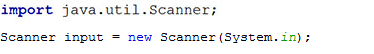

# JOBSHEET 13. Fungsi 1

## Tujuan
* Mahasiswa mampu memahami penggunaan fungsi static pada Java dengan parameter dan mengembalikan nilai.
* Mahasiswa mampu membuat program menggunakan fungsi static dan mengeksekusi fungsi tersebut.


## Alat dan Bahan
* PC/Laptop
* Browser
* Koneksi internet
* Anaconda3 + Java kernel (opsional)

## Praktikum

### Percobaan 1: Fungsi Void (tidak menggunakan return value)

1.	Buat fungsi **beriSalam** bertipe void yang digunakan untuk mencetak **“Halo! Selamat Pagi”**.


2. Eksekusi atau panggil fungsi **beriSalam**.


```Java
static void beriSalam() {
    System.out.println("Halo! Selamat Pagi");
}

beriSalam()
```

    Halo! Selamat Pagi


3. Buat fungsi **beriUcapan** dengan sebuah parameter bertipe String.


4. Buatlah variabel **salam** bertipe String kemudian eksekusi atau panggil fungsi **beriUcapan** dengan mengisi parameternya dengan variable **salam** yang sudah dibuat.


```Java
static void beriUcapan(String ucapan) {
    System.out.println(ucapan);
}

String salam = "Selamat datang di pemrograman Java";
beriUcapan(salam);
```

    Selamat datang di pemrograman Java


#### Pertanyaan
1. Jelaskan perbedaan fungsi **beriSalam** dan **beriUcapan** pada praktikum 1!

beriSalam tidak terdapat parameter, pada fungsi tersebut langsung mengeluarkan output hardcoded, sedangkan beriUcapan dapat menerima parameter bertipe String yang dapat ditampilkan secara dinamis

2. Jelaskan cara pemanggilan sebuah fungsi void yang berparameter dan tanpa parameter!

Berparameter
```java
namaFungsi(nilaiParameter...);
```

Contoh berparameter
```java
beriSalam("Halo Dunia!");
```

Tanpa parameter
```java
namaFungsi();
```

Contoh berparameter
```java
beriUcapan();
```

### Percobaan 2: Fungsi dengan return value (Bukan void)
Pada Percobaan 2, kode program yang dibuat digunakan untuk menghitung luas persegi dengan membuat fungsi **luasPersegi** yang menggunakan parameter.
1. Buat fungsi **luasPersegi**  untuk menghitung luas persegi yang mengembalikan nilai luas (int) dan parameter masukan sisi (int).


2.	Eksekusi atau panggil fungsi luasPersegi dengan cara membuat variabel baru yaitu **luasan**, kemudian isi variabel tersebut dengan memanggil fungsi luasPersegi dan mengisi parameter sisi. Selanjutnya cetak variabel luasan untuk menampilkan luas persegi panjang


```Java
static int luasPersegi(int sisi) {
    int luas = sisi * sisi;
    
    return luas;
}

int luasan = luasPersegi(5);
System.out.println("Luas Persegi dengan sisi 5 = " + luasan);
```

    Luas Persegi dengan sisi 5 = 25


#### Pertanyaan
1. jelaskan mengapa ketika memanggil fungsi **luasPersegi** harus membuat variabel baru yaitu luasan?

Variable luasan tersebut berfungsi untuk menampung hasil atau nilai return dari fungsi luasPersegi

2. Jelaskan kegunaan **return luas** pada percobaan 2 diatas!

Kegunaan kode tersebut adalah untuk memberikan nilai balik kepada pemanggil fungsi yaitu hasil dari operasi sisi * sisi

3. Modifikasilah program di percobaan 2, dengan membuat panjang **sisi** sebagai inputan!


```Java
import java.util.Scanner;

Scanner s = new Scanner(System.in);

System.out.print("Masukan sisi: ");
int luasan = luasPersegi(s.nextInt());
System.out.println("Luas Persegi = " + luasan);
```

    Masukan sisi: 2
    Luas Persegi = 4
    

### Percobaan 3: Fungsi dapat meng-CALL Fungsi Lain
Pada Percobaan 3, kode program yang dibuat digunakan untuk mengimplementasikan bahwa fungsi dapat meng-CALL fungsi yang lain. Dimana dalam percobaan ini terdapat fungsi **Kali dan Kurang**. 
1. Buatlah fungsi **Kali** yang mengembalikan nilai H (int) dan parameter masukan C dan D (int).


2.	Buatlah fungsi **Kurang** yang mengembalikan nilai X (int) dan parameter masukan A dan B (int) dan memanggil fungsi Kali.


3. Lakukan import class Scanner sebagai inputan di langkah selajutnya.

4. Eksekusi atau panggil fungsi **Kurang** .


```Java
static int Kali(int C, int D) {
    int H;
    H = (C + 10) % (D + 19);
    return H;
}

static int Kurang(int A, int B) {
    int X;
    A += 7;
    B += 4;
    X = Kali(A, B);
    return X;
}

int nilai1, nilai2;
Scanner i = new Scanner(System.in);

System.out.print("Masukan Nilai 1: ");
nilai1 = i.nextInt();
System.out.print("Masukan Nilai 2: ");
nilai2 = i.nextInt();

int hasil = Kurang(nilai1, nilai2);
System.out.println("Hasil akhir adalah " + hasil);
```

    Masukan Nilai 1: 1
    Masukan Nilai 2: 2
    Hasil akhir adalah 18
    

#### Pertanyaan
1. Modifikasilah percobaan diatas dimana di fungsi **Kali** dapat memanggil fungsi **Kurang** kemudian eksekusi atau panggil fungsi Kali


```Java
static int Kali(int C, int D) {
    int H;
    H = Kurang(C, D) * Kurang(D, C);
    return H - Kurang(C * D, D * C);
}

static int Kurang(int A, int B) {
    int X;
    
    A += 7;
    B += 4;
    
    return A -B;
}

int nilai1, nilai2;
Scanner i = new Scanner(System.in);

System.out.print("Masukan Nilai 1: ");
nilai1 = i.nextInt();
System.out.print("Masukan Nilai 2: ");
nilai2 = i.nextInt();

int hasil = Kali(nilai1, nilai2);
System.out.println("Hasil akhir adalah " + hasil);
```

    Masukan Nilai 1: 1
    Masukan Nilai 2: 2
    Hasil akhir adalah 5
    

2. Jelaskan alur jalannya program di percobaan 3 mulai dari input sampai keluar output!

- User input nilai 1 dan 2
- Input tersebut digunakan sebagai parameter fungsi Kurang
- Pada fungsi Kurang, nilai 1 akan ditambah dengan 7 dan nilai 2 akan ditambah dengan 4
- Kemudian, hasil penambahan tersebut digunakan sebagai parameter fungsi Kali
- Pada fungsi ini, dilakukan operasi (C + 10) % (D + 19); dimana C dan D adalah hasil input yang dilakukan penambahan nilai pada fungsi Kurang
- Setelah mendapat hasilnya, maka tampilkan kan user

### Percobaan 4: Mengubah Program Tidak Menggunakan Fungsi dan Menggunakan Fungsi
Pada Percobaan 4, kode program yang dibuat digunakan untuk menghitung luas persegi panjang dan volume balok tanpa menggunakan fungsi dan dengan menggunakan fungsi.
1. Import dan deklarasikan Scanner dengan nama **input**


2. Buatlah inputan panjang, lebar, dan tinggi 


3. Hitung luas persegi panjang dan volume balok


```Java
import java.util.Scanner;
Scanner input = new Scanner(System.in);

int p, l, t, L, vol;

System.out.print("Masukkan panjang : ");
p = input.nextInt();
System.out.print("Masukkan lebar : ");
l = input.nextInt();
System.out.print("Masukkan tingg : ");
t = input.nextInt();

L = p * l;
System.out.println("Luas Persegi panjang adalah : " + L);

vol = p * l * t;
System.out.println("Volume balok adalah : " + vol);
```

    Masukkan panjang : 10
    Masukkan lebar : 22
    Masukkan tingg : 31
    Luas Persegi panjang adalah : 220
    Volume balok adalah : 6820
    

4. Program menghitung luas persegi dan volume balok diatas jika dibuatkan fungsi maka terdapat 3 fungsi yaitu hitungLuas, hitungVolume dan fungsi main, seperti dibawah ini:

Fungsi hitungLuas


Fungsi hitungVolume


5. Eksekusi/panggil fungsi **hitungLuas** dan **hitungVolume**


```Java
static int hitungLuas(int pjg, int lbr){
    int Luas = pjg * lbr;
    return Luas;
}

static int hitungVolume(int tinggi, int a, int b){
    int volume = hitungLuas(a,b) * tinggi;
    return volume;
}

import java.util.Scanner;
Scanner input = new Scanner(System.in);
int p, l, t, L, vol;
System.out.print("Masukkan panjang : ");
p = input.nextInt();
System.out.print("Masukkan lebar : ");
l = input.nextInt();
System.out.print("Masukkan tinggi : ");
t = input.nextInt();

L = hitungLuas(p, l);
System.out.println("Luas Persegi panjang adalah : " + L);

vol = hitungVolume(t, p, l);
System.out.println("Volume Balok adalah : " + vol);
```

    Masukkan panjang : 32
    Masukkan lebar : 12
    Masukkan tinggi : 42
    Luas Persegi panjang adalah : 384
    Volume Balok adalah : 16128
    

#### Pertanyaan
1. Jelaskan kegunaan parameter yang terdapat didalam fungsi hitungLuas dan hitungVolume!

Parameter pada fungsi tersebut digunakan untuk mendapatkan nilai nilai yang diperlukan untuk dapat menjalankan rumus perhitungan luas dan volume. Dengan begitu kita dapat memanggil fungsi tersebut dengan nilai yang berbeda untuk mendapatkan hasil yang berbeda

2. Setelah melakukan percobaan 4, menurut anda manakah program yg lebih efisien apakah menggunakan fungsi atau tanpa fungsi? Jelaskan!

Menurut saya menggunakan fungsi, karena perhitungan tersebut dapat dipanggil berkali-kali dengan nilai yang berbeda, sehingga dapat mengurangi repetisi kode


### Percobaan 5: Fungsi Menggunakan Array dan Variabel Global
Pada Percobaan 5, kode program yang dibuat digunakan untuk menghitung total nilai yang ada didalam array dengan membuat 3 fungsi yaitu isiarray, hitTol, dan tampilArray.
1. Buatlah **variable global total dan i** bertipe int


2. Buatlah fungsi **isiarray** bertipe int dengan parameter angka bertipe int 


3. Buatlah fungsi **tampilArray** bertipe **void** dengan parameter data array **arr** bertipe int


4. Buatlah fungsi **hitTot** bertipe int dengan parameter data array **arr** bertipe int


5. Import dan deklarasikan Scanner dengan nama **input**


6. Eksekusi atau panggil ketiga fungsi yaitu **isiarray, tampilArray, dan hitTot**, kemudian jalankan program!


```Java
import java.util.Scanner;
static int total = 0, i;

static int[] isiarray(int angka){
    Scanner sc = new Scanner(System.in);
    int array[] = new int[angka];
    for(int i = 0; i < array.length; i++){
        System.out.printf("Masukkan data ke-%d :",i);
        array[i] = sc.nextInt();
    }
    return array;
}

static void tampilArray(int[] arr){
    for(int i = 0; i < arr.length; i++){
        System.out.println("Nilai yang anda inputkan ke- " + i);
        System.out.println(arr[i]);
    }
    
}

static int hitTot(int[] arr){
    for(int i = 0; i < arr.length; i++){
        total += arr[i];
    }
    return total;
}

Scanner input = new Scanner(System.in);
System.out.print("Masukkan jumlah data yang ingin anda inputkan: ");
int jum = input.nextInt();
int []dataArray = isiarray(jum);
tampilArray(dataArray);
total = hitTot(dataArray);
System.out.println("Total nilai = " + total);
```

    Masukkan jumlah data yang ingin anda inputkan: 2
    Masukkan data ke-0 :1
    Masukkan data ke-1 :3
    Nilai yang anda inputkan ke- 0
    1
    Nilai yang anda inputkan ke- 1
    3
    Total nilai = 4
    

#### Pertanyaan
1. Jelaskan mengapa fungsi tampil array dibuat bertipe void, sedangkan isiarray dan hitTot bertipe int!

Karena fungsi tersebut tidak mengembalikan apa apa dan langsung menampilkan output dengan `System.out.println` di dalamnya.

Sedangkan fungsi isiArray dan hitTot akan mengembalikan nilai yaitu jika isiArray akan mengembalikan hasil array yang diinput oleh user dan hitTot akan menghitung total nilai dari array yang dimasukan kedalam parameter

2. Menurut pendapat anda apakah fugsi isiarray dan hitTot dapat diganti dengan tipe void? Jelaskan dan buktikan dengan program!

Bisa, kita bisa memanfaatkan function pass by refference untuk isiarray, dan untuk hitTot kita dapat langsung menampilkan outputnya di dalam fungsi


```Java
import java.util.Scanner;
static int total = 0, i;

static void isiarray(int[] array){
    Scanner sc = new Scanner(System.in);
    
    for(int i = 0; i < array.length; i++){
        System.out.printf("Masukkan data ke-%d :",i);
        array[i] = sc.nextInt();
    }
}

static void tampilArray(int[] arr){
    for(int i = 0; i < arr.length; i++){
        System.out.println("Nilai yang anda inputkan ke- " + i);
        System.out.println(arr[i]);
    }
    
}

static void hitTot(int[] arr){
    for(int i = 0; i < arr.length; i++){
        total += arr[i];
    }
    
    System.out.println("Total nilai = " + total);
}

Scanner input = new Scanner(System.in);
System.out.print("Masukkan jumlah data yang ingin anda inputkan: ");
int jum = input.nextInt();
int []dataArray = new int[jum];

isiarray(dataArray);
tampilArray(dataArray);
hitTot(dataArray);
```

    Masukkan jumlah data yang ingin anda inputkan: 2
    Masukkan data ke-0 :1
    Masukkan data ke-1 :2
    Nilai yang anda inputkan ke- 0
    1
    Nilai yang anda inputkan ke- 1
    2
    Total nilai = 3
    

## Tugas

1. Buatlah sebuah static method yang bernama Max3(int bil1, int bil2, int bil3) yang menerima 3 buah parameter bilangan integer dan mengembalikan sebuah bilangan integer yang merupakan nilai maksimum diantara ketiga bilangan tersebut. 


```Java
static int Max3(int bil1, int bil2, int bil3) {
    int maks = 0;

    if (bil1 > bil2 && bil1 > bil3) {
      maks = bil1;
    } else if (bil2 > bil1 && bil2 > bil3) {
      maks = bil2;
    } else {
      maks = bil3;
    }
    
    return maks;
}

System.out.println(Max3(2, 4, 5));
System.out.println(Max3(12, 23, 50));
System.out.println(Max3(999, 1000, 1));
```

    5
    50
    1000
    

Fungsi di atas berfungsi untuk menampilkan bilangan terbesar dengan cara mengecek apakah sebuah nilai lebih besar dari kedua nilai yang lain menggunakan pernyataan **if-else if-else**

2. Disebuah restoran terdapat 3 menu yang dijual yaitu nasi goreng, soto, dan sate. Harga nasi goreng Rp. 20.000, soto Rp. 15.000, dan sate Rp. 25.000. Restoran tersebut buka dari hari senin sampai jumat. Berikut ini merupakan tabel pejualan perhari untuk masing-masing menu di restoran tersebut dari hari senin sampai jumat


Buatlah Fungsi sebagai berikut:
 * Fungsi menampilkan menu favorit di hari selasa dan jumat (menu favorit diasumsikan adalah menu yang paling banyak terjual di hari tersebut)
 * Fungsi untuk menghitung pemasukan restoran tersebut mulai hari senin sampai jumat.
 * Fungsi untuk menghitung berapa porsi yang terjual untuk masing-masing menu yaitu nasi goreng, soto, dan sate mulai senin sampai jumat.


```Java
static void favMenuAtDay(int[][] salesData, String[] menusName, int... days) {
    int[] maxSalesAtDay = new int[days.length];
    int[] maxSalesMenuIndex = new int[days.length];

    for (int menuIndex = 0; menuIndex < salesData.length; menuIndex++) {
      for (int dayIndex = 0; dayIndex < days.length; dayIndex++) {
        int day = days[dayIndex];

        if (salesData[menuIndex][day] > maxSalesAtDay[dayIndex]) {
          maxSalesAtDay[dayIndex] = salesData[menuIndex][day];
          maxSalesMenuIndex[dayIndex] = menuIndex;
        }
      }
    }

    String[] daysName = {"Senin", "Selasa", "Rabu", "Kamis", "Jumat"};

    for (int dayIndex = 0; dayIndex < days.length; dayIndex++) {
      int day = days[dayIndex];
      int menuIndex = maxSalesMenuIndex[dayIndex];

      System.out.println("Menu favorit pada hari " + daysName[day] + " adalah " + menusName[menuIndex]);
    }
}

static void restaurantIncomes(int[][] salesData, int[] prices) {
    if (salesData.length != prices.length) {
      System.out.println("salesData dan harga tidak sama");
      return;
    }

    int totalPemasukan = 0;

    for (int menuIndex = 0; menuIndex < salesData.length; menuIndex++) {
      for (int dayIndex = 0; dayIndex < salesData[menuIndex].length; dayIndex++) {
        totalPemasukan += salesData[menuIndex][dayIndex] * prices[menuIndex];
      }
    }

    System.out.println("Total Pemasukan Restoran: Rp." + totalPemasukan);
}

static void totalMenuSales(int[][] salesData, String[] menusName) {
    int[] totalSales = new int[salesData.length];

    for (int menuIndex = 0; menuIndex < salesData.length; menuIndex++) {
      for (int dayIndex = 0; dayIndex < salesData[menuIndex].length; dayIndex++) {
        totalSales[menuIndex] += salesData[menuIndex][dayIndex];
      }
    }

    for (int menuIndex = 0; menuIndex < totalSales.length; menuIndex++) {
      System.out.println("Total salesData " + menusName[menuIndex] + " adalah " + totalSales[menuIndex] + " porsi");
    }
}

int[][] salesData = { { 20, 15, 35, 24, 70 }, { 30, 40, 10, 28, 35 }, { 5, 10, 50, 48, 15 } };
String[] menusName = { "Nasi Goreng", "Soto", "Sate" };
int[] prices = { 20000, 15000, 25000 };

String divider = "=".repeat(40);

System.out.println("Menu Favorit");
System.out.println(divider);
// 1 = Selasa, 4 = Jumat
favMenuAtDay(salesData, menusName, 1, 4);
System.out.println(divider);

System.out.println("\nTotal Pendapatan Restoran");
System.out.println(divider);
restaurantIncomes(salesData, prices);
System.out.println(divider);

System.out.println("\nTotal Penjualan Tiap Menu");
System.out.println(divider);
totalMenuSales(salesData, menusName);
```

    Menu Favorit
    ========================================
    Menu favorit pada hari Selasa adalah Soto
    Menu favorit pada hari Jumat adalah Nasi Goreng
    ========================================
    
    Total Pendapatan Restoran
    ========================================
    Total Pemasukan Restoran: Rp.8625000
    ========================================
    
    Total Penjualan Tiap Menu
    ========================================
    Total salesData Nasi Goreng adalah 164 porsi
    Total salesData Soto adalah 143 porsi
    Total salesData Sate adalah 128 porsi
    

Pada kode di atas, terdapat fungsi untuk mencari menu favorit pada hari tertentu. Di sini saya menggunakan parameter agar jika terjadi perubahan menu, fungsi dapat bekerja dengan adaptif.

Cara kerja fungsi menu favorit adalah dengan cara looping tiap menu, kemudian looping varargs days, pada tiap iterasi days, akan dilakukan pengecekan untuk penjualan terbesar, kemudian simpan indexnya, index ini nanti digunakan untuk mendapatkan nama menu dari array menusName.

Cara kerja fungsi restaurantIncomes adalah dengan melakukan looping terhadap tiap menu, kemudian tiap harinya, setelah itu kalikan jumlah penjualan dengan harga yang dapat kita tentukan dengan parameter int[] prices.

Cara kerja totalMenuSales adalah lakukan looping pada tiap menu, kemudian lakukan looping tiap harinya, setelah itu lakukan penjumlahan untuk tiap hari. Hasil penjumlahan ini disimpan pada array totalSales yang nantinya dapat digunakan untuk menampilkan hasilnya berdasarkan nama menunya. Kenapa menggunakan array adalah agar jika jumlah menu bertambah, fungsi ini masih dapat digunakan secara dinamis.

Setelah semua fungsi dibuat, lakukan pemanggilan tiap fungsi dengan parameter yang sesuai
