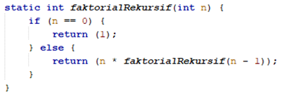
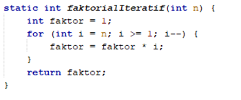
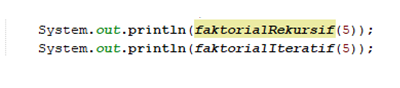
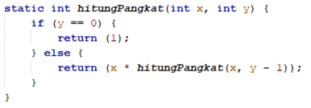
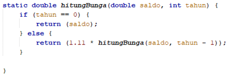
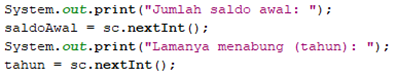

# JOBSHEET 14. Fungsi 2

## Tujuan
* Mahasiswa memahami konsep fungsi rekursif
* Mahasiswa mampu mengimplementasikan fungsi rekursif dalam kode program


## Alat dan Bahan
* PC/Laptop
* Browser
* Koneksi internet
* Anaconda3 + Java kernel (opsional)

## Praktikum

### Percobaan 1
Pada percobaan ini akan dilakukan pembuatan program untuk menghitung nilai faktorial dari suatu bilangan dengan menggunakan fungsi rekursif. Selain itu, akan dibuat juga fungsi untuk menghitung nilai faktorial dengan menggunakan algoritma iteratif sebagai pembandingnya

1. Buat fungsi static dengan nama **faktorialRekursif()**, dengan tipe data kembalian fungsi int dan memiliki 1 parameter dengan tipe data int berupa bilangan yang akan dihitung nilai faktorialnya

    


```Java
// Tuliskan kode program Percobaan 1 Langkah 1
static int faktorialRekursif(int n) {
    if(n == 0) {
        return 1;
    } else {
        return n * faktorialRekursif(n - 1);
    }
}
```

2. Buat lagi fungsi static dengan nama **faktorialIteratif()**, dengan tipe data kembalian fungsi int dan memiliki 1 parameter dengan tipe data int berupa bilangan yang akan dihitung nilai faktorialnya.

    


```Java
// Tuliskan kode program Percobaan 1 Langkah 2
static int faktorialIteratif(int n) {
    int faktor = 1;
    for (int i = n; i >= 1; i--) {
        faktor = faktor * i;
    }
    return faktor;
}
```

3. Lakukan pemanggilan terhadap kedua fungsi yang telah dibuat sebelumnya, dan tampilkan hasil yang didapatkan.

    


```Java
// Tuliskan kode program Percobaan 1 Langkah 1, 2, 3
System.out.println(faktorialRekursif(5));
System.out.println(faktorialIteratif(5));
```

    120
    120


4. Jika ditelusuri, pada saat pemanggilan fungsi faktorialRekursif(5),maka proses yang terjadi dapat diilustrasikan sebagai berikut:

    

#### Pertanyaan
1. Apa yang dimaksud dengan fungsi rekursif?
2. Bagaimana contoh kasus penggunaan fungsi rekursif ?
3. Pada Percobaan1, apakah hasil yang diberikan fungsi faktorialRekursif() dan fungsi faktorialIteratif() sama? Jelaskan perbedaan alur jalannya program pada penggunaan fungsi rekursif dan fungsi iteratif!


Jawaban :

1. Fungsi rekursif adalah fungsi yang memanggil dirinya sendiri

2. Contoh kasus penggunaan rekursif adalah faktorial, pencarian FPB, perkalian, perpangkatan dan lainnya.

3. Iya, hasil yang diberikan fungsi faktorialRekursif() dan fungsi faktorialIteratif() sama, namun memiliki alur yang berbeda sebagai berikut :

fungsi faktorialRekursif memanggil dirinya sendiri dengan parameter berbeda yang terus berkurang satu dari n bilangan hingga kondisi yang ditentukan yaitu hingga n==0

fungsi faktorialIteratif memiliki alur pemrograman dengan menggunakan perulangan for yaitu dengan melakukan perulangan dari n hingga 1 dan dikalikan dengan variable faktor

### Percobaan 2
Pada percobaan ini akan dilakukan pembuatan program untuk menghitung pangkat sebuah bilangan dengan menggunakan fungsi rekursif.

1. Buat fungsi static dengan nama **hitungPangkat()**, dengan tipe data kembalian fungsi int dan memiliki 2 parameter dengan tipe data int berupa bilangan yang akan dihitung pangkatnya dan bilangan pangkatnya

    

2.	Deklarasikan Scanner dengan nama sc
3.	Buatlah dua buah variabel bertipe int dengan nama bilangan dan pangkat
4.	Tambahkan kode berikut ini untuk menerima input dari keyboard

    

5. Lakukan pemanggilan fungsi hitungPangkat yang telah dibuat sebelumnya dengan mengirimkan dua nilai parameter.

    


```Java
// Tuliskan kode program Percobaan 2 Langkah 1 - 5
import java.util.Scanner;
Scanner sc = new Scanner(System.in);
int bilangan, pangkat;
static int hitungPangkat(int x, int y){
    if(y == 0) {
        return (1);
    }else {
        return (x * hitungPangkat(x, y-1));
    }
}
System.out.print("Bilangan yang dihitung: ");
bilangan = sc.nextInt();
System.out.print("Pangkat: ");
pangkat = sc.nextInt();
System.out.println(hitungPangkat(bilangan, pangkat));
```

    Bilangan yang dihitung: 5
    Pangkat: 3
    125


#### Pertanyaan
1. Pada Percobaan2, terdapat pemanggilan fungsi rekursif hitungPangkat(bilangan, pangkat) pada fungsi main, kemudian dilakukan pemanggilan fungsi hitungPangkat() secara berulangkali. Jelaskan sampai kapan proses pemanggilan fungsi tersebut akan dijalankan!

Jawaban : proses pemanggilan fungsi tersebut akan dijalankan hingga parameter y (pangkat) == 0, dimana pada pemanggilan fungsi berikutnya, parameter kedua yaitu y terus berkurang (y-1)

### Percobaan 3
Pada percobaan ini akan dilakukan pembuatan program untuk menghitung jumlah uang nasabah yang disimpan di Bank setelah mendapatkan bunga selama beberapa tahun dengan menggunakan fungsi rekursif. 

1. Buat fungsi static dengan nama **hitungBunga()**, dengan tipe data kembalian fungsi double dan memiliki 2 parameter dengan tipe  data int berupa saldo nasabah dan lamanya menabung. Pada kasus ini dianggap bunga yang ditentukan oleh bank adalah 11% per tahun. Karena perhitungan bunga adalah bunga * saldo, sehingga untuk menghitung besarnya uang setelah ditambah bunga adalah saldo + bunga * saldo. Dalam hal ini, besarnya bunga adalah 0.11 * saldo, dan saldo dianggap 1 * saldo, sehingga 1 * saldo + 0.11 * saldo dapat diringkas menjadi 1.11 * saldo untuk perhitungan saldo setelah ditambah bunga (dalam setahun).

    

2.	Deklarasikan Scanner dengan nama sc
3.	Buatlah sebuah variabel bertipa double dengan nama saldoAwal dan sebuah variabel bertipe int bernama tahun
4.	Tambahkan kode berikut ini untuk menerima input dari keyboard

 

5. Lakukan pemanggilan fungsi hitungBunga yang telah dibuat sebelumnya dengan mengirimkan dua nilai parameter.

    


```Java
// Tuliskan kode program Percobaan 3 Langkah 1 - 5
import java.util.Scanner;
Scanner sc = new Scanner(System.in);
static double hitungBunga(double saldo, int tahun) {
    if (tahun == 0) {
        return (saldo);
    } else {
        return (1.11 * hitungBunga(saldo, tahun - 1));
    }
}
int saldoAwal, tahun;
System.out.print("Jumlah saldo awal: ");
saldoAwal = sc.nextInt();
System.out.print("Lamanya menabung (tahun): ");
tahun = sc.nextInt();
System.out.print("Jumlah uang setelah " + tahun + " tahun: ");
System.out.println(hitungBunga(saldoAwal, tahun));
```

    Jumlah saldo awal: 1000000
    Lamanya menabung (tahun): 5
    Jumlah uang setelah 5 tahun: 1685058.1551000006


#### Pertanyaan
1. Pada Percobaan3, sebutkan blok kode program manakah yang merupakan “base case” dan “recursion call”!

Base case merupakan nilai batas suatu fungsi rekursif, pada kode diatas yang merupakan base case adalah :

if (tahun == 0) { return (saldo);

Recursion call pada kode diatas adalah :

else { return (1.11 * hitungBunga(saldo, tahun - 1)); }

recursion call harus mendekati base case disetiap pemanggilan fungsi rekursif, supaya rekursi dapat berhenti

pada kode diatas parameter tahun selalu berkurang setiap pemanggilan fungsi supaya dapat mendekati nilai batas yaitu tahun == 0

## Tugas

1. Buatlah program untuk menampilkan bilangan n sampai 0 dengan menggunakan fungsi rekursif dan fungsi iteratif. (**DeretDescendingRekursif**).


```Java
// Tuliskan jawaban tugas nomor 1
import java.util.Scanner;
Scanner sc = new Scanner(System.in);
int n;
static int fungsiRekursif(int n) { 
    if(n == 0) {
        return 0;
    } else {
        System.out.println(n);
        return fungsiRekursif(n - 1);
    }
}
System.out.print("jumlah bilangan : ");
n = sc.nextInt();
System.out.println(fungsiRekursif(n));
```

    jumlah bilangan : 9
    9
    8
    7
    6
    5
    4
    3
    2
    1
    0


Penjelasan :

fungsiRekursif memanggil dirinya sendiri dengan parameter berbeda yang terus berkurang satu dari n bilangan hingga kondisi yang ditentukan yaitu hingga n==0, dimana selama kondisi n==0 belum terpenuhi, dicetak n dan selanjutnya parameter bilangan n - 1 dikirim dalam rekursif. Dan apabila n==0 (pemanggilan yang terakhir), dilakukan return 0.

-Menampilkan bilangan dengan fungsi iteratif(perulangan) :


```Java
static void fungsiIteratif(int n) {
    for(int i = n; i >= 0; i--) {
        System.out.println(i);
    }
}
System.out.print("jumlah bilangan : ");
n = sc.nextInt();
fungsiIteratif(n);
```

    jumlah bilangan : 9
    9
    8
    7
    6
    5
    4
    3
    2
    1
    0


Penjelasan : 

fungsiIteratif memiliki alur pemrograman dengan menggunakan perulangan for yaitu dengan melakukan perulangan dari i=n hingga i=0 dan disetiap perulangan dilakukan pencetakan i, kemudian i dikurangi 1.

2. Buatlah program yang di dalamnya terdapat fungsi rekursif untuk menghitung bilangan faktorial. Misalniya f = 8, maka akan dihasilkan 1+2+3+4+5+6+7+8 = 36 (**PenjumlahanRekursif**).


```Java
// Tuliskan jawaban tugas nomor 2
import java.util.Scanner;
Scanner sc = new Scanner(System.in);
int n = 1;
int bilangan;
System.out.print("Masukkan bilangan : ");
bilangan = sc.nextInt();
static int penjumlahanRekursif(int n) { 
    if(n == bilangan) {
        return n;
    } else {
        return n + penjumlahanRekursif(n + 1);
    }
}
System.out.println(penjumlahanRekursif(n));
```

    Masukkan bilangan : 8
    36


Penjelasan : fungsi penjumlahanRekursif memanggil dirinya sendiri dengan parameter berbeda yang terus bertambah satu dari n==1 hingga kondisi yang ditentukan yaitu hingga n==bilangan, dimana selama kondisi n==bilangan belum terpenuhi, return n + penjumlahanRekursif(n+1) dan selanjutnya parameter bilangan n + 1 dikirim dalam rekursif. Dan apabila n==bilangan (pemanggilan yang terakhir), dilakukan return n.

3.	Buat program yang di dalamnya terdapat fungsi rekursif untuk mengecek apakah suatu bilangan n merupakan bilangan prima atau bukan. n dikatakan bukan bilangan prima jika ia habis dibagi dengan bilangan kurang dari n. (**CekPrimaRekursif**).


```Java
// Tuliskan jawaban tugas nomor 3
import java.util.Scanner;
Scanner sc = new Scanner(System.in);
int n;
System.out.print("Masukkan bilangan yang ingin di check : ");
n = sc.nextInt();
static void CekPrimaRekursif(int bilangan, int divider){
    if(bilangan < 2){
        System.out.println(n + " bukan bilangan prima");
    }
    else if(divider > 2){
        if(bilangan % (divider-1) != 0){
            CekPrimaRekursif(bilangan, (divider-1));
        }
        else{
        System.out.println(n + " bukan bilangan prima");
    }}else{
        System.out.println(n + " adalah bilangan prima");
    }
}CekPrimaRekursif(n, n);
```

    Masukkan bilangan yang ingin di check : 139
    139 adalah bilangan prima


Penjelasan : 
- Diinputkan sebuah bilangan, dimana bilangan tersebut akan disimpan kedalam variable n
- Membuat fungsi CekPrimaRekursif, dengan parameter pertama adalah bilangan dan parameter kedua adalah divider (pembaginya)
- Parameter bilangan dan parameter divider diisi dengan bilangan yang diinputkan (n)
a) Apabila bilangan < 2 maka bilangan tersebut bukan bilangan prima

b) Apabila pembagi > 2 :

Jika bilangan (operand 1) modulus (%) pembagi (operand 2) yang dilakukan satu persatu mulai pembaginya adalah n-1 hingga pembaginya adalah 2, dan bilangan terbagi habis maka bilangan tersebut bukan bilangan prima.

Namun jika bilangan (operand 1) modulus (%) pembagi (operand 2) yang dilakukan satu persatu mulai pembaginya adalah n-1 hingga pembaginya adalah 2, dan bilangan tidak terbagi habis maka bilangan tersebut adalah bilangan prima.

4.	Sepasang marmut yang baru lahir (jantan dan betina) ditempatkan pada suatu pembiakan.  Setelah dua bulan pasangan marmut tersebut melahirkan sepasang marmut kembar (jantan dan betina). Setiap pasangan marmut yang lahir juga akan melahirkan sepasang marmut juga setiap 2 bulan.  Berapa pasangan marmut yang ada pada akhir bulan ke-12? Buatlah programnya menggunakan fungsi rekursif! (**Fibonacci**).
Berikut ini adalah ilustrasinya dalam bentuk tabel.

 


```Java
// Tuliskan jawaban tugas nomor 4
import java.util.Scanner;
Scanner sc = new Scanner(System.in);
int n;
System.out.print("Masukkan bulan : ");
n = sc.nextInt();
static int fibonacciRekursif (int n){
    if(n==1 || n==2){
        return 1;
    }
    else{
        return fibonacciRekursif(n-1) + fibonacciRekursif(n-2);
    }
}
System.out.print("Banyak pasangan marmut pada bulan ke-" + n + " adalah: ");
System.out.println(fibonacciRekursif(n));
```

    Masukkan bulan : 12
    Banyak pasangan marmut pada bulan ke-12 adalah: 144


Penjelasan :

Seperti yang tertera pada tabel diatas, bahwa pada bulan satu atau bulan 2 total pasangannya adalah 1, sehingga dapat kita tulis sebagai berikut :


```Java
static int fibonacciRekursif (int n){
    if(n==1 || n==2){
        return 1;
    }
```


```Java
Lalu, dilihat dari polanya bahwa :
total pasangan bulan 3 = total pasangan bulan 2 + total pasangan bulan 1
total pasangan bulan 4 = total pasangan bulan 3 + total pasangan bulan 2
total pasangan bulan 5 = total pasangan bulan 4 + total pasangan bulan 3
dan seterusnya.
Sehingga : 
Total pasangan bulan ke-n = total pasangan bulan ke-(n-1) + total pasangan bulan ke-(n-2) 
```


```Java
Contoh : 
fibonacciRekursif (3), maka : 
fibonacciRekursif (2) + fibonacciRekursif (1) = 1 + 1 = 2
```
