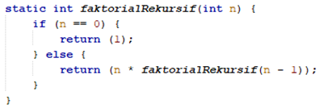
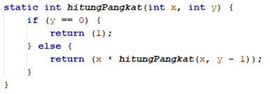

# JOBSHEET 14. Fungsi 2

## Tujuan
* Mahasiswa memahami konsep fungsi rekursif
* Mahasiswa mampu mengimplementasikan fungsi rekursif dalam kode program


## Alat dan Bahan
* PC/Laptop
* Browser
* Koneksi internet
* Anaconda3 + Java kernel (opsional)

## Praktikum

### Percobaan 1
Pada percobaan ini akan dilakukan pembuatan program untuk menghitung nilai faktorial dari suatu bilangan dengan menggunakan fungsi rekursif. Selain itu, akan dibuat juga fungsi untuk menghitung nilai faktorial dengan menggunakan algoritma iteratif sebagai pembandingnya

1. Buat fungsi static dengan nama **faktorialRekursif()**, dengan tipe data kembalian fungsi int dan memiliki 1 parameter dengan tipe data int berupa bilangan yang akan dihitung nilai faktorialnya

    


```Java
// Tuliskan kode program Percobaan 1 Langkah 1
static int faktorialRekursif(int n) {
    if (n == 0) {
        return 1;
    } else {
        return (n * faktorialRekursif(n - 1));
    }
}
```

pada kode program ini, kita membuat fungsi static dengan fungsi untuk menghitung nilai-nilai faktorial dari suatu angka. dalam method terdapat perintah pemilihan, dimana jika nilai tertentu tersebut sudah mencapai nilai 1, maka akan mengembalikan angka 1. tapi, jika tidak, maka method akan mengembalikan nilai tertentu tersebut dan kemudian memanggil method itu sendiri namun dengan nilai yang di decreament.

2. Buat lagi fungsi static dengan nama **faktorialIteratif()**, dengan tipe data kembalian fungsi int dan memiliki 1 parameter dengan tipe data int berupa bilangan yang akan dihitung nilai faktorialnya.

    


```Java
// Tuliskan kode program Percobaan 1 Langkah 2
static int faktorialIteratif ( int n ) {
    int faktor = 1;
    for (int i = n; i >= 1; --i) {
        faktor = faktor * i;
    }
    return faktor;
}
```

pada method ini, perintah nya memiliki fungsi yang sama dengan method sebelumnya. perbedaannya pada fungsi ini, kita menggunakan perintah perulangan dan mengembalikan semua nilai dari tiap nilai perulangan sampai menyentuh angka 1.

3. Lakukan pemanggilan terhadap kedua fungsi yang telah dibuat sebelumnya, dan tampilkan hasil yang didapatkan.

    


```Java
System.out.println(faktorialRekursif(5));
System.out.println(faktorialIteratif(5));
```

    120
    120


disini, kita melakukan pemanggilan 2 method yang telah kita tulis sebelumnya.

4. Jika ditelusuri, pada saat pemanggilan fungsi faktorialRekursif(5),maka proses yang terjadi dapat diilustrasikan sebagai berikut:

    

#### Pertanyaan
1. Apa yang dimaksud dengan fungsi rekursif?
2. Bagaimana contoh kasus penggunaan fungsi rekursif ?
3. Pada Percobaan1, apakah hasil yang diberikan fungsi faktorialRekursif() dan fungsi faktorialIteratif() sama? Jelaskan perbedaan alur jalannya program pada penggunaan fungsi rekursif dan fungsi iteratif!


1. fungsi rekursif adalah fungsi yang memanggil fungsi itu sendiri. tapi, kita perlu menentukan nilai dasar agar fungsi ini tidak menjadi infinite loop dan menghabiskan memori.
2. pada penghitungan faktorial seperti pada percobaan 1 dan pada kasus-kasus perulangan lain
3. iya. pada fungsi rekursif, kita memanggil method dalam method untuk menjalankan fungsi perulangan. karena itu, fungsi rekursif ini akan memakan cukup banyak memori. sedangkan pada fungsi iteratif, kita cuma menjalankan perintah perulangan yang memang di rancang khusus untuk menjalankan perintah perulangan.

### Percobaan 2
Pada percobaan ini akan dilakukan pembuatan program untuk menghitung pangkat sebuah bilangan dengan menggunakan fungsi rekursif.

1. Buat fungsi static dengan nama **hitungPangkat()**, dengan tipe data kembalian fungsi int dan memiliki 2 parameter dengan tipe data int berupa bilangan yang akan dihitung pangkatnya dan bilangan pangkatnya

    

2.	Deklarasikan Scanner dengan nama sc
3.	Buatlah dua buah variabel bertipe int dengan nama bilangan dan pangkat
4.	Tambahkan kode berikut ini untuk menerima input dari keyboard

    

5. Lakukan pemanggilan fungsi hitungPangkat yang telah dibuat sebelumnya dengan mengirimkan dua nilai parameter.

    


```Java
// Tuliskan kode program Percobaan 2 Langkah 1 - 5
static int hitungPangkat( int x, int y) {
    if (y == 0) {
        return 1;
    } else {
        return (x * hitungPangkat(x, y - 1));
    }
}
import java.util.Scanner;
Scanner sc = new Scanner(System.in);
int bilangan, pangkat;
System.out.print("Bilangan yang dihitung: ");
bilangan = sc.nextInt();
System.out.print("Pangkat: ");
pangkat = sc.nextInt();
System.out.println(hitungPangkat(bilangan, pangkat));
```

    Bilangan yang dihitung: 3
    Pangkat: 2
    9


disini, parameter yang digunakan ada 2, yakni x dan y. dimana nilai dasar dari fungsi adalah nilai y yang mencapai nilai 1. sebelum nilai y mencapai 1, maka fungsi hitungPangkat akan terus memanggil dirinya sendiri dengan decreament pada nilai y.

#### Pertanyaan
1. Pada Percobaan2, terdapat pemanggilan fungsi rekursif hitungPangkat(bilangan, pangkat) pada fungsi main, kemudian dilakukan pemanggilan fungsi hitungPangkat() secara berulangkali. Jelaskan sampai kapan proses pemanggilan fungsi tersebut akan dijalankan!

fungsi akan terus dijalankan sampai nilai y(pangkat) mencapai angka 1. Jika sudah mencapai nilai 1, maka fungsi hanya akan mengembalikan nilai 1 dan tidak akan memanggil fungsi hitungPangkat lagi.

### Percobaan 3
Pada percobaan ini akan dilakukan pembuatan program untuk menghitung jumlah uang nasabah yang disimpan di Bank setelah mendapatkan bunga selama beberapa tahun dengan menggunakan fungsi rekursif. 

1. Buat fungsi static dengan nama **hitungBunga()**, dengan tipe data kembalian fungsi double dan memiliki 2 parameter dengan tipe  data int berupa saldo nasabah dan lamanya menabung. Pada kasus ini dianggap bunga yang ditentukan oleh bank adalah 11% per tahun. Karena perhitungan bunga adalah bunga * saldo, sehingga untuk menghitung besarnya uang setelah ditambah bunga adalah saldo + bunga * saldo. Dalam hal ini, besarnya bunga adalah 0.11 * saldo, dan saldo dianggap 1 * saldo, sehingga 1 * saldo + 0.11 * saldo dapat diringkas menjadi 1.11 * saldo untuk perhitungan saldo setelah ditambah bunga (dalam setahun).

    

2.	Deklarasikan Scanner dengan nama sc
3.	Buatlah sebuah variabel bertipa double dengan nama saldoAwal dan sebuah variabel bertipe int bernama tahun
4.	Tambahkan kode berikut ini untuk menerima input dari keyboard

 

5. Lakukan pemanggilan fungsi hitungBunga yang telah dibuat sebelumnya dengan mengirimkan dua nilai parameter.

    


```Java
// Tuliskan kode program Percobaan 3 Langkah 1 - 5
static double hitungBunga(double saldo, int tahun) {
    if (tahun == 0) {
        return saldo;
    } else {
        return (1.11 * hitungBunga(saldo, tahun - 1));
    }
}
import java.util.Scanner;
Scanner sc = new Scanner(System.in);
double saldoAwal;
int tahun;
System.out.print("Jumlah saldo awal: ");
saldoAwal = sc.nextDouble();
System.out.print("Lamanya menabung (tahun): ");
tahun = sc.nextInt();
System.out.print("Jumlah uang setelah " + tahun + " tahun");
System.out.println(hitungBunga(saldoAwal, tahun));
```

    Jumlah saldo awal: 2000000
    Lamanya menabung (tahun): 3
    Jumlah uang setelah 3 tahun2735262.0000000005


pada kode program kali ini, kita membuat fungsi untuk menghitung bunga setiap tahun dari data saldo awal nasabah. nasabah hanya perlu memasukkan nilai saldo awal dan lama dia menabung pada bank. setelah itu, akan dipanggil fungsi hitungBunga berkali-kali hingga nilai tahun yang dimasukkan bernilai 0. jika nilai tahun sudah bernilai 0, maka fungsi akan mengembalikan nilai dari saldo terakhir.

#### Pertanyaan
1. Pada Percobaan3, sebutkan blok kode program manakah yang merupakan “base case” dan “recursion call”!

base case adalah 
if ( tahun == 0 ) { 
    return saldo;
}
recursion call adalah 
else {
    return (1.11 * hitungBunga(saldo, tahun - 1));
}

## Tugas

1. Buatlah program untuk menampilkan bilangan n sampai 0 dengan menggunakan fungsi rekursif dan fungsi iteratif. (**DeretDescendingRekursif**).


```Java
// Tuliskan jawaban tugas nomor 1
import java.util.Scanner;
static void deretDescendingRekursif(int n) {
    if (n == 0) {
        System.out.println("0");
    } else {
        System.out.print(n + " ");
        deretDescendingRekursif(n - 1);
    }
}
static void deretDescendingIteratif(int n) {
    while (n >= 0) {
        System.out.print(n + " ");
        --n;
    }
}
Scanner hehe = new Scanner(System.in);
System.out.print("Masukkan sebuah angka: ");
int angka = hehe.nextInt();
System.out.println("Perhitungan nilai menurun dengan Fungsi Rekursif");
deretDescendingRekursif(angka);
System.out.println("\nPerhitungan nilai menurun dengan Fungsi Iteratif");
deretDescendingIteratif(angka);
```

    Masukkan sebuah angka: 5
    Perhitungan nilai menurun dengan Fungsi Rekursif
    5 4 3 2 1 0
    
    Perhitungan nilai menurun dengan Fungsi Iteratif
    5 4 3 2 1 0 

pada fungsi deretDescendingRekursif saya menggunakan fungsi void karena lebih mudah dalam menggunakan fungsi Sout nantinya. saya menetapkan n == 0 sebagai base case. selain itu, fungsi akan mencetak nilai dari n dan akan memanggil fungsi deretDescendingRekursif lagi sampai menemui base case. pada fungsi deretDescendingIteratif, saya menggunakan perulangan while dan kemudian melakukan perintah perulangan untuk mencetak nilai n dan kemudian melakukan decreament.

2. Buatlah program yang di dalamnya terdapat fungsi rekursif untuk menghitung bilangan faktorial. Misalniya f = 8, maka akan dihasilkan 1+2+3+4+5+6+7+8 = 36 (**PenjumlahanRekursif**).


```Java
// Tuliskan jawaban tugas nomor 2
import java.util.Scanner;
static byte i = 1;
static int jumlah = 0;
static void PenjumlahanRekursif(int t) {
    if (i == t) {
        jumlah += i;
        System.out.print(i + " = " + jumlah);
    } else {
        System.out.print(i + " + ");
        jumlah += i;
        i++;
        PenjumlahanRekursif(t);
    }
}
Scanner yihaa = new Scanner(System.in);
System.out.println("-----Menghitung Penjumlahan Rekursif-----");
System.out.print("Masukkan angka: ");
int angka = yihaa.nextInt();
PenjumlahanRekursif(angka);
```

    -----Menghitung Penjumlahan Rekursif-----
    Masukkan angka: 5
    1 + 2 + 3 + 4 + 5 = 15

3.	Buat program yang di dalamnya terdapat fungsi rekursif untuk mengecek apakah suatu bilangan n merupakan bilangan prima atau bukan. n dikatakan bukan bilangan prima jika ia habis dibagi dengan bilangan kurang dari n. (**CekPrimaRekursif**).

pertama, saya meminta input dari user. kemudian menggunakan input tersebut sebagai parameter fungsi PenjumlahanRekursif. fungsi PenjumlahanRekursif memiliki base case yaitu i == t dimana t adalah parameter dan i adalah counter. selain itu, fungsi akan menjalankan perintah sout yang mencetak nilai i dan menjumlahkannya ke dalam variabel jumlah. kemudian akan kembali memanggil fungsi PenjumlahanRekursif hingga menemui base case.

```Java
static void CekPrimaRekursif(int n, int p) {
    if ( p == 1 ) {
        System.out.println("n merupakan Bilangan Prima !");
        System.out.println("Program selesai !");
    } else if ( n % p == 0 ) {
        System.out.println("n BUKAN merupakan Bilangan Prima !");
        System.out.println("Program Selesai !");
    } else if ( n % p != 0) {
        CekPrimaRekursif(n, p - 1);
    }
}
import java.util.Scanner;
Scanner bingung = new Scanner(System.in);
System.out.print("Masukkan nilai n: ");
int nilaiN = bingung.nextInt();
int pembagi = nilaiN - 1;
CekPrimaRekursif(nilaiN, pembagi);
```

    Masukkan nilai n: 5
    n merupakan Bilangan Prima !
    Program selesai !

jadi disini saya menggunakan if else if. jika parameter nilaiN di modulus pembagi menghasilkan 0, maka n bukan merupakan bilangan prima. jika parameter nilaiN di modulus pembagi tidak menghasilkan 0, maka kita akan memanggil fungsi CekPrimaRekursif hingga menyentuh base case, yaitu jika parameter pembagi == 1, maka n merupakan bilangan prima dan program akan selesai.

4.	Sepasang marmut yang baru lahir (jantan dan betina) ditempatkan pada suatu pembiakan.  Setelah dua bulan pasangan marmut tersebut melahirkan sepasang marmut kembar (jantan dan betina). Setiap pasangan marmut yang lahir juga akan melahirkan sepasang marmut juga setiap 2 bulan.  Berapa pasangan marmut yang ada pada akhir bulan ke-12? Buatlah programnya menggunakan fungsi rekursif! (**Fibonacci**).
Berikut ini adalah ilustrasinya dalam bentuk tabel.

 


```Java
static int i = 0, j = 1, l = 1, k = 0;
static void Fibonacci(int n) {
    if (n == 0) {
        System.out.println("Jumlah pasangan marmut pada akhir bulan ke-" + bulan + " adalah: " + k);
        System.out.println("Program Selesai !");
    } else {
        System.out.println("Bulan ke-" + l);
        if ( l == 1) {
            System.out.println("Jumlah Produktif\t: " + i);
            System.out.println("Jumlah Belum Produktif\t: " + j);
            k = i + j;
            System.out.println("Total Pasangan\t\t: " + k);
            l++;
            Fibonacci(n - 1);
        } else {
            System.out.println("Jumlah Produktif\t: " + i);
            System.out.println("Jumlah Belum Produktif\t: " + j);
            k = i + j;
            System.out.println("Total Pasangan\t\t: " + k);
            i = j;
            j = k;
            l++;
            Fibonacci(n - 1);
        }
    }
}
import java.util.Scanner;
Scanner jiwa = new Scanner(System.in);
System.out.print("Masukkan jumlah bulan: ");
int bulan = jiwa.nextInt();
Fibonacci(bulan);
```
saya meminta input dari user. kemudian akan menggunakan input tersebut sebagai parameter. kemudian, kita akan memanggil fungsi Fibonacci. fungsi Fibonacci akan mencetak bulan keberapa, dengan jumlah produktif dan belum produktif. jangan lupa untuk menetapkan base case agar tidak infinite loops.

    Masukkan jumlah bulan: 12
    Bulan ke-1
    Jumlah Produktif	: 0
    Jumlah Belum Produktif	: 1
    Total Pasangan		: 1
    Bulan ke-2
    Jumlah Produktif	: 0
    Jumlah Belum Produktif	: 1
    Total Pasangan		: 1
    Bulan ke-3
    Jumlah Produktif	: 1
    Jumlah Belum Produktif	: 1
    Total Pasangan		: 2
    Bulan ke-4
    Jumlah Produktif	: 1
    Jumlah Belum Produktif	: 2
    Total Pasangan		: 3
    Bulan ke-5
    Jumlah Produktif	: 2
    Jumlah Belum Produktif	: 3
    Total Pasangan		: 5
    Bulan ke-6
    Jumlah Produktif	: 3
    Jumlah Belum Produktif	: 5
    Total Pasangan		: 8
    Bulan ke-7
    Jumlah Produktif	: 5
    Jumlah Belum Produktif	: 8
    Total Pasangan		: 13
    Bulan ke-8
    Jumlah Produktif	: 8
    Jumlah Belum Produktif	: 13
    Total Pasangan		: 21
    Bulan ke-9
    Jumlah Produktif	: 13
    Jumlah Belum Produktif	: 21
    Total Pasangan		: 34
    Bulan ke-10
    Jumlah Produktif	: 21
    Jumlah Belum Produktif	: 34
    Total Pasangan		: 55
    Bulan ke-11
    Jumlah Produktif	: 34
    Jumlah Belum Produktif	: 55
    Total Pasangan		: 89
    Bulan ke-12
    Jumlah Produktif	: 55
    Jumlah Belum Produktif	: 89
    Total Pasangan		: 144
    Jumlah pasangan marmut pada akhir bulan ke-12 adalah: 144
    Program Selesai !

