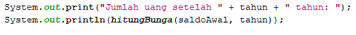

# JOBSHEET 14. Fungsi 2

## Tujuan
* Mahasiswa memahami konsep fungsi rekursif
* Mahasiswa mampu mengimplementasikan fungsi rekursif dalam kode program


## Alat dan Bahan
* PC/Laptop
* Browser
* Koneksi internet
* Anaconda3 + Java kernel (opsional)

## Praktikum

### Percobaan 1
Pada percobaan ini akan dilakukan pembuatan program untuk menghitung nilai faktorial dari suatu bilangan dengan menggunakan fungsi rekursif. Selain itu, akan dibuat juga fungsi untuk menghitung nilai faktorial dengan menggunakan algoritma iteratif sebagai pembandingnya

1. Buat fungsi static dengan nama **faktorialRekursif()**, dengan tipe data kembalian fungsi int dan memiliki 1 parameter dengan tipe data int berupa bilangan yang akan dihitung nilai faktorialnya

    


```Java
// Tuliskan kode program Percobaan 1 Langkah 1
static int faktorialRekursif(int n){
    if(n == 0) {
        return (1);
    } else {
        return (n * faktorialRekursif(n - 1));
    }
}
```

2. Buat lagi fungsi static dengan nama **faktorialIteratif()**, dengan tipe data kembalian fungsi int dan memiliki 1 parameter dengan tipe data int berupa bilangan yang akan dihitung nilai faktorialnya.

    


```Java
// Tuliskan kode program Percobaan 1 Langkah 2
static int faktorialIternatif(int n){
    int faktor = 1;
    for(int i = n; i >= 1; i--){
        faktor *= i;
    }
    return faktor;
}
```

3. Lakukan pemanggilan terhadap kedua fungsi yang telah dibuat sebelumnya, dan tampilkan hasil yang didapatkan.

    


```Java
// Tuliskan kode program Percobaan 1 Langkah 1, 2, 3
System.out.println(faktorialRekursif(5));
System.out.println(faktorialIternatif(5));
```

    120
    120
    

4. Jika ditelusuri, pada saat pemanggilan fungsi faktorialRekursif(5),maka proses yang terjadi dapat diilustrasikan sebagai berikut:

    

#### Pertanyaan
1. Apa yang dimaksud dengan fungsi rekursif?

Yang dimaksud dengan fungsi rekursif adalah fungsi yang pengulangannya menggunakan if else dan pengulangannya akan berenti saat base case terpenuhi.

2. Bagaimana contoh kasus penggunaan fungsi rekursif ?

Contoh penggunaan fungsi ini adalah program perhitungan faktorial

3. Pada Percobaan1, apakah hasil yang diberikan fungsi faktorialRekursif() dan fungsi faktorialIteratif() sama? Jelaskan perbedaan alur jalannya program pada penggunaan fungsi rekursif dan fungsi iteratif!

Sama, perbedaan alurnya adalah faktorialRekursif menggunakan if dan else sedangkan fungsiIteratif menggunakan perulangan for

### Percobaan 2
Pada percobaan ini akan dilakukan pembuatan program untuk menghitung pangkat sebuah bilangan dengan menggunakan fungsi rekursif.

1. Buat fungsi static dengan nama **hitungPangkat()**, dengan tipe data kembalian fungsi int dan memiliki 2 parameter dengan tipe data int berupa bilangan yang akan dihitung pangkatnya dan bilangan pangkatnya

    

2.	Deklarasikan Scanner dengan nama sc
3.	Buatlah dua buah variabel bertipe int dengan nama bilangan dan pangkat
4.	Tambahkan kode berikut ini untuk menerima input dari keyboard

    

5. Lakukan pemanggilan fungsi hitungPangkat yang telah dibuat sebelumnya dengan mengirimkan dua nilai parameter.

    


```Java
// Tuliskan kode program Percobaan 2 Langkah 1 - 5
import java.util.Scanner;
static int hitungPangkat(int x, int y){
    if(y == 0){
        return(1);
    } else {
        return(x * hitungPangkat(x, y - 1));
    }
}
int bilangan, pangkat;
Scanner sc = new Scanner(System.in);
System.out.print("BIlangan yang dihitung : ");
bilangan = sc.nextInt();
System.out.print("Pangkat : ");
pangkat = sc.nextInt();
System.out.println(hitungPangkat(bilangan, pangkat));
```

    BIlangan yang dihitung : 12
    Pangkat : 2
    144
    

#### Pertanyaan
1. Pada Percobaan2, terdapat pemanggilan fungsi rekursif hitungPangkat(bilangan, pangkat) pada fungsi main, kemudian dilakukan pemanggilan fungsi hitungPangkat() secara berulangkali. Jelaskan sampai kapan proses pemanggilan fungsi tersebut akan dijalankan!

Proses pemanggilan fungsi itu akan dijalankan sampai base case atau kondisi y == 0 terpenuhi.


### Percobaan 3
Pada percobaan ini akan dilakukan pembuatan program untuk menghitung jumlah uang nasabah yang disimpan di Bank setelah mendapatkan bunga selama beberapa tahun dengan menggunakan fungsi rekursif. 

1. Buat fungsi static dengan nama **hitungBunga()**, dengan tipe data kembalian fungsi double dan memiliki 2 parameter dengan tipe  data int berupa saldo nasabah dan lamanya menabung. Pada kasus ini dianggap bunga yang ditentukan oleh bank adalah 11% per tahun. Karena perhitungan bunga adalah bunga * saldo, sehingga untuk menghitung besarnya uang setelah ditambah bunga adalah saldo + bunga * saldo. Dalam hal ini, besarnya bunga adalah 0.11 * saldo, dan saldo dianggap 1 * saldo, sehingga 1 * saldo + 0.11 * saldo dapat diringkas menjadi 1.11 * saldo untuk perhitungan saldo setelah ditambah bunga (dalam setahun).

    

2.	Deklarasikan Scanner dengan nama sc
3.	Buatlah sebuah variabel bertipa double dengan nama saldoAwal dan sebuah variabel bertipe int bernama tahun
4.	Tambahkan kode berikut ini untuk menerima input dari keyboard

 

5. Lakukan pemanggilan fungsi hitungBunga yang telah dibuat sebelumnya dengan mengirimkan dua nilai parameter.

    


```Java
// Tuliskan kode program Percobaan 3 Langkah 1 - 5
import java.util.Scanner;
static double hitungBunga(double saldo, int tahun){
    if(tahun == 0){
        return(saldo);
    } else {
        return(1.11 * hitungBunga(saldo, tahun - 1));
    }
}
Scanner sc = new Scanner(System.in);
int tahun; double saldoAwal;
System.out.print("Jumlah saldo awal : ");
saldoAwal = sc.nextInt();
System.out.print("Lamanya menabung (tahun) : ");
tahun = sc.nextInt();
System.out.print("Jumlah uang setelah " + tahun + " tahun : ");
System.out.println(hitungBunga(saldoAwal, tahun));
```

    Jumlah saldo awal : 1000000
    Lamanya menabung (tahun) : 2
    Jumlah uang setelah 2 tahun : 1232100.0
    

#### Pertanyaan
1. Pada Percobaan3, sebutkan blok kode program manakah yang merupakan “base case” dan “recursion call”!

base case terdapat pada kondisi tahun == 0 sedangkan recursion call terdapat pada (1.11 * hitunBunga(saldo, tahun - 1)

## Tugas

1. Buatlah program untuk menampilkan bilangan n sampai 0 dengan menggunakan fungsi rekursif dan fungsi iteratif. (**DeretDescendingRekursif**).


```Java
// Tuliskan jawaban tugas nomor 1
import java.util.Scanner;
static int DeretRekursif(int n){
    System.out.println(n);
    if(n == 1) {
        return(1);
    } else {
        return (DeretRekursif(n - 1));
    }
}
static int DeretIteratif(int m){
    for(int a = m; a >= 1; a--){
        System.out.println(a);
    }
    return(1);
}
int bilangan;
Scanner sc = new Scanner(System.in);
System.out.print("Masukkan bilangan : ");
bilangan = sc.nextInt();
System.out.println("Deret Rekursif : ");
DeretRekursif(bilangan);
System.out.println("Deret Iteratif : ");
DeretIteratif(bilangan);
```

    Masukkan bilangan : 7
    Deret Rekursif : 
    7
    6
    5
    4
    3
    2
    1
    Deret Iteratif : 
    7
    6
    5
    4
    3
    2
    1
    


    1


Alurnya adalah membuat fungsi Deret Rekursif yang didalamnya terdapat output mengeluarkan nilai dari var n yang akan diulang hingga nilai n == 1. Selanjutnya membuat fungsi Deret Iteratif yang didalam perulangan for mengeluarkan isi dari var a (a == m) hingga nilai a kurang dari 1. Setelah fungsi membuat deklerasi scanner dan pemanggilan fungsi DeretRekursif dan DeretIteratif.

2. Buatlah program yang di dalamnya terdapat fungsi rekursif untuk menghitung bilangan faktorial. Misalniya f = 8, maka akan dihasilkan 1+2+3+4+5+6+7+8 = 36 (**PenjumlahanRekursif**).


```Java
// Tuliskan jawaban tugas nomor 2
import java.util.Scanner;
static int PenjumlahanRek(int n){
    if(n == 1) {
        return (1);
    } else {
        return (n + PenjumlahanRek(n - 1));
    }
}
int bilangan;
Scanner sc = new Scanner(System.in);
System.out.print("Masukkan bilangan : ");
bilangan = sc.nextInt();
System.out.println(PenjumlahanRek(bilangan));
```

    Masukkan bilangan : 6
    21
    

Alurnya adalah dengan membuat fungsi PenjumlahanRek yang didalamnya terdapat perulangan yang akan berhenti jika n == 1. Dengan Recursion call n + PenjumlahanRek(n-1). Setelah fungsi mendeklarasi scanner dan melakukan pemanggilan fungsi.

3.	Buat program yang di dalamnya terdapat fungsi rekursif untuk mengecek apakah suatu bilangan n merupakan bilangan prima atau bukan. n dikatakan bukan bilangan prima jika ia habis dibagi dengan bilangan kurang dari n. (**CekPrimaRekursif**).


```Java
// Tuliskan jawaban tugas nomor 3
import java.util.Scanner;
static int CekPrimaRek(int n, int m){
    if(m == 1){
        return(1);
    } else if(n % m == 0){
        return(0);
    } else {
        return(CekPrimaRek(n, m - 1));
    }
}
int bil;
Scanner sc = new Scanner(System.in);
System.out.print("Masukkan bilangan : ");
bil = sc.nextInt();
int a = CekPrimaRek(bil, bil-1);
if(a == 1){
    System.out.println("Ini Bilangan Prima");
} else{
    System.out.println("Ini Bukan Bilangan Prima");
}
```

    Masukkan bilangan : 567
    Ini Bukan Bilangan Prima
    

Jadi alurnya adalah membuat fungsi dengan 2 parameter yaitu n dan m. n sebagai bilangan yang diinputkan sedangkan m sebagai bilangan kurang dari n. Dengan kondisi hingga m == 1. Setelah membuat fungsi lanjut mendeklarasi scanner dan melakukan pemanggilan fungsi. kemudian melakukan pemilihan jika nilai a == 1 (1 dari return) maka bilangan prima namun jika nilai a == 0 atau selain 1 maka bukan bilangan prima.

4.	Sepasang marmut yang baru lahir (jantan dan betina) ditempatkan pada suatu pembiakan.  Setelah dua bulan pasangan marmut tersebut melahirkan sepasang marmut kembar (jantan dan betina). Setiap pasangan marmut yang lahir juga akan melahirkan sepasang marmut juga setiap 2 bulan.  Berapa pasangan marmut yang ada pada akhir bulan ke-12? Buatlah programnya menggunakan fungsi rekursif! (**Fibonacci**).
Berikut ini adalah ilustrasinya dalam bentuk tabel.

 


```Java
// Tuliskan jawaban tugas nomor 4
import java.util.Scanner;
static int Fibonacci(int a) {
    if(a <= 1) {
        return a;
    } else {
        return Fibonacci(a - 1)+Fibonacci(a - 2);
    }
}

Scanner sc = new Scanner(System.in);
System.out.print("Bulan ke- ");
int i = sc.nextInt();
System.out.print(Fibonacci(i));
```

    Bulan ke- 11
    89

Alurnya adalah membuat fungsi Fibonacci dimanaa akan berhenti jika a <= 1 dengan Recursion call Fibonacci(a-1) + Fibonacci(a-2) Kemudian mendeklarasi Scanner dan mengeluarkan keluaran dari fungsi yang dipanggil.
